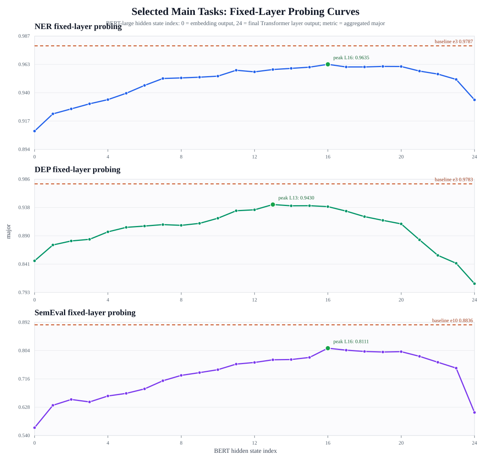

# BERT-large Edge Probing 实验

本项目用于在 `jiant` 框架下运行 **《BERT Rediscovers the Classical NLP Pipeline》** 中的八类 Edge Probing 任务。当前目标不是严格复现论文全部设置，而是先建立一套可运行、可记录、可复用的 BERT-large 任务评估流程，后续用于对比修改 BERT-large 线性与非线性运算后的性能变化。

## 新对话交接摘要

这是一项硕士论文实验项目，核心问题是：**BERT-large 不同层对不同 NLP 任务的重要性不同，能否利用这种 layer-wise 差异指导轻量化加速，使相同平均计算/存储预算下的 layer-wise 配置优于 uniform 压缩或近似。**

当前代码和实验已经支持以下已有基础，线性主线已基本确定，非线性与硬件部分仍待后续收敛：

1. **Layer probing / 表征诊断**：冻结 BERT-large，只取某一层输出训练任务 head/probe classifier，用该层输出的任务指标判断该层表征是否足够可分。该方法能说明“某层表征含有多少任务信息”，但不能直接证明“后续层可以删除”或“该层一定最该保护”。若要证明删层，需要额外做 truncated BERT fine-tuning。
2. **非线性近似基础**：已实现 GELU PWL 的 uniform 和 layer-wise 段数配置，并完成大量 SPR2、SemEval、NER、DEP、Coref 等实验。总体结论是：uniform 激进近似会损失明显，少量层保留更高精度常能恢复性能；但 layer probing 精确排序对 PWL 最优层的预测不稳定。后续非线性方法不应局限于 PWL，可继续比较 LUT-GELU、quantized LUT、分段二次、Softmax/LayerNorm 近似等硬件友好方案。
3. **线性压缩基础**：已实现 FFN SVD low-rank 和 FFN neuron pruning 初探。uniform low-rank 呈现 rank 越高精度越好，但当前 probing-guided layer-wise low-rank 未体现稳定优势；neuron pruning 退化较明显。后续线性方法不应局限于当前 FFN 压缩，可考虑 layer-wise quantization、outlier-aware quantization、attention/FFN 结构化剪枝、低秩分解等方案。
4. **量化主线已完成 uniform、双侧 outlier-aware PTQ 和 probing-guided 同 BOP 多 seed 验证**：NER、DEP、SemEval 的 uniform PTQ 已完成；SemEval W4A4 双侧 outlier16/outlier8 两套 30 组比例网格均已完成，outlier8 成本-精度边界更优。NER 已完成 W4A4+outlier8 的 30 点动态阈值网格、9 点固定 train calibration 超低预算扫描、8 点 INT2 压力测试，以及 low/boundary 两档预算、四 calibration seed、六策略的 88 个 pilot/BOP-fix run；probing 在两档都是 4/4 seed 优于 uniform，但 late 平均更高。DEP 已完成 12 个统一比例预算点、6 个 `floor=0` probing 点、4 个 `floor50` 定位点，以及 low/boundary 两档、四 calibration seed 的六策略 pilot/BOP-fix2 补全；pilot 中 probing 对 inverse/early/late/random 均为 4/4 seed 胜出，近似同 measured BOP 下 probing 对 uniform 在两档也均为 4/4 seed 胜出。DEP 的早期无 floor 分配会在超低预算下塌缩，`floor50` 证明逐层最低保护是必要约束；boundary 是目前最干净的六策略同成本证据，low 下 inverse/late/random 的 BOP 修正仍存在离散阈值跳变和负载失配。SemEval low budget probing 则在四 seed 中均优于 uniform、early、late 和 `random_s29`。当前不做 QAT，也不把 probing 得分直接等同于逐层数值量化敏感度；所有分类结果必须同时报告 `major` 和 `f1_micro`，不能用高 `acc` 掩盖多数类塌缩。
5. **Fisher 数值敏感性强基线已实现并完成第一轮对照**：当前使用 empirical diagonal Fisher，将梯度平方与 W4/A4 对称量化误差平方结合，分别形成 24 层权重和激活分数。SemEval 四 seed 显示 low budget 下 probing 优于 Fisher，probe+Fisher 略优于 probing；boundary 下各方法差异很小。NER/DEP 单 seed pilot 显示 probing 与 Fisher 总体相当，但 Fisher-A 与真实单层损伤的相关性弱，固定 `beta=0.5` 的双侧融合也未稳定跨任务占优。因此当前证据支持“任务 probing 可达到传统数值敏感性基线的水平并提供互补信息”，不支持“probing 等价于 Fisher”或“融合在所有任务上最优”。

目前算法主线已进一步收敛为：**以 fixed-probing-guided、equal-BOP constrained outlier-aware PTQ 加速线性计算，以 GELU 等特殊函数近似处理非线性计算，算法有效后再做协同硬件设计**。当前量化方法用 fixed probing 决定 24 层之间的相对离群值预算形状，用 measured BOP 作为全模型计算代价硬约束；它已经考虑全局 cost，但尚未把逐层 reconstruction error 纳入分配目标。第一版论文方法可以直接比较 uniform、early/late、random、inverse-probing 与 probing-guided 分配；reconstruction-guided 或 probing+reconstruction `L_PTH` 保留为可选增强，不作为当前必做前置项。

已有较有价值的实验观察：

- **SemEval** 对 PWL 最敏感，e10 平均 5.0 段的 mid-high `13-18` 配置几乎贴近 baseline，且明显优于同平均段数 early/late，是当前最支持中高层保护的证据，可作为后续方法筛选的重点任务。
- **SPR2** uniform PWL2 明显崩溃，但少量层升到 PWL4 可恢复到接近 baseline，说明 layer-wise 近似有价值；不过 single-layer scan 层间差距很小，probing 排序不稳定。
- **Coref** uniform PWL2 崩得很厉害，但加少量 PWL4 层可恢复，说明极低段数近似下层配置影响显著；目前 late/aware 谁更优不稳定。
- **NER、DEP、POS、nonterminal、SRL** 对 PWL4 普遍不敏感，适合作为非线性近似的“低敏感任务”或补充任务；但 DEP 对 naive uniform PTQ 很敏感，并已成为验证 outlier-aware probing-guided 线性加速的主任务之一。
- **FFN SVD low-rank** 的 uniform rank 结果有清晰压缩敏感性，但 layer-wise 低秩暂不支持当前 probing 窗口，说明线性压缩需要重新筛选方法和实验设计，不能只沿用 FFN low-rank。

如果新开对话，建议让模型优先阅读：

```text
/cluster/home/zhangzx/my_project/README.md
```

并重点查看这些章节：

- `## 新对话交接摘要`
- `## 当前状态总览`
- `### Layer probing 状态`
- GELU PWL 结果表中 `SPR2`、`SemEval`、`Coref`
- `### 后续方向：线性与非线性协同加速`
- `### 参考论文调研提炼`
- `## 后续计划`

推荐的新对话启动提示词：

```text
请阅读 /cluster/home/zhangzx/my_project/README.md，尤其是“新对话交接摘要”“Layer probing 状态”“GELU PWL 结果”“后续方向”和“后续计划”。这是我的硕士论文项目：基于 BERT-large 的 layer-wise NLP 任务敏感性分析，并计划在 layer probing / sensitivity analysis 指导下同时探索线性计算和非线性计算加速，之后再进行硬件设计；目前具体线性和非线性加速方法尚未最终确定。请先总结你理解的研究目标、已有实验结论、当前证据不足，以及下一步最值得筛选和验证的方法。
```

## 当前状态总览

- 主框架：`base_exp/jiant`，即 `jiant 2.x`。
- 旧数据工具：`tools/jiant-v1-legacy`，用于部分 edge probing 数据转换。
- 基础模型：`bert-large-uncased`，已提前导出到本地，Slurm 作业中不再临时下载。
- 当前环境：`anaconda3/2024.02` 模块下的 `pytorch-test` conda 环境。
- 当前量化实验环境：租用 RTX 4090，项目路径 `/root/autodl-tmp/master-gra/my_project`，Python 环境 `/home/zhangzx/master-gra/conda-envs/graduate`；PyTorch `2.5.1+cu121`、Transformers `5.7.0`。2026-08-05 的 outlier-aware PTQ 批次均在该环境串行运行，跨配置比较使用同一 checkpoint、cache、代码和 GPU。
- 当前量化状态（2026-08-17）：SemEval、NER、DEP 三主任务已完成 W4A4+双侧 outlier8 的预算筛选、probing-guided 多 seed 验证、跨任务 allocation 单 seed 交换和 empirical Fisher 四 seed对照；NER 还完成 `20260810-20260813` 的 late-only low/boundary 稳健性复验。四 seed均值下，probing 在 6 个“任务 × 预算”组合中的 4 个高于 Fisher；Fisher 领先的 SemEval-boundary 与 DEP-boundary 均不足 `0.001 major`。逐 seed共 24 个 probing-Fisher 配对，probing 胜出 18 次。该证据支持 probing 与传统数值敏感性基线总体相当，并在多个低预算场景更强；不支持 probing 在所有任务预算上严格最优。
- 量化结果完整性审计（2026-08-17）：全项目现有 `756` 个 `quant_summary.json`；按任务路径统计，SemEval `295`、NER `198`、DEP `203`，三任务合计 `696`，其余 `60` 属于其他任务或历史路径。相较上一轮 `692` 条全项目记录，本轮新增 64 条：NER/DEP Fisher 剩余三 seed 48 条，NER late-only 四新 seed 16 条；均已完成，`failures=0`。smoke 工程验证仍不计入论文正式结果，当前没有相关实验进程运行。
- 已准备任务：**已完成端到端（数据 → cache `ms256` → 多 epoch 训练）** 的为 **`dep`、`semeval`、`ner`**：均有 **`best_model.p`** 与 **`val_metrics.json`**（`dep`×4、`semeval`×6、`ner`×4 个带 checkpoint 的 run，见各 `runs/bert-large-uncased/<task>/`）。**`spr2`**：JSONL 与 **`cache/bert-large-uncased/spr2/`**（train/val/test/val_labels，`ms256`）就绪；Slurm **`17202`–`17205`**（1/3/5/10 epoch）均已 **`COMPLETED`、`ExitCode=0`**（Walltime 见作业表），**`runs/bert-large-uncased/spr2/`** 下已有对应 **`RUN_NAME`** 与 **`best_model.p`**。**OntoNotes 四任务 `pos` / `nonterminal` / `srl` / `coref`**：JSONL 与配置已在仓库；**cache `ms512`** 已由作业 **`17206`** 完成（**`COMPLETED`**，`16:23:46`），**`cache/bert-large-uncased/{pos,nonterminal,srl,coref}/`** 含 **`train`/`val`/`test`/`val_labels`**。**`smoke_e1_ms512_*` 训练试探**（作业 **`17212`–`17215`**）均已 **`COMPLETED`、`ExitCode=0`**（Walltime 见作业表），各 **`runs/bert-large-uncased/<task>/smoke_e1_ms512_*/`** 含 **`best_model.p`** 与 **`val_metrics.json`**（默认 **早停**，进度条未必跑满 runconfig 中的名义 **`max_steps`**，见「验证集指标」一节 OntoNotes 表上方说明）。**Formal `ms512` 多 epoch（无早停）**：**`17222`–`17233`**（**12** 作业，**`NO_IMPROVEMENTS_FOR_N_EVALS=0`**）。截至 2026-06-09 文档更新：**`17222`–`17233`** 已全部 **`COMPLETED`、`ExitCode=0`**；四个 OntoNotes 任务的 formal **3/5/10 ep** run 均有 **`best_model.p`** 与 **`val_metrics.json`**。指标见「验证集指标」OntoNotes formal 表。旧作业 **`17196`**（`ms256`）于 POS 失败，不完整 cache 已删除。
- Slurm：`dep`、`semeval`、`ner` 多轮训练均已完成（见作业表与验证集指标）。批量 test 作业 `17195` 已结束，但其 **`test_summary.tsv` 与当时各 `test_eval/test_metrics.json` 未对齐真实 test gold，不可作为有效 test**；有效 test 须用 `tools/evaluate_edge_test.py` 或 `test_edge_*.sh` 重跑（默认写入 `test_<task>.tsv`）。**`17207`**（`edge_test_real_gold`）已 **`COMPLETED`**（`00:21:56`），**`test_semeval.tsv` / `test_ner.tsv` / `test_spr2.tsv`** 已为批量行；**`dep`** 的 **`test_dep.tsv`** 已补齐 4 个 run。OntoNotes test 作业 **`17564`–`17567`**（`pos` / `nonterminal` / `srl` / `coref`）已全部 **`COMPLETED`、`ExitCode=0`**，并写入 **`test_pos.tsv` / `test_nonterminal.tsv` / `test_srl.tsv` / `test_coref.tsv`**。当前队列请用 `squeue -u "$USER"` 自查。
- 备份状态：租用服务器独立快照使用私有仓库 `https://github.com/ZzX1ng/graduate-rental`，与旧仓库 `https://github.com/ZzX1ng/graduate` 分开；代码、README 和精简实验结果已推送。子模块 **`base_exp/jiant`**、**`tools/jiant-v1-legacy`** 仍有本地补丁未单独推送至各自上游，克隆后需应用 `patches/jiant-local-changes.patch`。

## 待完成主项（工程侧优先）

与「当前状态总览」一致，OntoNotes **cache（`17206`）**、**`17212`–`17215`** smoke 训练、**`17222`–`17233`** formal 训练，以及 OntoNotes **test（`17564`–`17567`）** 均已完成；SPR2 训练与 **`17207`** 批量 **test** 已写入对应 TSV。**下列项为可选深化或收尾**：

1. **OntoNotes formal / test 收尾**：**`17222`–`17233`**（四任务 × 3/5/10 ep）均已完成，README 已补全 formal 验证集指标；**`17564`–`17567`** 已完成 OntoNotes 四任务 test，README 已补全 test 指标。

2. **SPR2**：**`17202`–`17205`** 与 **`17207`** 已覆盖当前 run；新增 **`RUN_NAME`** 时再批量评测即可。

3. **各任务 test 汇总**：现有 **`dep` / `semeval` / `ner` / `spr2` / `pos` / `nonterminal` / `srl` / `coref`** 的 test TSV 已写入 `base_exp/exp_edge/runs/bert-large-uncased/`。新增 run 时再用 **`evaluate_edge_test.py`** 或对应脚本追加。**不要**引用 **`17195`** 的 **`test_summary.tsv`** 或当时未对齐真实 gold 的 **`test_eval/test_metrics.json`**。

## 八个任务

下表「现状」按 **数据 JSONL → token cache → 训练 checkpoint** 简要汇总（**`ms256`/`ms512`** 指当前脚本约定的 `MAX_SEQ_LENGTH`）。论文八类任务中 **`spr1`** 与 **`spr2`** 同属 SPR 族；本仓库以 **`spr2` 作替代实验**，`spr1` 仍缺可训练数据。

| 任务名 | 论文任务 | 中文说明 | 现状概要 |
| --- | --- | --- | --- |
| `pos` | POS | 词性标注 | **Cache**：**`ms512`**。**训练**：smoke + formal **3/5/10 ep** 均完成（**`17222`–`17224`**），共 **4** 个带 **`val_metrics.json`** 的 run。 |
| `nonterminal` | Constituents | 句法成分分析 | 同上。**训练**：smoke + formal **3/5/10 ep** 均完成（**`17225`–`17227`**），共 **4** 个带 **`val_metrics.json`** 的 run。 |
| `dep` | Dependencies | 依存句法分析 | **数据**：UD EWT。**Cache**：`ms256`，train/val/test 齐全。**训练**：**4** 个 run 含 **`best_model.p`**（smoke + formal 3/5/10）。 |
| `ner` | Entities | 命名实体识别 | **数据**：`tner/ontonotes5` 派生（非完整 LDC 句级 OntoNotes）。**Cache**：`ms256`，齐全。**训练**：**4** 个 run 含 **`best_model.p`**。 |
| `srl` | SRL | 语义角色标注 | **Cache**：**`ms512`**。**训练**：smoke + formal **3/5/10 ep** 均完成（**`17228`–`17230`**），共 **4** 个带 **`val_metrics.json`** 的 run。 |
| `coref` | Coreference | 共指消解 | 同上。**训练**：smoke + formal **3/5/10 ep** 均完成（**`17231`–`17233`**），共 **4** 个带 **`val_metrics.json`** 的 run。 |
| `spr1` / `spr2` | SPR | 语义原型角色 | **`spr1`**：仅官方标注包，**无** jiant 可训 JSONL。**`spr2`**（替代）：JSONL + cache（`ms256`，含 `val_labels`）就绪；**`17202`–`17205`** 已完成，**`runs/.../spr2/`** 含 **4** 个带 **`best_model.p`** 的 run（验证集指标见下表 **`spr2`** 小节）。 |
| `semeval` | Relations | 关系抽取 | **数据**：SemEval 2010 T8。**Cache**：`ms256`，齐全。**训练**：**6** 个 run 含 **`best_model.p`**（含 15/20 epoch）。 |

（八类任务与论文对齐：`spr1`/`spr2` 占 SPR 一类；本项目用 **`spr2`** 推进 SPR 族实验。）

## 目录结构

```text
my_project/
├── README.md
├── .gitignore
├── .cursor/
│   └── rules/
│       └── update-readme.mdc
├── run_bert_large_edge_tasks.sh
├── test_bert_large_edge_models.sh
├── test_edge_dep.sh
├── test_edge_semeval.sh
├── test_edge_ner.sh
├── test_edge_spr2.sh
├── slurm_test_bert_large_edge_models.sbatch
├── slurm_dep_bert_large.sbatch
├── slurm_dep_bert_large_e3.sbatch
├── slurm_dep_bert_large_e5.sbatch
├── slurm_dep_bert_large_e10.sbatch
├── slurm_ner_bert_large.sbatch
├── slurm_ner_bert_large_e3.sbatch
├── slurm_ner_bert_large_e5.sbatch
├── slurm_ner_bert_large_e10.sbatch
├── slurm_spr2_bert_large.sbatch
├── slurm_spr2_bert_large_e3.sbatch
├── slurm_spr2_bert_large_e5.sbatch
├── slurm_spr2_bert_large_e10.sbatch
├── slurm_semeval_bert_large.sbatch
├── slurm_semeval_bert_large_e3.sbatch
├── slurm_semeval_bert_large_e5.sbatch
├── slurm_semeval_bert_large_e10.sbatch
├── slurm_semeval_bert_large_e15.sbatch
├── slurm_semeval_bert_large_e20.sbatch
├── slurm_pos_bert_large.sbatch
├── slurm_pos_bert_large_ms512_e1.sbatch   # OntoNotes pos，1 ep，MAX_SEQ_LENGTH=512（不复跑 cache）
├── slurm_nonterminal_bert_large_ms512_e1.sbatch
├── slurm_srl_bert_large_ms512_e1.sbatch
├── slurm_coref_bert_large_ms512_e1.sbatch
├── slurm_onto_ms512_formal_train.sbatch   # OntoNotes 四任务 formal 训练模板（export TASKS/EPOCHS/RUN_NAME；默认无早停）
├── slurm_edge_ms256_formal_train.sbatch   # dep/semeval/ner/spr2 的 ms256 formal/PWL 训练模板（export TASKS/EPOCHS/RUN_NAME）
├── submit_onto_ms512_formal_e3_e5_e10.sh # 提交 12 作业：四任务 × epoch 3/5/10（17222–17233）
├── slurm_edge_layer_probe.sbatch          # 固定 BERT 层 edge probing 模板（BERT_LAYER_INDEX=0..24）
├── submit_edge_layer_probe_scan.sh        # 默认提交 8 任务 × layer 0/4/8/12/16/20/24 小扫描
├── submit_edge_layer_probe_full_scan.sh   # 全层扫描：8 任务 × layer 0..24（小扫描确认后再提交）
├── submit_edge_layer_probe_<task>.sh      # 单任务 layer probing 包装脚本（dep/semeval/ner/spr2/pos/nonterminal/srl/coref）
├── slurm_cache_pos_nt_srl_coref.sbatch   # OntoNotes 四任务 cache（MAX_SEQ_LENGTH=512）
├── patches/
│   ├── jiant-local-changes.patch
│   └── jiant-v1-legacy-local-changes.patch
├── dataset/
│   └── ...                         # 原始或手动下载的数据集，不提交 Git
├── tools/
│   ├── convert_ontonotes_ldc_to_edge.py  # LDC gold_conll -> pos/nonterminal/srl/coref JSONL
│   ├── evaluate_edge_test.py            # test 集指标（真实 gold / test_labels）
│   ├── edge_test_gold_labels.py         # test.jsonl 与 cache guid 对齐
│   ├── summarize_edge_layer_probe.py    # 汇总 edge_lXX_* 的 val_metrics.json 为 layer_probe_summary.tsv
│   └── jiant-v1-legacy/            # 旧版 jiant 数据转换工具，作为子模块记录
└── base_exp/
    ├── jiant/                      # 当前使用的 jiant 2.x，作为子模块记录
    └── exp_edge/
        ├── tasks/
        │   ├── data/               # jiant JSONL 任务数据，不提交 Git
        │   └── configs/            # 任务数据配置
        ├── legacy_edges/           # legacy 转换中间数据，不提交 Git
        ├── models/                 # 本地 BERT-large 模型，不提交 Git
        ├── cache/                  # tokenize_and_cache 缓存，不提交 Git
        ├── runconfigs/             # jiant 训练配置
        ├── runs/                   # 训练输出和指标，不提交 Git
        └── slurm_logs/             # Slurm 日志，不提交 Git
```

## 核心脚本

`run_bert_large_edge_tasks.sh` 是主流程脚本，负责：

- `prepare`：生成任务数据配置。
- `export`：导出 HuggingFace 模型到本地。
- `cache`：对任务数据进行 tokenize 和 cache。
- `train`：运行 jiant 训练和验证。
- `summarize`：汇总验证集指标。

环境变量 **`NO_IMPROVEMENTS_FOR_N_EVALS`**（传给 **`runscript.py --no_improvements_for_n_evals`**）：默认为 **`10`**（早停与历史作业一致）；设为 **`0`** 关闭早停，训练跑满 configurator 按 **`EPOCHS`** 给出的 **`max_steps`**。**`slurm_onto_ms512_formal_train.sbatch`** / **`submit_onto_ms512_formal_e3_e5_e10.sh`** 对该批次使用 **`0`**。

Layer probing（固定层 edge probing）已在本地 jiant 补丁中接入：

- **`BERT_LAYER_INDEX`**：指定 BERT-large hidden state 层，**`0`** 为 embedding 输出，**`1`–`24`** 为 Transformer 第 1–24 层；未设置时仍使用默认最后一层。
- **`FREEZE_ENCODER=1`**：冻结 BERT encoder，只训练 probe / task head，用于更接近 edge probing 的“读出表示信息”实验。
- **`slurm_edge_layer_probe.sbatch`**：单任务单层模板；**`submit_edge_layer_probe_scan.sh`** 默认提交 **8 任务 × 7 层**（`0 4 8 12 16 20 24`）小扫描，默认早停 **`NO_IMPROVEMENTS_FOR_N_EVALS=10`**，默认 **`LEARNING_RATE=1e-5`**（可通过 sbatch `--export=...LEARNING_RATE=...` 覆盖）。
- **`submit_edge_layer_probe_full_scan.sh`**：全层扫描（`0..24`，共 **25** 层）；建议小扫描指标和耗时确认合理后再提交。

Slurm 脚本负责申请资源、加载环境并调用主流程脚本。调用关系是：

```text
slurm_*.sbatch
        ↓
run_bert_large_edge_tasks.sh
        ↓
jiant
```

## 数据与缓存状态

### DEP

- 数据来源：UD English EWT。
- 数据位置：`base_exp/exp_edge/tasks/data/dep/`。
- cache 位置：`base_exp/exp_edge/cache/bert-large-uncased/dep/`。
- `train` / `val` / `test` cache：`max_seq_length=256`（已统一）。

已移除 `dep` test 中 1 条超长样本（原 `guid=test-1139-0`），当前 test cache 统计为 `25019` 条、`>256` 样本数为 `0`。

### SemEval

- 数据来源：SemEval 2010 Task 8，已从公开 GitHub 镜像下载。
- 数据位置：`base_exp/exp_edge/tasks/data/semeval/`。
- cache 位置：`base_exp/exp_edge/cache/bert-large-uncased/semeval/`。

```text
train      max_seq_length=256, 6851 examples
val        max_seq_length=256, 1149 examples
val_labels max_seq_length=256, 1149 examples
test       max_seq_length=256, 2717 examples
```

### NER

- 数据来源：Hugging Face `tner/ontonotes5`，这是 OntoNotes 5.0 派生的 **NER token-classification 子集**，不是完整 OntoNotes 5.0。
- 原始数据位置：`dataset/tner_ontonotes5/raw/`。
- jiant JSONL 位置：`base_exp/exp_edge/tasks/data/ner/`。
- cache 位置：`base_exp/exp_edge/cache/bert-large-uncased/ner/`。

```text
train      max_seq_length=256, 59924 sentences, 81827 entity targets
val        max_seq_length=256, 8528 sentences, 11066 entity targets
test       max_seq_length=256, 8262 sentences, 11257 entity targets
```

已修复 `17186` 暴露的 cache 问题：`train-12705-31` 在 BERT wordpiece 后超出 `MAX_SEQ_LENGTH=256` 截断边界，已从 `train.jsonl` 中移除并重建 cache；重建后 train/val/test 的 span 越界数均为 0。

该数据仅用于 `ner`；`pos`、`nonterminal`、`srl`、`coref` 已改为 LDC OntoNotes 5.0 真词面转换版本。

### OntoNotes 系任务

已使用你上传的 `LDC2013T19`（`dataset/ontonotes-release-5.0_LDC2013T19.tgz`）完成真词面转换：

- 原始解压目录：`dataset/ontonotes-release-5.0/`（含 `data/files/...` 与 `.parse`）。
- 公开骨架与分区布局：`dataset/conll-formatted-ontonotes-5.0-full/conll-formatted-ontonotes-5.0/`（`*.gold_skel`）；用 CoNLL-2012 官方脚本 `skeleton2conll.py`（本机克隆于 `dataset/conll-tools/conll-2012/`，来源 [explosion/conll-2012](https://github.com/explosion/conll-2012)）批量生成英文 `*.gold_conll`。
- Edge JSONL：`python tools/convert_ontonotes_ldc_to_edge.py --ontonotes_conll_root .../conll-formatted-ontonotes-5.0 --output_root base_exp/exp_edge/tasks/data`。
- **POS 标签**：转换时丢弃不在 jiant `PosTask.LABELS` 内的标签（如 `*`、`VERB`、`XX`），避免 cache 时 `KeyError`。
- 生成位置：`base_exp/exp_edge/tasks/data/{pos,nonterminal,srl,coref}/{train,val,test}.jsonl`。
- 对应配置：`base_exp/exp_edge/tasks/configs/{pos,nonterminal,srl,coref}_config.json`（均含 `train/val/test`）。
- **Cache**：`base_exp/exp_edge/cache/bert-large-uncased/{pos,nonterminal,srl,coref}/`，`INCLUDE_TEST=1`、**`MAX_SEQ_LENGTH=512`**（脚本 `slurm_cache_pos_nt_srl_coref.sbatch`）。作业 **`17206`**：**`COMPLETED`**（`16:23:46`），成功时应出现 **`train` / `val` / `test` / `val_labels`** 等子目录。
- `ner` 保持现有 `tner/ontonotes5` 数据，不重复转换。

### SPR1

已下载官方 v1 Penn TreeBank 标注包：

```text
dataset/spr1_official/
```

该包只有 proto-role 标注表，缺少 jiant 所需的句子 token、predicate span 和 argument span。后续需要已处理好的 Rudinger JSON，或基于授权 PTB / PropBank 重建。

### SPR2（替代实验）

已通过 `tools/jiant-v1-legacy/probing/data/get_spr2_data.sh` 下载并转换 `spr2`，并接入 jiant2 目录结构：

```text
base_exp/exp_edge/tasks/data/spr2/train.jsonl
base_exp/exp_edge/tasks/data/spr2/val.jsonl
base_exp/exp_edge/tasks/data/spr2/test.jsonl
base_exp/exp_edge/tasks/configs/spr2_config.json
base_exp/exp_edge/cache/bert-large-uncased/spr2/{train,val,test,val_labels}
```

当前样本数：

```text
train 2226
val    291
test   276
```

说明：`spr2` 仅作为“同任务族替代实验”（流程推进与模型改造对比），不直接替代论文中 `spr1` 的正式对齐分数。

## 已提交 Slurm 作业

本节只维护“能追踪当前实验进度”的关键 Slurm 记录，不再逐项保留所有历史流水账。早期 baseline/cache/test、fixed-layer probing、GELU PWL、FFN pruning/low-rank 的详细指标请看后续 `验证集指标`、`Layer probing 状态`、`GELU PWL 结果`、`后续方向` 等专题小节；具体结果仍以各 run 目录下 `val_metrics.json`、`best_model.p`、Slurm 日志和 `sacct` 为准。

### 作业记录维护策略

- `17176`-`18220` 以前的大量作业已压缩为批次摘要：只保留主线意义、完成状态和已知无效原因。
- `18468` 之后只记录当前论文主线直接相关的关键作业：DEP fixed-layer 补全、离群值统计、Tenney-style probing。
- node6 已确认存在 CUDA/NVML 异常：Slurm 可分配 `gres/gpu:1`，但 PyTorch 日志可能显示 `device=cpu,n_gpu=0`。GPU 训练/统计作业应继续排除 node6；已落到 node6 的结果不作为有效实验结果。
- 早停说明：`run_bert_large_edge_tasks.sh` 默认 `NO_IMPROVEMENTS_FOR_N_EVALS=10`。若需要固定 epoch 对比，应显式设为 `0` 关闭早停；进度条未到 100% 不一定异常，应以 `.out` 末尾汇总、`best_model.p`、`val_metrics.json` 与 `sacct` 为准。

### 历史批次归档摘要

| Job ID 范围 | 类别 | 状态 | 保留结论 / 说明 |
| --- | --- | --- | --- |
| `17176`-`17233` | BERT-large baseline、cache、formal 训练、test 评测 | 完成 / 少量无效 | dep、semeval、ner、spr2 与 OntoNotes 四任务 baseline 已建立；`17195` 的 test summary 无效，真实 gold test 以 `17207` 和 `17564`-`17567` 为准。 |
| `17557`-`17941` | fixed-layer probing 与 SemEval e10 no-early 补全 | 完成 / 部分失败后修复 | hidden states 未返回、早停误配等失败已定位；NER、SemEval、DEP 三个主任务已有完整 fixed-layer 曲线，主要峰值集中在中后层，约 L16 附近。 |
| `17677`-`18139` | GELU PWL / layer-aware PWL / single-layer PWL 扫描 | 完成 / 部分作废 | PWL 近似整体可作为非线性特殊函数近似方向；`17772` 因 `sbatch --export` 分隔符问题只替换 12 个模块，已作废，正确配置由后续作业验证。 |
| `18178`-`18220` | FFN intermediate pruning / low-rank 初筛 | 完成 / 部分失败后修复 | pruning 首批 shape mismatch 已修复；这些结果作为线性加速备选参考，当前论文主线暂优先转向离群值感知量化 + GELU 近似。 |

### 近期关键作业表（截至 2026-08-17）

| Job ID | 主题 | 状态 | 节点 | Walltime / Elapsed | 说明 |
| --- | --- | --- | --- | --- | --- |
| `18468` | DEP fixed-layer L1 初次补跑 | `CANCELLED` | node6 | `2-05:54:38` | node6 CUDA/NVML 异常导致长期占用，结果作废。 |
| `18469`-`18482` | DEP fixed-layer 缺失层补全（L2/L3/L5/L6/L7/L9/L10/L11/L13/L14/L15/L17/L18/L19） | `COMPLETED` | node8 | 约 `03:41:45`-`04:35:29` | DEP 全层曲线的主体补全批次。 |
| `18483`-`18485` | DEP fixed-layer L21-L23 旧 pending | `CANCELLED` | 未分配 | `00:00:00` | 为排除 node6 和清理队列而取消。 |
| `18505` | DEP fixed-layer L1 重提 | `COMPLETED` | node8 | `04:35:43` | 替代 `18468` 的有效结果。 |
| `18506` | DEP fixed-layer L21 重提 | `COMPLETED` | node8 | `04:41:46` | DEP 高层补全。 |
| `18507` | DEP fixed-layer L22 重提 | `COMPLETED` | node8 | `04:40:43` | DEP 高层补全。 |
| `18508` | DEP fixed-layer L23 重提 | `COMPLETED` | node8 | `03:25:29` | DEP 高层补全，至此 DEP fixed-layer 全层补齐。 |
| `18509` | NER/DEP/SemEval 离群值统计 | `COMPLETED` | node8 | `00:17:26` | 统计模型：NER `formal_e3_ms256_retry1`、DEP `formal_e3_ms256_retry1`、SemEval `formal_e10_ms256`；用于后续离群值感知量化设计。 |
| `18510`-`18514` | Tenney-style SemEval e3 试运行 | `COMPLETED` | node8 | 约 `00:07:15`-`00:07:24` | 仅验证 scalar-mix / cumulative probing 代码路径；SemEval 正式应使用 e10 no-early，因此该批结果不进入论文结论。 |
| `18515`-`18536` | Tenney-style SemEval e3 后续层与汇总 | `CANCELLED` | node8 / 未分配 | `00:00:00`-`00:01:20` | 发现 epoch 设置不符合 SemEval 正式实验后取消。 |
| `18537` | Tenney-style SemEval e10 scalar-mix | `COMPLETED` | node8 | `00:23:08` | 正式 e10 no-early scalar-mix 已完成；用于层混合权重/任务性能分析。 |
| `18538` | Tenney-style SemEval e10 cumulative L0 | `COMPLETED` | node8 | `00:22:33` | 正式 e10 no-early cumulative probing 首层已完成。 |
| `18539`-`18562` | Tenney-style SemEval e10 cumulative L1-L24 | `COMPLETED` | node8 | 约 `00:22:06`-`00:27:12` | 25 层 cumulative probing 已全部完成。 |
| `18563` | Tenney-style SemEval e10 汇总 | `FAILED`，已手动补汇总 | node4 | `00:00:31` | Slurm 汇总因 `CUMULATIVE_PATTERN` 少 `}_` 失败；训练结果完整，已用正确默认参数手动生成汇总文件和 SVG 图。 |
| `18564`-`18570` | SemEval uniform PTQ 第一轮提交 | `FAILED` | node8 | `00:00:14`-`00:00:15` | Slurm 模板同时使用 `--ZZsrc` 与显式 `--model_path`，zconf 判定重复覆盖 `model_path`；结果无效，已修复脚本后重提。 |
| `18571`-`18577` | SemEval uniform PTQ 第一阶段重提 | `COMPLETED` | node8 | `00:01:13`-`00:02:00` | 有效重提批次：`W8A8`、`W6A8`、`W8A6`、`W6A6`、`W4A8`、`W8A4`、`W4A4`，全部 `--exclude=node6`；结果见 SemEval uniform PTQ 小节。 |
| `18578` | Tenney-style NER e3 scalar-mix | `COMPLETED` | node8 | `01:51:17` | `RUN_NAME=tenney_scalar_mix_ms256_ner_lr1e4_e3_noearly`；选择 NER 是因为 NER e3 baseline/单层 probing 明显短于 DEP，适合作为 SemEval 后的第二个 Tenney-style 任务。 |
| `18579`-`18603` | Tenney-style NER e3 cumulative L0-L24 | `COMPLETED` | node8 | `00:56:34`-`01:54:29` | 25 个 cumulative run 全部完成，全部 `--exclude=node6`；最后一个 GPU 作业 `18603` 于 `2026-07-29 03:29:28 CST` 结束。 |
| `18604` | Tenney-style NER e3 汇总 | `FAILED`，已手动补汇总 | node4 | `00:00:33` | 自动汇总于 `2026-07-29 03:30:01 CST` 失败，原因是 bash 默认值中的 `{layer:02d}` 被误解析；训练结果完整，已手动补跑汇总并修复 `slurm_tenney_probe_summary.sbatch`。 |
| `18606` | Tenney-style DEP e3 scalar-mix | `COMPLETED` | node8 | `02:26:37` | `RUN_NAME=tenney_scalar_mix_ms256_dep_lr1e4_e3_noearly`；三主任务 Tenney-style probing 的最后一个任务。 |
| `18607`-`18631` | Tenney-style DEP e3 cumulative L0-L24 | `COMPLETED` | node8 | `02:14:38`-`04:39:46` | 25 个 cumulative run 全部完成，全部 `--exclude=node6`；配置与 DEP fixed-layer `edge_lXX_ms256_dep_lr1e4` 对齐。 |
| `18632` | Tenney-style DEP e3 汇总 | `COMPLETED` | node4 | `00:00:34` | 自动汇总已完成，输出到 `analysis/tenney_probe/dep_e3_lr1e4_noearly/`。 |
| `18662`-`18668` | NER uniform PTQ 第一阶段 | `COMPLETED` | node8 | `00:03:38`-`00:05:18` | 7 个配置：`W8A8`、`W6A8`、`W8A6`、`W6A6`、`W4A8`、`W8A4`、`W4A4`；baseline `ner/formal_e3_ms256_tner`；全部 `--exclude=node6`，结果见 NER/DEP uniform PTQ 小节。 |
| `18669`-`18675` | DEP uniform PTQ 第一阶段 | `COMPLETED` | node8 | `00:07:31`-`00:07:50` | 7 个配置：`W8A8`、`W6A8`、`W8A6`、`W6A6`、`W4A8`、`W8A4`、`W4A4`；baseline `dep/formal_e3_ms256_retry1`；全部 `--exclude=node6`，结果见 NER/DEP uniform PTQ 小节。 |
| `18676` | node6 GPU 健康探针 | `FAILED` | node6 | `00:00:00` | 指定 `--nodelist=node6 --gres=gpu:1` 后 Slurm 成功分配 GPU，但 `nvidia-smi` 报 `Unable to determine the device handle ... Unknown Error`，未进入 PyTorch 检测；node6 仍不应作为有效 GPU 节点。 |
| `18683`-`18689` | SemEval `W6A8 + W-outlier16` 阶段 1 | `CANCELLED`（未运行） | 未分配 | `00:00:00` | 旧服务器长期 pending，于 2026-08-05 取消；相同 7 个配置已迁移到租用 RTX 4090，由本地批次 `20260805_rental1` 完成。 |
| `18690`-`18696` | SemEval `W8A6 + A-outlier16` 阶段 1 | `CANCELLED`（未运行） | 未分配 | `00:00:00` | 旧服务器长期 pending，于 2026-08-05 取消；相同 7 个配置已迁移到租用 RTX 4090，由本地批次 `20260805_rental1` 完成。 |
| `20260805_rental1` | SemEval outlier-aware PTQ 阶段 1，本地串行 sweep | `COMPLETED`，14/14，0 failed | 租用 RTX 4090 | `16:00:51`-`16:10:58` | 无 Slurm Job ID；权重 7 个比例与激活 7 个比例均完成。状态表：`base_exp/exp_edge/local_logs/semeval_oa_stage1_20260805_rental1/status.tsv`。 |
| `20260805_w4a4_single1` | SemEval W4A4 单侧 outlier16 sweep | `COMPLETED`，11/11，0 failed | 租用 RTX 4090 | `16:36:53`-`16:45:12` | 统一 W4A4 对照 1 组、W-outlier16 5 组、A-outlier16 5 组；单侧保护未恢复 W4A4。状态表：`base_exp/exp_edge/local_logs/semeval_w4a4_single_20260805_w4a4_single1/status.tsv`。 |
| `20260805_isolate4bit1` | SemEval W4A8/W8A4 单侧隔离 sweep | `COMPLETED`，13/13，0 failed | 租用 RTX 4090 | `16:55:57`-`17:05:04` | 验证 W4 权重与 A4 激活分别在另一侧保持 8 bit 时均可由 outlier16 恢复。状态表：`base_exp/exp_edge/local_logs/semeval_w4a8_w8a4_single_20260805_isolate4bit1/status.tsv`。 |
| `20260805_dual1` | SemEval W4A4 双侧 W/A-outlier16 锚点 | `COMPLETED`，4/4，0 failed | 租用 RTX 4090 | `17:31:30`-`17:36:13` | 四个 W/A 比例组合全部恢复到 W8A8 附近或以上；状态表：`base_exp/exp_edge/local_logs/semeval_w4a4_dual_20260805_dual1/status.tsv`。 |
| `20260805_full_grid1` | SemEval W4A4 双侧 W/A-outlier16 完整网格 | `COMPLETED`，26 completed + 4 skipped existing，0 failed | 租用 RTX 4090 | `20:29:22`-`21:00:20` | 权重比例 `{0.1,0.25,0.5,1,2,4}%` × 激活比例 `{0.5,1,2,4,6}%`，共 30 组均有结果；状态表：`base_exp/exp_edge/local_logs/semeval_w4a4_dual_grid_20260805_full_grid1/status.tsv`。 |
| `20260805_out8_full_grid1` | SemEval W4A4 双侧 W/A-outlier8 完整网格 | `COMPLETED`，30/30，0 failed | 租用 RTX 4090 | `21:36:57`-`22:13:13` | 与 outlier16 使用相同 6×5 比例网格，全部完整 validation；状态表：`base_exp/exp_edge/local_logs/semeval_w4a4_dual_out8_grid_20260805_out8_full_grid1/status.tsv`。 |
| `20260805_w2w4_out8_screen1` | SemEval W2A4/W4A2 + W/A-outlier8 INT2 筛选 | `COMPLETED`，8/8，0 failed | 租用 RTX 4090 | `23:06:30`-`23:14:45` | W2A4、W4A2 各 1 个 uniform 与 3 个双侧保护点；均未恢复到 W8A8，当前不扩大 INT2 网格。状态表：`base_exp/exp_edge/local_logs/semeval_w2a4_w4a2_out8_20260805_w2w4_out8_screen1/status.tsv`。 |
| `20260806_pg_smoke` | SemEval W4A4+outlier8 probing-guided 固定阈值 smoke | `COMPLETED`，诊断用 | 租用 RTX 4090 | 2026-08-06 `00:35:54` 前 | `RUN_NAME=ptq_pg_w4a4_out8_smoke_cal2_eval4_semeval_e10`；仅 2 个 train calibration batch、4 个 validation batch，`major=0.852189`、`f1_micro=0.730533`、BOP overhead `0.569366%`。只验证 144 个模块校准/统计链路，不进入正式结果排名；日志：`base_exp/exp_edge/local_logs/ptq_pg_smoke.log`。 |
| `20260806_pg_out8_1` | SemEval W4A4 + outlier8 probing-guided 名义 BOP 首轮 | `COMPLETED`，16/16，0 failed；`seed` 未固定，诊断用 | 租用 RTX 4090 | `00:36:19`-`00:52:58` | 两档预算各比较 uniform、fixed-probing、inverse、early、late、random×3；各 run 的 calibration seed 不同，不能作为正式策略对比。状态表：`base_exp/exp_edge/local_logs/semeval_w4a4_probe_guided_out8_20260806_003619/status.tsv`。 |
| `20260806_pg_out8_bopfix1` | 未固定 seed 的 measured-BOP 二次匹配 | `COMPLETED`，14/14，0 failed；诊断用 | 租用 RTX 4090 | `00:53`-`01:07:37` | 运行路径完整，但 calibration seed 仍逐 run 变化；结果只用于暴露随机性和校验 BOP 修正代码。状态表：`base_exp/exp_edge/local_logs/semeval_w4a4_probe_guided_out8_bopfix1_20260806_bopfix1/status.tsv`。 |
| `20260806_pg_out8_fixedseed1` | 固定 `seed=20260806` 的 probing-guided 名义 BOP 首轮 | `COMPLETED`，16/16，0 failed | 租用 RTX 4090 | `01:07:40`-`01:24:35` | 30 份 fixed-seed 首轮/BOP-fix2 日志均核对为同一 seed；首轮用于计算各策略 measured-BOP 修正系数。状态表：`base_exp/exp_edge/local_logs/semeval_w4a4_probe_guided_out8_fixedseed_20260806_fixedseed1/status.tsv`。 |
| `20260806_pg_out8_bopfix2_fixedseed1` | 固定 seed 的 measured-BOP 二次匹配 | `COMPLETED`，14/14，0 failed | 租用 RTX 4090 | `01:24:35`-`01:39:42` | 正式比较批；low probing 在同 BOP 下第一，boundary probing 高于 uniform 但低于 early。状态表：`base_exp/exp_edge/local_logs/semeval_w4a4_probe_guided_out8_bopfix2_fixedseed_20260806_bopfix2_fixedseed1/status.tsv`。 |
| `20260807_low_multiseed1` | SemEval low-budget 多 seed 首次启动 | `FAILED`，未启动任何模型运行、无结果 | 租用 RTX 4090 | 2026-08-06 `19:53:53` | launcher 将 seed 列表错误传给 `env`，报 `env: '20260808': No such file or directory`；没有生成 `status.tsv` 或 run。修正后由 `20260807_low_multiseed2` 完整替代；日志：`base_exp/exp_edge/local_logs/semeval_w4a4_probe_guided_out8_low_multiseed_20260807_low_multiseed1.launcher.log`。 |
| `20260807_low_multiseed2` | SemEval low-budget probing 多 calibration seed 复验 | `COMPLETED`，27/27，0 failed | 租用 RTX 4090 | `2026-08-06 19:55:48`-`20:24:01` | 新增 seed `20260807/08/09`；每个 seed 运行 5 个 pilot 和 4 个 measured-BOP fix，并与已有 `20260806` 汇总。状态表：`base_exp/exp_edge/local_logs/semeval_w4a4_probe_guided_out8_low_multiseed_20260807_low_multiseed2/status.tsv`。 |
| `20260806_late_multiseed1` | SemEval low-budget late 多 seed 补充 | `COMPLETED`，6/6，0 failed | 租用 RTX 4090 | `20:41:10`-`20:46:33` | 对 seed `20260807/08/09` 各补 1 个 late pilot 和 1 个 measured-BOP fix，复用已有 uniform 锚点；四 seed 六策略汇总已重写。状态表：`base_exp/exp_edge/local_logs/semeval_w4a4_probe_guided_out8_late_multiseed_20260806_late_multiseed1/status.tsv`。 |
| `20260810_semeval_boundary_multiseed` | SemEval boundary 四 seed 六策略补全 | `COMPLETED`，33/33，0 failed | 租用 RTX 4090 | 至 `2026-08-10 08:13:36` | probing 与 uniform 基本持平，early 平均略高；与 low 档形成“预算越紧 probing 收益越明显”的对照。 |
| `20260810_cross_task_probe_single_seed` | 三任务 probing allocation 交换 | `COMPLETED`，24/24，0 failed | 租用 RTX 4090 | 至 `2026-08-10 11:07:44` | 固定 seed `20260806`，low/boundary 均做 pilot+BOP-fix2；DEP-low 外部分配存在严重 BOP 失配，作为负面结果保留。 |
| `20260816_semeval_fisher_pipeline` | SemEval Fisher stage 1/2 | `COMPLETED`，0 failed | 租用 RTX 4090 | 至 `2026-08-16 20:56:19` | stage 1 验证代表层 Fisher 与单层扰动关系；stage 2 完成四 calibration seed、low/boundary 的 Fisher 与 probe+Fisher 比较。 |
| `20260816_17_ner_dep_fisher_single_seed` | NER/DEP Fisher 单 seed pilot | `COMPLETED`，16/16，0 failed | 租用 RTX 4090 | 至 `2026-08-17 01:41:15` | 每任务 Fisher/probe+Fisher × low/boundary × pilot/BOP-fix2；仅为单 seed，不能声称统计显著。 |
| `20260817_fisher3_late4` | NER/DEP Fisher 三 seed补全 + NER late 四新 seed复验 | `COMPLETED`，64/64，0 failed | 租用 RTX 4090 | `02:20:22`-`12:35:39`，约 `10:15:17` | Fisher seed `20260807-09` 共 48 个 PTQ run，late-only seed `20260810-13` 共 16 run；总日志：`base_exp/exp_edge/local_logs/20260817_fisher3_late4.nohup.log`。 |
| `20260806_ner_budget_grid1` | NER W4A4 + 双侧 outlier8 动态阈值完整网格 | `COMPLETED`，30/30，0 failed | 租用 RTX 4090 | 2026-08-06 | `6×5` 比例网格全部完成；用于粗筛预算，不与固定 train calibration 正式结果直接排名。状态表：`base_exp/exp_edge/local_logs/ner_w4a4_dual_out8_grid_20260806_ner_budget_grid1/status.tsv`。 |
| `20260807_ultralow1` / `refine1` | NER W4A4 + 双侧 outlier8 固定校准超低预算扫描 | `COMPLETED`，6/6 + 3/3，0 failed | 租用 RTX 4090 | 2026-08-07 | 找到明显性能转折区，并选定 low=`W0.03125%/A0.15625%`、boundary=`W0.04375%/A0.21875%`。状态表位于 `base_exp/exp_edge/local_logs/ner_w4a4_ultralow*_20260807_*/status.tsv`。 |
| `20260807_int2_screen1` / `int2_uniform_repair1` | NER W2A4/W4A2 + outlier8 压力测试 | 最终 `COMPLETED`，8 个配置均有有效结果；原批次 2 个 uniform 曾失败，repair 2/2 完成 | 租用 RTX 4090 | 2026-08-07 | 原 `w2a4_uniform`/`w4a2_uniform` 因无 A-outlier 模块却触发 activation calibration 而报错，随后由 repair 批次补齐；W2A4 三个保护点均不可用，W4A2 最佳 `major=0.932899`、`f1_micro=0.878107`，但 BOP overhead 已达 `18.6231%`，不作为主线。 |
| `20260807_ner_pg_seed1` / `ner_pg_remaining1` | NER low/boundary 六策略四 seed pilot + BOP-fix | `COMPLETED`，88/88，0 failed | 租用 RTX 4090 | 2026-08-07 | seed `20260806-20260809`；正式 48 个同 BOP 结果显示 probing 两档均 4/4 优于 uniform，但 late 平均更强。状态表：`base_exp/exp_edge/local_logs/ner_w4a4_probe_guided_out8_*/status.tsv`。 |
| `20260807_dep_budget1` / `20260808_dep_boundary_refine1` | DEP W4A4 + 双侧 outlier8 固定校准预算扫描 | `COMPLETED`，6/6 + 6/6，0 failed | 租用 RTX 4090 | 2026-08-07 至 2026-08-08 | 粗扫与 `.055/.275`-`.090/.450` 六点细化均完成；固定 `seed=20260806`、16 calibration batch、完整 validation。状态表：`base_exp/exp_edge/local_logs/dep_w4a4_out8_*/status.tsv`。 |
| `20260807_dep_low4seed1` | DEP 旧 low=`W0.05%/A0.25%` 无 floor 六策略四 seed 诊断 | `COMPLETED`，正式汇总 24 点 | 租用 RTX 4090 | 2026-08-07 | probing 在 4/4 seed 均塌缩，证明 raw probing 在超低预算下会让部分层失去必要保护；该批仅作 floor 动机，不作正式正向结果。状态表：`base_exp/exp_edge/local_logs/dep_w4a4_probe_guided_out8_low_*/status.tsv`。 |
| `20260808_dep_raw_probe_six1` | DEP 六预算点 `floor=0` probing 扫描 | `COMPLETED`，5 completed + 1 reused，0 failed | 租用 RTX 4090 | `08:42:21`-`09:52:39` | `.055/.275` 严重塌缩，预算升高后逐步恢复；用于定位 raw probing 的稳定性边界。状态表：`base_exp/exp_edge/local_logs/dep_w4a4_raw_probing_six_budget_scan_20260808_dep_raw_probe_six1/status.tsv`。 |
| `20260808_dep_floor50_boundary1` | DEP `floor50` probing 三个 boundary 定位点 | `COMPLETED`，3/3，0 failed | 租用 RTX 4090 | `17:31:33`-`18:13:24` | 完成 `.065/.325`、`.070/.350`、`.080/.400`；结合已有 `.055/.275` 确定 low/boundary。状态表：`base_exp/exp_edge/local_logs/dep_w4a4_floor50_probing_boundary_scan_20260808_dep_floor50_boundary1/status.tsv`。 |
| `20260808_dep_floor50_lb_seed1` | DEP floor50 low/boundary 六策略 fixed-seed pilot | `COMPLETED`，8 completed + 4 reused，0 failed | 租用 RTX 4090 | `18:47:41`-`20:39:53` | seed `20260806`；probing 是最好的非 uniform 策略且以更低 measured BOP 接近 uniform。状态表：`base_exp/exp_edge/local_logs/dep_w4a4_floor50_low_boundary_six_strategy_20260808_dep_floor50_lb_seed1/status.tsv`。 |
| `20260808_dep_floor50_bopfix2_seed1` | DEP floor50 low/boundary 六策略 BOP-fix2 | `COMPLETED`，10/10，0 failed | 租用 RTX 4090 | `21:31:11`-`23:51:37` | probing 在两档近似同 BOP 下均高于 uniform；low 的 inverse/late/random 修正后 BOP 失配并塌缩，不用于严格同 BOP排名。状态表：`base_exp/exp_edge/local_logs/dep_w4a4_floor50_low_boundary_bopfix2_20260808_dep_floor50_bopfix2_seed1/status.tsv`。 |
| `20260809_dep_floor50_paired3seeds1` | DEP floor50 low/boundary 余下三 seed paired uniform/probing + BOP-fix2 | `COMPLETED`，18/18，0 failed | 租用 RTX 4090 | 2026-08-09 | seed `20260807/08/09`，每个 seed 4 pilot + 2 probing BOP-fix；与 `20260806` 合并为四 seed 正式证据。状态表：`base_exp/exp_edge/local_logs/dep_w4a4_floor50_low_boundary_paired_multiseed_20260809_dep_floor50_paired3seeds1/status.tsv`。 |
| `20260809_dep_floor50_remaining3seeds1` | DEP floor50 low/boundary 余下三 seed 的 inverse/early/late/random pilot + BOP-fix2 | `COMPLETED`，48 个目标策略运行全部完成，0 failed | 租用 RTX 4090 | `2026-08-09 06:41:20`-`19:17:46` | seed `20260807/08/09`；补全两档四策略 pilot 与 BOP-fix2，probing 复用已有结果，pilot uniform 锚点按脚本重跑。pilot 中 probing 对四种启发式均 4/4 seed 胜出；boundary BOP-fix2 中 probing 为六策略最佳，low 的 inverse/late/random 存在 BOP 失配和塌缩。总状态表：`base_exp/exp_edge/local_logs/dep_w4a4_floor50_remaining_strategies_multiseed_20260809_dep_floor50_remaining3seeds1/status.tsv`。 |


### 验证集指标（`val_metrics.json`）

以下为各 `RUN_NAME` 下 **`val`** 集的 `loss`、`acc`、`f1_micro` 与 `major`（后者为 jiant 主指标 `acc_and_f1_micro` 的平均）。

**`dep`（同上超参，`max_seq_length=256`）**

| Epoch | Job ID | `RUN_NAME` | loss | acc | f1_micro | major |
| --- | --- | --- | ---: | ---: | ---: | ---: |
| 1 | `17176` | `smoke_e1_ms256_retry1` | 0.00767 | 0.99806 | 0.94457 | 0.97132 |
| 3 | `17178` | `formal_e3_ms256_retry1` | 0.00540 | 0.99852 | 0.95806 | 0.97829 |
| 5 | `17180` | `formal_e5_ms256` | 0.00492 | 0.99865 | 0.96193 | 0.98029 |
| 10 | `17182` | `formal_e10_ms256` | 0.00490 | 0.99864 | 0.96154 | 0.98009 |

**`semeval`**

| Epoch | Job ID | `RUN_NAME` | loss | acc | f1_micro | major |
| --- | --- | --- | ---: | ---: | ---: | ---: |
| 1 | `17177` | `smoke_e1_ms256_retry1` | 0.13636 | 0.95630 | 0.31367 | 0.63498 |
| 3 | `17179` | `formal_e3_ms256_retry1` | 0.07594 | 0.97375 | 0.71507 | 0.84441 |
| 5 | `17181` | `formal_e5_ms256` | 0.07037 | 0.97778 | 0.77283 | 0.87531 |
| 10 | `17183` | `formal_e10_ms256` | 0.07908 | 0.97861 | 0.78859 | 0.88360 |
| 15 | `17184` | `formal_e15_ms256` | 0.09302 | 0.97751 | 0.78090 | 0.87921 |
| 20 | `17185` | `formal_e20_ms256` | 0.11471 | 0.97636 | 0.77107 | 0.87372 |

**`ner`（`tner/ontonotes5` 派生数据，`max_seq_length=256`）**

| Epoch | Job ID | `RUN_NAME` | loss | acc | f1_micro | major |
| --- | --- | --- | ---: | ---: | ---: | ---: |
| 1 | `17190` | `smoke_e1_ms256_tner_retry1` | 0.02117 | 0.99519 | 0.95622 | 0.97570 |
| 3 | `17192` | `formal_e3_ms256_tner` | 0.01736 | 0.99576 | 0.96163 | 0.97870 |
| 5 | `17193` | `formal_e5_ms256_tner` | 0.01985 | 0.99578 | 0.96196 | 0.97887 |
| 10 | `17194` | `formal_e10_ms256_tner` | 0.02396 | 0.99573 | 0.96151 | 0.97862 |

**`spr2`（替代实验，`max_seq_length=256`）**

| Epoch | Job ID | `RUN_NAME` | loss | acc | f1_micro | major |
| --- | --- | --- | ---: | ---: | ---: | ---: |
| 1 | `17202` | `smoke_e1_ms256_spr2` | 0.33151 | 0.84246 | 0.76070 | 0.80158 |
| 3 | `17203` | `formal_e3_ms256_spr2` | 0.28676 | 0.86460 | 0.80028 | 0.83244 |
| 5 | `17204` | `formal_e5_ms256_spr2` | 0.27852 | 0.86968 | 0.81039 | 0.84004 |
| 10 | `17205` | `formal_e10_ms256_spr2` | 0.28924 | 0.87278 | 0.81938 | 0.84608 |

**OntoNotes smoke（`smoke_e1_ms512_*`，默认早停，`17212`–`17215`）**

| Task | Job ID | `RUN_NAME` | loss | acc | f1_micro | major |
| --- | --- | --- | ---: | ---: | ---: | ---: |
| `pos` | `17212` | `smoke_e1_ms512_pos` | 0.00439 | 0.99877 | 0.97042 | 0.98460 |
| `nonterminal` | `17213` | `smoke_e1_ms512_nonterminal` | 0.01552 | 0.99346 | 0.89534 | 0.94440 |
| `srl` | `17214` | `smoke_e1_ms512_srl` | 0.00789 | 0.99738 | 0.91067 | 0.95403 |
| `coref` | `17215` | `smoke_e1_ms512_coref` | 0.31217 | 0.92946 | 0.92900 | 0.92923 |

**OntoNotes formal（`formal_e{3,5,10}_ms512_*`，无早停，`17222`–`17233`）**

**`17222`–`17233`** 已全部完成，以下为对应 **`val`** 指标。无早停时训练应跑满名义 **`max_steps`**（Slurm **`Training`** 进度条可接近 100%）。

| Task | Epoch | Job ID | `RUN_NAME` | loss | acc | f1_micro | major |
| --- | ---: | --- | --- | ---: | ---: | ---: | ---: |
| `pos` | 3 | `17222` | `formal_e3_ms512_pos` | 0.00319 | 0.99904 | 0.97689 | 0.98797 |
| `pos` | 5 | `17223` | `formal_e5_ms512_pos` | 0.00325 | 0.99900 | 0.97581 | 0.98740 |
| `pos` | 10 | `17224` | `formal_e10_ms512_pos` | 0.00348 | 0.99902 | 0.97629 | 0.98765 |
| `nonterminal` | 3 | `17225` | `formal_e3_ms512_nonterminal` | 0.01292 | 0.99402 | 0.90353 | 0.94877 |
| `nonterminal` | 5 | `17226` | `formal_e5_ms512_nonterminal` | 0.01316 | 0.99418 | 0.90592 | 0.95005 |
| `nonterminal` | 10 | `17227` | `formal_e10_ms512_nonterminal` | 0.01271 | 0.99406 | 0.90412 | 0.94909 |
| `srl` | 3 | `17228` | `formal_e3_ms512_srl` | 0.00667 | 0.99788 | 0.92866 | 0.96327 |
| `srl` | 5 | `17229` | `formal_e5_ms512_srl` | 0.00665 | 0.99783 | 0.92667 | 0.96225 |
| `srl` | 10 | `17230` | `formal_e10_ms512_srl` | 0.00723 | 0.99787 | 0.92866 | 0.96326 |
| `coref` | 3 | `17231` | `formal_e3_ms512_coref` | 0.31532 | 0.94082 | 0.94056 | 0.94069 |
| `coref` | 5 | `17232` | `formal_e5_ms512_coref` | 0.34198 | 0.94182 | 0.94163 | 0.94173 |
| `coref` | 10 | `17233` | `formal_e10_ms512_coref` | 0.41446 | 0.94066 | 0.94053 | 0.94060 |

对应指标文件：

```text
base_exp/exp_edge/runs/bert-large-uncased/dep/<RUN_NAME>/val_metrics.json
base_exp/exp_edge/runs/bert-large-uncased/semeval/<RUN_NAME>/val_metrics.json
base_exp/exp_edge/runs/bert-large-uncased/ner/<RUN_NAME>/val_metrics.json
base_exp/exp_edge/runs/bert-large-uncased/spr2/<RUN_NAME>/val_metrics.json
base_exp/exp_edge/runs/bert-large-uncased/pos/<RUN_NAME>/val_metrics.json
base_exp/exp_edge/runs/bert-large-uncased/nonterminal/<RUN_NAME>/val_metrics.json
base_exp/exp_edge/runs/bert-large-uncased/srl/<RUN_NAME>/val_metrics.json
base_exp/exp_edge/runs/bert-large-uncased/coref/<RUN_NAME>/val_metrics.json
```

**训练 checkpoint**：`dep` / `semeval` / `ner` / **`spr2`** 各 formal run 均有 **`best_model.p`**。OntoNotes：**`17212`–`17215`** → **`smoke_e1_ms512_*`**；**`17222`–`17233`** → 四任务 **`formal_e{3,5,10}_ms512_*`**，均有 **`best_model.p`** 与 **`val_metrics.json`**。

注意：当前 `summarize_results` 会按**单次作业的 `TASKS`** 覆盖写入 `summary.<RUN_NAME>.tsv`，同一 `RUN_NAME` 跑 `dep`、`semeval` 两条作业时 `.tsv` 可能只剩后完成的一行。**汇总请以各任务目录下的 `val_metrics.json` 为准**，或手动合并两行。

### Layer probing 状态

POS 固定层小扫描首轮 **`17557`–`17563`**（`layer=0/4/8/12/16/20/24`，`RUN_NAME=edge_l{00,04,08,12,16,20,24}_ms512_pos`，`FREEZE_ENCODER=1`，`EPOCHS=3`）已提交并结束，但 **7 个作业均失败**（`FAILED`，`ExitCode=1:0`），没有生成 **`best_model.p`** 或 **`val_metrics.json`**，因此首轮没有可比较的 layer probing 指标。

失败原因一致：训练第一步调用固定层表示时，encoder 未返回 hidden states：

```text
ValueError: BERT_LAYER_INDEX was set, but encoder did not return hidden_states
```

对应日志：

```text
base_exp/exp_edge/slurm_logs/edge_pos_l00-17557.{out,err}
...
base_exp/exp_edge/slurm_logs/edge_pos_l24-17563.{out,err}
```

根因已定位：`jiant` 用动态类包装 HuggingFace 模型后，transformers 5.7 的 output capture registry 仍登记在原始 `BertModel` 类名下，`capture_outputs` 按动态类名查不到 `"hidden_states"` 捕获配置。已在 `base_exp/jiant/jiant/proj/main/modeling/primary.py` 中给动态 wrapper 复制原 HF 类的 output capture registry，并用探针验证：

```text
direct forward hs True
encode other True 13
```

修复后重新提交 POS 固定层小扫描 **`17570`–`17576`**（同 `layer=0/4/8/12/16/20/24`，同 `RUN_NAME`、`FREEZE_ENCODER=1`、`EPOCHS=3`、默认 **`LEARNING_RATE=1e-5`**）。该批次已全部完成并生成 **`best_model.p`** 与 **`val_metrics.json`**，但除 `layer=0/8` 外多数层出现 **高 acc + 极低 f1_micro** 的退化现象，判断主要是 frozen encoder + probe/head 训练时 **`LEARNING_RATE=1e-5`** 过低导致。

已完成层的 POS layer probing 验证集指标：

| layer | Job ID | `RUN_NAME` | loss | acc | f1_micro | major | 初步判断 |
| ---: | --- | --- | ---: | ---: | ---: | ---: | --- |
| 0 | `17570` | `edge_l00_ms512_pos` | 0.01583 | 0.99378 | 0.83579 | 0.91478 | 表现较好 |
| 4 | `17571` | `edge_l04_ms512_pos` | 0.57832 | 0.97197 | 0.01316 | 0.49256 | 退化，需复查 |
| 8 | `17572` | `edge_l08_ms512_pos` | 0.01061 | 0.99628 | 0.90509 | 0.95069 | 当前最佳 |
| 12 | `17573` | `edge_l12_ms512_pos` | 0.55723 | 0.96593 | 0.02294 | 0.49444 | 退化，需复查 |
| 16 | `17574` | `edge_l16_ms512_pos` | 0.55874 | 0.96645 | 0.03197 | 0.49921 | 退化，需复查 |
| 20 | `17575` | `edge_l20_ms512_pos` | 0.60695 | 0.95480 | 0.05361 | 0.50421 | 退化，需复查 |
| 24 | `17576` | `edge_l24_ms512_pos` | 0.45518 | 0.97912 | 0.00002 | 0.48957 | 退化，需复查 |

初步分析：`layer=8` 最高、`layer=0` 也较强，但 `layer=4/12/16/20/24` 的 **`f1_micro`** 接近 0，且部分作业耗时明显短于 `layer=0/8`，更像是 probe/head 在冻结 encoder、**`LEARNING_RATE=1e-5`** 下优化不足或早停过早，而不能直接解释为这些层完全不含 POS 信息。

为复查坏层，已将 **`slurm_edge_layer_probe.sbatch`** 改为支持外部覆盖 **`LEARNING_RATE`**（默认仍为 `1e-5`，原行为不变），并提交 **`LEARNING_RATE=1e-4`** 的 POS layer probing 对照，使用新 `RUN_NAME`，不会覆盖原实验。POS 的统一 **`lr=1e-4`** 七层扫描已完成：

| layer | Job ID | `RUN_NAME` | loss | acc | f1_micro | major | 判断 |
| ---: | --- | --- | ---: | ---: | ---: | ---: | --- |
| 0 | `17604` | `edge_l00_ms512_pos_lr1e4` | 0.01295 | 0.99476 | 0.86646 | 0.93061 | 低层可用，但弱于中层 |
| 4 | `17593` | `edge_l04_ms512_pos_lr1e4` | 0.00745 | 0.99730 | 0.93315 | 0.96522 | 明显恢复 |
| 8 | `17605` | `edge_l08_ms512_pos_lr1e4` | 0.00657 | 0.99766 | 0.94231 | 0.96998 | 较强 |
| 12 | `17594` | `edge_l12_ms512_pos_lr1e4` | 0.00577 | 0.99805 | 0.95207 | 0.97506 | 最佳 |
| 16 | `17595` | `edge_l16_ms512_pos_lr1e4` | 0.00591 | 0.99800 | 0.95087 | 0.97444 | 接近最佳 |
| 20 | `17596` | `edge_l20_ms512_pos_lr1e4` | 0.00895 | 0.99682 | 0.92000 | 0.95841 | 开始下降 |
| 24 | `17606` | `edge_l24_ms512_pos_lr1e4` | 0.01729 | 0.99374 | 0.83173 | 0.91274 | 高层明显下降 |

POS 结论：统一 `lr=1e-4` 后曲线为 **`0 < 4 < 8 < 12 ≈ 16 > 20 > 24`**。这比 `lr=1e-5` 扫描可信，说明 POS 信息在低层可读，中层最强，高层开始下降，整体符合 POS 偏低层/中层语言信息的预期；同时也说明固定层 probe 对学习率非常敏感，后续任务统一采用 **`LEARNING_RATE=1e-4`** 作为 layer probing 默认对照。

已提交下一个任务 **`nonterminal`** 的统一 **`lr=1e-4`** 七层扫描 **`17610`–`17616`**，设置为 `EPOCHS=3`、`FREEZE_ENCODER=1`、`NO_IMPROVEMENTS_FOR_N_EVALS=10`、`LEARNING_RATE=1e-4`，新 `RUN_NAME=edge_lXX_ms512_nonterminal_lr1e4`。该批次七层均已完成：

| layer | Job ID | `RUN_NAME` | loss | acc | f1_micro | major | 当前状态 |
| ---: | --- | --- | ---: | ---: | ---: | ---: | --- |
| 0 | `17610` | `edge_l00_ms512_nonterminal_lr1e4` | 0.04234 | 0.98313 | 0.69567 | 0.83940 | 完成 |
| 4 | `17611` | `edge_l04_ms512_nonterminal_lr1e4` | 0.03370 | 0.98632 | 0.76180 | 0.87406 | 完成 |
| 8 | `17612` | `edge_l08_ms512_nonterminal_lr1e4` | 0.03295 | 0.98631 | 0.76190 | 0.87410 | 完成 |
| 12 | `17613` | `edge_l12_ms512_nonterminal_lr1e4` | 0.02692 | 0.98891 | 0.81327 | 0.90109 | 完成 |
| 16 | `17614` | `edge_l16_ms512_nonterminal_lr1e4` | 0.02651 | 0.98901 | 0.81606 | 0.90254 | 完成 |
| 20 | `17615` | `edge_l20_ms512_nonterminal_lr1e4` | 0.03163 | 0.98655 | 0.76847 | 0.87751 | 完成 |
| 24 | `17616` | `edge_l24_ms512_nonterminal_lr1e4` | 0.04479 | 0.98149 | 0.65741 | 0.81945 | 完成 |

Nonterminal 结论：统一 `lr=1e-4` 后曲线为 **`0 < 4 ≈ 8 < 12 ≈ 16 > 20 > 24`**，最佳层为 `16`（`major=0.90254`，`f1_micro=0.81606`），`12` 几乎持平。与 POS 相比，NT 同样呈现中层/中高层最优、高层下降，但 `layer=24` 退化更明显，且最好单层与完整 fine-tuning baseline 的差距更大；这符合成分句法比 POS 更依赖上下文化和跨层组合的预期。

SRL 的统一 **`lr=1e-4`** 七层扫描 **`17623`–`17629`** 已提交，设置同上。该批次七层均已完成：

| layer | Job ID | `RUN_NAME` | loss | acc | f1_micro | major | 当前状态 |
| ---: | --- | --- | ---: | ---: | ---: | ---: | --- |
| 0 | `17623` | `edge_l00_ms512_srl_lr1e4` | 0.02237 | 0.99054 | 0.60220 | 0.79637 | 完成 |
| 4 | `17624` | `edge_l04_ms512_srl_lr1e4` | 0.01868 | 0.99239 | 0.69970 | 0.84605 | 完成 |
| 8 | `17625` | `edge_l08_ms512_srl_lr1e4` | 0.01732 | 0.99301 | 0.73117 | 0.86209 | 完成 |
| 12 | `17626` | `edge_l12_ms512_srl_lr1e4` | 0.01446 | 0.99441 | 0.79430 | 0.89436 | 完成 |
| 16 | `17627` | `edge_l16_ms512_srl_lr1e4` | 0.01364 | 0.99479 | 0.80970 | 0.90224 | 完成 |
| 20 | `17628` | `edge_l20_ms512_srl_lr1e4` | 0.01568 | 0.99386 | 0.76836 | 0.88111 | 完成 |
| 24 | `17629` | `edge_l24_ms512_srl_lr1e4` | 0.01945 | 0.99229 | 0.69323 | 0.84276 | 完成 |

SRL 结论：统一 `lr=1e-4` 后曲线为 **`0 < 4 < 8 < 12 < 16 > 20 > 24`**，最佳层为 `16`。这与语义角色标注更依赖中高层语义表示的预期一致，同时最后层仍出现明显下降。

Coref 的统一 **`lr=1e-4`** 七层扫描 **`17631`–`17637`** 已提交，`RUN_NAME=edge_lXX_ms512_coref_lr1e4`。该批次七层均已完成：

| layer | Job ID | `RUN_NAME` | loss | acc | f1_micro | major | 当前状态 |
| ---: | --- | --- | ---: | ---: | ---: | ---: | --- |
| 0 | `17631` | `edge_l00_ms512_coref_lr1e4` | 0.41763 | 0.79613 | 0.77451 | 0.78532 | 完成 |
| 4 | `17632` | `edge_l04_ms512_coref_lr1e4` | 0.37780 | 0.83130 | 0.81987 | 0.82558 | 完成 |
| 8 | `17633` | `edge_l08_ms512_coref_lr1e4` | 0.36099 | 0.84654 | 0.83869 | 0.84262 | 完成 |
| 12 | `17634` | `edge_l12_ms512_coref_lr1e4` | 0.31968 | 0.86819 | 0.86280 | 0.86549 | 完成 |
| 16 | `17635` | `edge_l16_ms512_coref_lr1e4` | 0.30210 | 0.87510 | 0.87025 | 0.87268 | 完成 |
| 20 | `17636` | `edge_l20_ms512_coref_lr1e4` | 0.31726 | 0.86889 | 0.86328 | 0.86609 | 完成 |
| 24 | `17637` | `edge_l24_ms512_coref_lr1e4` | 0.35916 | 0.84126 | 0.83145 | 0.83636 | 完成 |

Coref 结论：统一 `lr=1e-4` 后曲线为 **`0 < 4 < 8 < 12 < 16 > 20 > 24`**，最佳层为 `16`。Coref 的 loss 绝对值高于 POS/DEP/SRL 属正常现象，因任务形式、类别分布和难度不同，横向比较应优先看 `major` 与 `f1_micro`。

Dep 的统一 **`lr=1e-4`** 七层扫描 **`17647`–`17653`** 已完成：

| layer | Job ID | `RUN_NAME` | loss | acc | f1_micro | major | 当前状态 |
| ---: | --- | --- | ---: | ---: | ---: | ---: | --- |
| 0 | `17647` | `edge_l00_ms256_dep_lr1e4` | 0.02347 | 0.99146 | 0.70243 | 0.84695 | 完成 |
| 4 | `17648` | `edge_l04_ms256_dep_lr1e4` | 0.01644 | 0.99382 | 0.79894 | 0.89638 | 完成 |
| 8 | `17649` | `edge_l08_ms256_dep_lr1e4` | 0.01483 | 0.99439 | 0.82061 | 0.90750 | 完成 |
| 12 | `17650` | `edge_l12_ms256_dep_lr1e4` | 0.01107 | 0.99585 | 0.87220 | 0.93403 | 完成 |
| 16 | `17651` | `edge_l16_ms256_dep_lr1e4` | 0.01035 | 0.99615 | 0.88274 | 0.93945 | 完成 |
| 20 | `17652` | `edge_l20_ms256_dep_lr1e4` | 0.01440 | 0.99451 | 0.82543 | 0.90997 | 完成 |
| 24 | `17653` | `edge_l24_ms256_dep_lr1e4` | 0.02610 | 0.98996 | 0.62595 | 0.80796 | 完成 |

Dep 结论：统一 `lr=1e-4` 后曲线为 **`0 < 4 < 8 < 12 < 16 > 20 > 24`**，最佳层为 `16`，最后层退化最明显。

Semeval 的统一 **`lr=1e-4`** 七层扫描 **`17656`–`17662`** 已完成：

| layer | Job ID | `RUN_NAME` | loss | acc | f1_micro | major | 当前状态 |
| ---: | --- | --- | ---: | ---: | ---: | ---: | --- |
| 0 | `17656` | `edge_l00_ms256_semeval_lr1e4` | 0.18744 | 0.94751 | 0.00521 | 0.47636 | 完成 |
| 4 | `17657` | `edge_l04_ms256_semeval_lr1e4` | 0.14691 | 0.94796 | 0.02238 | 0.48517 | 完成 |
| 8 | `17658` | `edge_l08_ms256_semeval_lr1e4` | 0.12685 | 0.95094 | 0.13139 | 0.54116 | 完成 |
| 12 | `17659` | `edge_l12_ms256_semeval_lr1e4` | 0.11307 | 0.95506 | 0.26296 | 0.60901 | 完成 |
| 16 | `17660` | `edge_l16_ms256_semeval_lr1e4` | 0.10686 | 0.95699 | 0.31410 | 0.63554 | 完成 |
| 20 | `17661` | `edge_l20_ms256_semeval_lr1e4` | 0.11036 | 0.95502 | 0.25831 | 0.60666 | 完成 |
| 24 | `17662` | `edge_l24_ms256_semeval_lr1e4` | 0.16543 | 0.94764 | 0.01039 | 0.47902 | 完成 |

Semeval 结论：统一 `lr=1e-4` 后曲线为 **`0 < 4 < 8 < 12 < 16 > 20 > 24`**，最佳层为 `16`。低层与最后层 `f1_micro` 接近 0，说明关系/语义分类对中高层表示更敏感，且仅看 `acc` 会掩盖多数类预测问题。

Semeval e10 layer probing 补全：为和 e10 PWL 实验对齐，已完成完整 `0-24` 层扫描。误设 `NO_IMPROVEMENTS_FOR_N_EVALS=10` 的 **`17889`–`17906`** 已取消；有效版本使用 **`NO_IMPROVEMENTS_FOR_N_EVALS=0`**、`LEARNING_RATE=1e-4`、`EPOCHS=10`，RUN_NAME 后缀为 `_noearly`。完整曲线图已生成到 `base_exp/exp_edge/plots/semeval_layer_probing_major.svg`。

| layer | Job ID | `RUN_NAME` | loss | acc | f1_micro | major | 当前状态 |
| ---: | --- | --- | ---: | ---: | ---: | ---: | --- |
| 0 | `17935` | `edge_l00_ms256_semeval_e10_lr1e4_noearly` | 0.13166 | 0.95213 | 0.17652 | 0.56432 | 完成 |
| 1 | `17907` | `edge_l01_ms256_semeval_e10_lr1e4_noearly` | 0.11151 | 0.95625 | 0.31146 | 0.63386 | 完成 |
| 2 | `17908` | `edge_l02_ms256_semeval_e10_lr1e4_noearly` | 0.10963 | 0.95777 | 0.34610 | 0.65193 | 完成 |
| 3 | `17909` | `edge_l03_ms256_semeval_e10_lr1e4_noearly` | 0.10987 | 0.95713 | 0.33143 | 0.64428 | 完成 |
| 4 | `17936` | `edge_l04_ms256_semeval_e10_lr1e4_noearly` | 0.10405 | 0.95859 | 0.36695 | 0.66277 | 完成 |
| 5 | `17910` | `edge_l05_ms256_semeval_e10_lr1e4_noearly` | 0.10166 | 0.95919 | 0.38254 | 0.67086 | 完成 |
| 6 | `17911` | `edge_l06_ms256_semeval_e10_lr1e4_noearly` | 0.09916 | 0.96010 | 0.40949 | 0.68480 | 完成 |
| 7 | `17912` | `edge_l07_ms256_semeval_e10_lr1e4_noearly` | 0.09428 | 0.96216 | 0.45801 | 0.71008 | 完成 |
| 8 | `17937` | `edge_l08_ms256_semeval_e10_lr1e4_noearly` | 0.09092 | 0.96340 | 0.49011 | 0.72675 | 完成 |
| 9 | `17913` | `edge_l09_ms256_semeval_e10_lr1e4_noearly` | 0.08887 | 0.96427 | 0.50633 | 0.73530 | 完成 |
| 10 | `17914` | `edge_l10_ms256_semeval_e10_lr1e4_noearly` | 0.08649 | 0.96510 | 0.52375 | 0.74442 | 完成 |
| 11 | `17915` | `edge_l11_ms256_semeval_e10_lr1e4_noearly` | 0.08247 | 0.96674 | 0.55678 | 0.76176 | 完成 |
| 12 | `17938` | `edge_l12_ms256_semeval_e10_lr1e4_noearly` | 0.08081 | 0.96725 | 0.56640 | 0.76683 | 完成 |
| 13 | `17916` | `edge_l13_ms256_semeval_e10_lr1e4_noearly` | 0.08004 | 0.96816 | 0.58208 | 0.77512 | 完成 |
| 14 | `17917` | `edge_l14_ms256_semeval_e10_lr1e4_noearly` | 0.07887 | 0.96835 | 0.58348 | 0.77592 | 完成 |
| 15 | `17918` | `edge_l15_ms256_semeval_e10_lr1e4_noearly` | 0.07632 | 0.96890 | 0.59607 | 0.78249 | 完成 |
| 16 | `17939` | `edge_l16_ms256_semeval_e10_lr1e4_noearly` | 0.07138 | 0.97187 | 0.65034 | 0.81111 | 完成 |
| 17 | `17919` | `edge_l17_ms256_semeval_e10_lr1e4_noearly` | 0.07192 | 0.97128 | 0.63862 | 0.80495 | 完成 |
| 18 | `17920` | `edge_l18_ms256_semeval_e10_lr1e4_noearly` | 0.07271 | 0.97096 | 0.63097 | 0.80096 | 完成 |
| 19 | `17921` | `edge_l19_ms256_semeval_e10_lr1e4_noearly` | 0.07287 | 0.97068 | 0.62791 | 0.79930 | 完成 |
| 20 | `17940` | `edge_l20_ms256_semeval_e10_lr1e4_noearly` | 0.07276 | 0.97068 | 0.63006 | 0.80037 | 完成 |
| 21 | `17922` | `edge_l21_ms256_semeval_e10_lr1e4_noearly` | 0.07647 | 0.96913 | 0.60259 | 0.78586 | 完成 |
| 22 | `17923` | `edge_l22_ms256_semeval_e10_lr1e4_noearly` | 0.08006 | 0.96752 | 0.56742 | 0.76747 | 完成 |
| 23 | `17924` | `edge_l23_ms256_semeval_e10_lr1e4_noearly` | 0.08405 | 0.96578 | 0.53283 | 0.74931 | 完成 |
| 24 | `17941` | `edge_l24_ms256_semeval_e10_lr1e4_noearly` | 0.11323 | 0.95520 | 0.26796 | 0.61158 | 完成 |

Semeval e10 no-early 补全结论：完整 `0-24` 曲线显示指标从低层到中高层整体上升，`16` 层达到全局最佳（`major=0.81111`），`17/18/20` 仍处于高平台，`24` 层明显回落到 `0.61158`。这与 SemEval PWL e10 中保护 `13-18` 的 mid-high 配置较稳相互吻合，也说明 SemEval 的主要可读信息集中在中高层而非最后一层。

NER 的统一 **`lr=1e-4`** layer probing 已补全。原始作业 **`17663`–`17664`**（layer 0/4）已完成；**`17665`–`17669`** 因 GELU PWL 临时补丁破坏 BERT wrapper 而快速失败，已用 **`17683`–`17687`** 补跑 layer 8/12/16/20/24；全层补全作业 **`17777`–`17794`** 已完成其余层。

| layer | Job ID | `RUN_NAME` | loss | acc | f1_micro | major | 当前状态 |
| ---: | --- | --- | ---: | ---: | ---: | ---: | --- |
| 0 | `17663` | `edge_l00_ms256_ner_lr1e4` | 0.04929 | 0.98334 | 0.83422 | 0.90878 | 完成 |
| 1 | `17777` | `edge_l01_ms256_ner_lr1e4` | 0.04046 | 0.98575 | 0.86006 | 0.92290 | 完成 |
| 2 | `17778` | `edge_l02_ms256_ner_lr1e4` | 0.03882 | 0.98643 | 0.86755 | 0.92699 | 完成 |
| 3 | `17779` | `edge_l03_ms256_ner_lr1e4` | 0.03728 | 0.98715 | 0.87515 | 0.93115 | 完成 |
| 4 | `17664` | `edge_l04_ms256_ner_lr1e4` | 0.03587 | 0.98775 | 0.88143 | 0.93459 | 完成 |
| 5 | `17780` | `edge_l05_ms256_ner_lr1e4` | 0.03302 | 0.98867 | 0.89094 | 0.93981 | 完成 |
| 6 | `17781` | `edge_l06_ms256_ner_lr1e4` | 0.03065 | 0.98980 | 0.90269 | 0.94625 | 完成 |
| 7 | `17782` | `edge_l07_ms256_ner_lr1e4` | 0.02803 | 0.99083 | 0.91301 | 0.95192 | 完成 |
| 8 | `17683` | `edge_l08_ms256_ner_lr1e4` | 0.02745 | 0.99091 | 0.91388 | 0.95239 | 完成 |
| 9 | `17783` | `edge_l09_ms256_ner_lr1e4` | 0.02703 | 0.99100 | 0.91497 | 0.95298 | 完成 |
| 10 | `17784` | `edge_l10_ms256_ner_lr1e4` | 0.02659 | 0.99116 | 0.91653 | 0.95385 | 完成 |
| 11 | `17785` | `edge_l11_ms256_ner_lr1e4` | 0.02474 | 0.99205 | 0.92531 | 0.95868 | 完成 |
| 12 | `17684` | `edge_l12_ms256_ner_lr1e4` | 0.02504 | 0.99180 | 0.92292 | 0.95736 | 完成 |
| 13 | `17786` | `edge_l13_ms256_ner_lr1e4` | 0.02409 | 0.99216 | 0.92638 | 0.95927 | 完成 |
| 14 | `17787` | `edge_l14_ms256_ner_lr1e4` | 0.02364 | 0.99234 | 0.92810 | 0.96022 | 完成 |
| 15 | `17788` | `edge_l15_ms256_ner_lr1e4` | 0.02279 | 0.99253 | 0.92991 | 0.96122 | 完成 |
| 16 | `17685` | `edge_l16_ms256_ner_lr1e4` | 0.02184 | 0.99296 | 0.93412 | 0.96354 | 完成 |
| 17 | `17789` | `edge_l17_ms256_ner_lr1e4` | 0.02292 | 0.99255 | 0.93020 | 0.96137 | 完成 |
| 18 | `17790` | `edge_l18_ms256_ner_lr1e4` | 0.02293 | 0.99255 | 0.93022 | 0.96138 | 完成 |
| 19 | `17791` | `edge_l19_ms256_ner_lr1e4` | 0.02288 | 0.99265 | 0.93102 | 0.96183 | 完成 |
| 20 | `17686` | `edge_l20_ms256_ner_lr1e4` | 0.02304 | 0.99263 | 0.93089 | 0.96176 | 完成 |
| 21 | `17792` | `edge_l21_ms256_ner_lr1e4` | 0.02590 | 0.99194 | 0.92406 | 0.95800 | 完成 |
| 22 | `17793` | `edge_l22_ms256_ner_lr1e4` | 0.02781 | 0.99149 | 0.91959 | 0.95554 | 完成 |
| 23 | `17794` | `edge_l23_ms256_ner_lr1e4` | 0.02940 | 0.99071 | 0.91159 | 0.95115 | 完成 |
| 24 | `17687` | `edge_l24_ms256_ner_lr1e4` | 0.03658 | 0.98789 | 0.88088 | 0.93438 | 完成 |

NER 结论：统一 `lr=1e-4` 后曲线整体为 **低层逐步上升，中高层达到峰值，最后几层回落**；最佳层仍为 `16`（`major=0.96354`，`f1_micro=0.93412`），`19/20` 接近但略低，`21-24` 明显回落。这符合 NER 对中层/中高层上下文表示敏感的预期。

SPR2 的统一 **`lr=1e-4`** layer probing 已补全。原始作业 **`17670`–`17676`** 因同一 wrapper 问题快速失败；修复后已用 **`17688`–`17694`** 补跑七层扫描，剩余层由 **`17808`–`17825`** 补齐，`RUN_NAME=edge_lXX_ms256_spr2_lr1e4`。

| layer | Job ID | `RUN_NAME` | loss | acc | f1_micro | major | 当前状态 |
| ---: | --- | --- | ---: | ---: | ---: | ---: | --- |
| 0 | `17688` | `edge_l00_ms256_spr2_lr1e4` | 0.35023 | 0.83238 | 0.73952 | 0.78595 | 完成 |
| 1 | `17808` | `edge_l01_ms256_spr2_lr1e4` | 0.33064 | 0.83746 | 0.74988 | 0.79367 | 完成 |
| 2 | `17809` | `edge_l02_ms256_spr2_lr1e4` | 0.32636 | 0.84198 | 0.75717 | 0.79957 | 完成 |
| 3 | `17810` | `edge_l03_ms256_spr2_lr1e4` | 0.32798 | 0.84016 | 0.75457 | 0.79736 | 完成 |
| 4 | `17689` | `edge_l04_ms256_spr2_lr1e4` | 0.33018 | 0.83960 | 0.75357 | 0.79658 | 完成 |
| 5 | `17811` | `edge_l05_ms256_spr2_lr1e4` | 0.32785 | 0.84024 | 0.75472 | 0.79748 | 完成 |
| 6 | `17812` | `edge_l06_ms256_spr2_lr1e4` | 0.32546 | 0.84341 | 0.76076 | 0.80209 | 完成 |
| 7 | `17813` | `edge_l07_ms256_spr2_lr1e4` | 0.32109 | 0.84325 | 0.76133 | 0.80229 | 完成 |
| 8 | `17690` | `edge_l08_ms256_spr2_lr1e4` | 0.32093 | 0.84460 | 0.76347 | 0.80404 | 完成 |
| 9 | `17814` | `edge_l09_ms256_spr2_lr1e4` | 0.31515 | 0.84587 | 0.76597 | 0.80592 | 完成 |
| 10 | `17815` | `edge_l10_ms256_spr2_lr1e4` | 0.31406 | 0.84754 | 0.76808 | 0.80781 | 完成 |
| 11 | `17816` | `edge_l11_ms256_spr2_lr1e4` | 0.30965 | 0.84905 | 0.77046 | 0.80975 | 完成 |
| 12 | `17691` | `edge_l12_ms256_spr2_lr1e4` | 0.31011 | 0.84897 | 0.77036 | 0.80967 | 完成 |
| 13 | `17817` | `edge_l13_ms256_spr2_lr1e4` | 0.31201 | 0.85079 | 0.77377 | 0.81228 | 完成 |
| 14 | `17818` | `edge_l14_ms256_spr2_lr1e4` | 0.31102 | 0.85000 | 0.77273 | 0.81136 | 完成 |
| 15 | `17819` | `edge_l15_ms256_spr2_lr1e4` | 0.30951 | 0.85167 | 0.77555 | 0.81361 | 完成 |
| 16 | `17692` | `edge_l16_ms256_spr2_lr1e4` | 0.31104 | 0.85143 | 0.77586 | 0.81365 | 完成 |
| 17 | `17820` | `edge_l17_ms256_spr2_lr1e4` | 0.31157 | 0.85127 | 0.77546 | 0.81337 | 完成 |
| 18 | `17821` | `edge_l18_ms256_spr2_lr1e4` | 0.31250 | 0.85095 | 0.77444 | 0.81270 | 完成 |
| 19 | `17822` | `edge_l19_ms256_spr2_lr1e4` | 0.31176 | 0.85183 | 0.77633 | 0.81408 | 完成 |
| 20 | `17693` | `edge_l20_ms256_spr2_lr1e4` | 0.31185 | 0.84905 | 0.77128 | 0.81017 | 完成 |
| 21 | `17823` | `edge_l21_ms256_spr2_lr1e4` | 0.31564 | 0.84857 | 0.77056 | 0.80957 | 完成 |
| 22 | `17824` | `edge_l22_ms256_spr2_lr1e4` | 0.32101 | 0.84746 | 0.76882 | 0.80814 | 完成 |
| 23 | `17825` | `edge_l23_ms256_spr2_lr1e4` | 0.32239 | 0.84484 | 0.76346 | 0.80415 | 完成 |
| 24 | `17694` | `edge_l24_ms256_spr2_lr1e4` | 0.34622 | 0.83135 | 0.73678 | 0.78406 | 完成 |

SPR2 结论：统一 `lr=1e-4` 后曲线整体为 **低层逐步上升，中高层平台，最后层回落**；最佳层为 `19`（`major=0.81408`），但 `15-18` 与 `20` 非常接近。相比七层扫描时的粗略结论，完整扫描显示 SPR2 的高敏感区不是单点 `16`，而是大约 `15-20` 的中高层平台，`24` 明显回落。

GELU PWL 近似训练：首次 POS **`17677`–`17679`** 因 wrapper 问题失败；修复验证后 **`17680`–`17682`** 按要求取消。正式 POS e3 PWL 中 **`17695`**（4 段，`gelu_pwl4_e3_ms512_pos_retry2`）已完成；**`17696`–`17697`**（8/16 段）已在 node8 因外部进程占用约 41.83 GiB 显存而 OOM 失败，未产生有效指标。NER/SPR2 uniform PWL e3/e5 已完成；SRL PWL4 e3 **`17848`** 与 nonterminal PWL4 e3 **`17847`** 已完成；SemEval PWL4/8/16 的 e3/e10/e15/e20 已完成。**`17772`** 原计划测试 SPR2 layer-aware PWL，但日志显示实际只安装了 `config=0-11:4, modules=12`，因此该结果不作为 layer-aware 证据。已修复 `GELU_APPROX_LAYER_SEGMENTS` 解析以支持分号分隔；SPR2 正确配置 **`0-11:4;12-20:8;21-23:4`** 已由 **`17803`** 完成，e5 复验 **`17831`** 已完成；同平均 5.5 段的 early/late-heavy 对照 **`17851`–`17854`** 已完成，平均 3.5 / 5.0 / 4.67 段对照 **`17862`–`17872`** 已完成，平均 2.5 段 **`17879`–`17881`**、平均 2.33 段 **`17925`–`17927`**、平均 2.17 段 **`17942`–`17944`** 与平均 2.08 段 **`18063` / `18070` / `18071`** 已完成且日志均为 `modules=24`；single-layer PWL4 scan 已由 **`18095`–`18103` / `18128`–`18139`** 补全。SemEval 正确配置 **`17840`–`17843`** 已完成，early/late-heavy 平均 5.5 段对照 **`17855`–`17858`** 已完成，平均 5.0 / 4.67 段对照 **`17873`–`17878`** 与 avg4.83 **`18067`–`18069`** 已完成。Coref 平均 2.5 段 layer-aware/early/late **`17929`–`17931`** 与平均 2.17 段 **`18064`–`18066`** 已完成且均验证 `modules=24`。近期新增 dep PWL1 e3 **`17948`**、NER PWL2 e3 **`17949`**、DEP avg1.25 **`18087`–`18089`** 与 avg1.08 **`18123`–`18125`** 均已写入结果；其中 dep/ner PWL1 明显崩溃，说明 1 段近似过激。node6 曾出现 Slurm 分配 `gres/gpu:1` 但 PyTorch `device=cpu,n_gpu=0` 的异常，已取消相关无效尝试并记录；训练脚本已不再手动固定 `CUDA_VISIBLE_DEVICES=0`，改由 Slurm 设置并在日志打印实际值。所有 PWL run 均使用 `LEARNING_RATE=1e-5`、`TRAIN_BATCH_SIZE=1`、`GRADIENT_ACCUMULATION_STEPS=16`、`GELU_APPROX_MIN=-4.0`、`GELU_APPROX_MAX=4.0`。

已完成的 GELU PWL 验证集结果按任务记录如下。耗时为 Slurm walltime 的经验值，仅表示一次训练 run 的大概时长，不包含排队时间。

**POS**：单次 PWL e3 约 5 天 21 小时（ms512，POS 显著慢于其他任务；8/16 段曾因 node8 OOM 失败）。

| Task | 配置 | Job ID | `RUN_NAME` | loss | acc | f1_micro | major | 相对对应 baseline major |
| --- | --- | --- | --- | ---: | ---: | ---: | ---: | ---: |
| `pos` | baseline e3 | `17222` | `formal_e3_ms512_pos` | 0.00319 | 0.99904 | 0.97689 | 0.98797 | — |
| `pos` | PWL4 e3 | `17695` | `gelu_pwl4_e3_ms512_pos_retry2` | 0.00339 | 0.99905 | 0.97703 | 0.98804 | +0.00007 |

**Nonterminal**：单次 PWL e3 约 5 天 7 小时（ms512）。

| Task | 配置 | Job ID | `RUN_NAME` | loss | acc | f1_micro | major | 相对对应 baseline major |
| --- | --- | --- | --- | ---: | ---: | ---: | ---: | ---: |
| `nonterminal` | baseline e3 | `17225` | `formal_e3_ms512_nonterminal` | 0.01292 | 0.99402 | 0.90353 | 0.94877 | — |
| `nonterminal` | PWL4 e3 | `17847` | `gelu_pwl4_e3_ms512_nonterminal_uniform` | 0.01251 | 0.99416 | 0.90544 | 0.94980 | +0.00103 |

**SRL**：单次 PWL e3 约 1 天 20 小时（ms512）。

| Task | 配置 | Job ID | `RUN_NAME` | loss | acc | f1_micro | major | 相对对应 baseline major |
| --- | --- | --- | --- | ---: | ---: | ---: | ---: | ---: |
| `srl` | baseline e3 | `17228` | `formal_e3_ms512_srl` | 0.00667 | 0.99788 | 0.92866 | 0.96327 | — |
| `srl` | PWL4 e3 | `17848` | `gelu_pwl4_e3_ms512_srl_uniform` | 0.00683 | 0.99785 | 0.92779 | 0.96282 | -0.00045 |

**NER**：单次 PWL e3 约 5 小时 40 分；e5 约 9 小时（ms256）。

| Task | 配置 | Job ID | `RUN_NAME` | loss | acc | f1_micro | major | 相对对应 baseline major |
| --- | --- | --- | --- | ---: | ---: | ---: | ---: | ---: |
| `ner` | baseline e3 | `17192` | `formal_e3_ms256_tner` | 0.01736 | 0.99576 | 0.96163 | 0.97870 | — |
| `ner` | PWL1 e3 | `18086` | `gelu_pwl1_e3_ms256_ner_uniform_exnode6` | 0.17948 | 0.94444 | 0.00000 | 0.47222 | -0.50648 |
| `ner` | PWL4 e3 | `17726` | `gelu_pwl4_e3_ms256_ner_uniform_retry1` | 0.01881 | 0.99515 | 0.95599 | 0.97557 | -0.00313 |
| `ner` | PWL2 e3 | `17949` | `gelu_pwl2_e3_ms256_ner_uniform` | 0.02054 | 0.99502 | 0.95500 | 0.97501 | -0.00369 |
| `ner` | PWL8 e3 | `17727` | `gelu_pwl8_e3_ms256_ner_uniform_retry1` | 0.01829 | 0.99573 | 0.96143 | 0.97858 | -0.00012 |
| `ner` | PWL16 e3 | `17728` | `gelu_pwl16_e3_ms256_ner_uniform_retry1` | 0.01788 | 0.99550 | 0.95920 | 0.97735 | -0.00135 |
| `ner` | baseline e5 | `17193` | `formal_e5_ms256_tner` | 0.01985 | 0.99578 | 0.96196 | 0.97887 | — |
| `ner` | PWL4 e5 | `17745` | `gelu_pwl4_e5_ms256_ner_node7_retry1` | 0.01975 | 0.99569 | 0.96108 | 0.97838 | -0.00049 |
| `ner` | PWL8 e5 | `17746` | `gelu_pwl8_e5_ms256_ner_node7_retry1` | 0.02035 | 0.99571 | 0.96125 | 0.97848 | -0.00039 |
| `ner` | PWL16 e5 | `17747` | `gelu_pwl16_e5_ms256_ner_node7_retry1` | 0.01979 | 0.99580 | 0.96213 | 0.97897 | +0.00009 |

**SPR2**：单次 PWL e3 约 20 分钟；e5 约 30-35 分钟（ms256）。

| Task | 配置 | Job ID | `RUN_NAME` | loss | acc | f1_micro | major | 相对对应 baseline major |
| --- | --- | --- | --- | ---: | ---: | ---: | ---: | ---: |
| `spr2` | baseline e3 | `17203` | `formal_e3_ms256_spr2` | 0.28676 | 0.86460 | 0.80028 | 0.83244 | — |
| `spr2` | PWL4 e3 | `17723` | `gelu_pwl4_e3_ms256_spr2_uniform_retry1` | 0.31097 | 0.85087 | 0.77734 | 0.81411 | -0.01833 |
| `spr2` | PWL8 e3 | `17724` | `gelu_pwl8_e3_ms256_spr2_uniform_retry1` | 0.28940 | 0.86341 | 0.79812 | 0.83077 | -0.00167 |
| `spr2` | PWL16 e3 | `17725` | `gelu_pwl16_e3_ms256_spr2_uniform_retry1` | 0.29099 | 0.86135 | 0.79449 | 0.82792 | -0.00452 |
| `spr2` | 作废：原 layer-aware e3（实际仅 `0-11:4` 生效） | `17772` | `gelu_pwl4_l00_11_pwl8_l12_20_pwl4_l21_24_e3_ms256_spr2` | 0.28511 | 0.86675 | 0.80447 | 0.83561 | 不计入结论 |
| `spr2` | layer-aware e3：`0-11:4;12-20:8;21-23:4` | `17803` | `gelu_pwl4_l00_11_pwl8_l12_20_pwl4_l21_23_e3_ms256_spr2_retry1` | 0.28965 | 0.86389 | 0.80023 | 0.83206 | -0.00038 |
| `spr2` | early-heavy e3：`0-8:8;9-23:4` | `17852` | `gelu_pwl8_l00_08_pwl4_l09_23_e3_ms256_spr2_early_heavy` | 0.28401 | 0.86698 | 0.80457 | 0.83578 | +0.00334 |
| `spr2` | late-heavy e3：`0-14:4;15-23:8` | `17853` | `gelu_pwl4_l00_14_pwl8_l15_23_e3_ms256_spr2_late_heavy` | 0.28557 | 0.86556 | 0.80169 | 0.83362 | +0.00118 |
| `spr2` | aggressive guided e3：`0-14:2;15-20:8;21-23:2`（平均 3.5） | `17862` | `gelu_pwl2_l00_14_pwl8_l15_20_pwl2_l21_23_e3_ms256_spr2_aggressive_guided` | 0.28635 | 0.86500 | 0.80028 | 0.83264 | +0.00020 |
| `spr2` | aggressive early e3：`0-5:8;6-23:2`（平均 3.5） | `17863` | `gelu_pwl8_l00_05_pwl2_l06_23_e3_ms256_spr2_aggressive_early` | 0.28562 | 0.86516 | 0.80103 | 0.83309 | +0.00065 |
| `spr2` | aggressive late e3：`0-17:2;18-23:8`（平均 3.5） | `17864` | `gelu_pwl2_l00_17_pwl8_l18_23_e3_ms256_spr2_aggressive_late` | 0.28789 | 0.86429 | 0.79892 | 0.83160 | -0.00084 |
| `spr2` | aggressive wrong-middle e3：`0-8:2;9-14:8;15-23:2`（平均 3.5） | `17865` | `gelu_pwl2_l00_08_pwl8_l09_14_pwl2_l15_23_e3_ms256_spr2_aggressive_midwrong` | 0.28846 | 0.86238 | 0.79581 | 0.82909 | -0.00335 |
| `spr2` | PWL2 e3 | `17866` | `gelu_pwl2_e3_ms256_spr2_uniform` | 0.37677 | 0.79643 | 0.67337 | 0.73490 | -0.09754 |
| `spr2` | mid-high e3：`0-12:4;13-18:8;19-23:4`（平均 5.0） | `17867` | `gelu_pwl4_l00_12_pwl8_l13_18_pwl4_l19_23_e3_ms256_spr2_midhigh` | 0.28728 | 0.86524 | 0.80061 | 0.83292 | +0.00048 |
| `spr2` | early6 e3：`0-5:8;6-23:4`（平均 5.0） | `17868` | `gelu_pwl8_l00_05_pwl4_l06_23_e3_ms256_spr2_early6_avg5` | 0.28682 | 0.86556 | 0.80210 | 0.83383 | +0.00139 |
| `spr2` | late6 e3：`0-17:4;18-23:8`（平均 5.0） | `17869` | `gelu_pwl4_l00_17_pwl8_l18_23_e3_ms256_spr2_late6_avg5` | 0.29392 | 0.86048 | 0.79327 | 0.82687 | -0.00557 |
| `spr2` | aware15-18 e3：`0-14:4;15-18:8;19-23:4`（平均 4.67） | `17870` | `gelu_pwl4_l00_14_pwl8_l15_18_pwl4_l19_23_e3_ms256_spr2_aware15_18_avg466` | 0.28615 | 0.86468 | 0.80033 | 0.83251 | +0.00007 |
| `spr2` | early4 e3：`0-3:8;4-23:4`（平均 4.67） | `17871` | `gelu_pwl8_l00_03_pwl4_l04_23_e3_ms256_spr2_early4_avg466` | 0.28958 | 0.86175 | 0.79588 | 0.82881 | -0.00363 |
| `spr2` | late4 e3：`0-19:4;20-23:8`（平均 4.67） | `17872` | `gelu_pwl4_l00_19_pwl8_l20_23_e3_ms256_spr2_late4_avg466` | 0.28443 | 0.86429 | 0.80023 | 0.83226 | -0.00018 |
| `spr2` | avg2.5 guided e3：`0-14:2;15-20:4;21-23:2` | `17879` | `gelu_pwl2_l00_14_pwl4_l15_20_pwl2_l21_23_e3_ms256_spr2_avg25_guided` | 0.29075 | 0.86143 | 0.79410 | 0.82777 | -0.00467 |
| `spr2` | avg2.5 early e3：`0-5:4;6-23:2` | `17880` | `gelu_pwl4_l00_05_pwl2_l06_23_e3_ms256_spr2_avg25_early` | 0.28702 | 0.86238 | 0.79586 | 0.82912 | -0.00332 |
| `spr2` | avg2.5 late e3：`0-17:2;18-23:4` | `17881` | `gelu_pwl2_l00_17_pwl4_l18_23_e3_ms256_spr2_avg25_late` | 0.28747 | 0.86571 | 0.80229 | 0.83400 | +0.00156 |
| `spr2` | avg2.33 aware15-18 e3：`0-14:2;15-18:4;19-23:2` | `17927` | `gelu_pwl2_l00_14_pwl4_l15_18_pwl2_l19_23_e3_ms256_spr2_avg233_aware15_18` | 0.28656 | 0.86540 | 0.80164 | 0.83352 | +0.00108 |
| `spr2` | avg2.33 early4 e3：`0-3:4;4-23:2` | `17925` | `gelu_pwl4_l00_03_pwl2_l04_23_e3_ms256_spr2_avg233_early4` | 0.28571 | 0.86532 | 0.80140 | 0.83336 | +0.00092 |
| `spr2` | avg2.33 late4 e3：`0-19:2;20-23:4` | `17926` | `gelu_pwl2_l00_19_pwl4_l20_23_e3_ms256_spr2_avg233_late4` | 0.28551 | 0.86500 | 0.80080 | 0.83290 | +0.00046 |
| `spr2` | avg2.17 aware17-18 e3：`0-16:2;17-18:4;19-23:2` | `17942` | `gelu_pwl2_l00_16_pwl4_l17_18_pwl2_l19_23_e3_ms256_spr2_avg216_aware17_18` | 0.28384 | 0.86643 | 0.80295 | 0.83469 | +0.00225 |**
| `spr2` | avg2.17 early2 e3：`0-1:4;2-23:2` | `17943` | `gelu_pwl4_l00_01_pwl2_l02_23_e3_ms256_spr2_avg216_early2` | 0.28500 | 0.86381 | 0.79745 | 0.83063 | -0.00181 |**
| `spr2` | avg2.17 late2 e3：`0-21:2;22-23:4` | `17944` | `gelu_pwl2_l00_21_pwl4_l22_23_e3_ms256_spr2_avg216_late2` | 0.28973 | 0.86246 | 0.79609 | 0.82928 | -0.00316 |**
| `spr2` | avg2.08 late1 e3：`0-22:2;23:4` | `18063` | `gelu_pwl2_l00_22_pwl4_l23_e3_ms256_spr2_avg208_late1_exnode6` | 0.28886 | 0.86397 | 0.79911 | 0.83154 | -0.00090 |
| `spr2` | avg2.08 aware18 e3：`0-17:2;18:4;19-23:2` | `18070` | `gelu_pwl2_l00_17_pwl4_l18_pwl2_l19_23_e3_ms256_spr2_avg208_aware18_exnode6` | 0.29163 | 0.86175 | 0.79549 | 0.82862 | -0.00382 |
| `spr2` | avg2.08 early1 e3：`0:4;1-23:2` | `18071` | `gelu_pwl4_l00_pwl2_l01_23_e3_ms256_spr2_avg208_early1_exnode6` | 0.28466 | 0.86571 | 0.80113 | 0.83342 | +0.00098 |
| `spr2` | single-layer PWL4 l0 e3：`0:4;1-23:2` | `18071` | `gelu_pwl4_l00_pwl2_l01_23_e3_ms256_spr2_avg208_early1_exnode6` | 0.28466 | 0.86571 | 0.80113 | 0.83342 | +0.00098 |
| `spr2` | single-layer PWL4 l1 e3：`0:2;1:4;2-23:2` | `18128` | `gelu_pwl2_l00_00_pwl4_l01_pwl2_l02_23_e3_ms256_spr2_single_l01_exnode6` | 0.28637 | 0.86341 | 0.79751 | 0.83046 | -0.00198 |
| `spr2` | single-layer PWL4 l2 e3：`0-1:2;2:4;3-23:2` | `18129` | `gelu_pwl2_l00_01_pwl4_l02_pwl2_l03_23_e3_ms256_spr2_single_l02_exnode6` | 0.28608 | 0.86595 | 0.80367 | 0.83481 | +0.00237 |
| `spr2` | single-layer PWL4 l3 e3：`0-2:2;3:4;4-23:2` | `18130` | `gelu_pwl2_l00_02_pwl4_l03_pwl2_l04_23_e3_ms256_spr2_single_l03_exnode6` | 0.29134 | 0.86119 | 0.79358 | 0.82739 | -0.00505 |
| `spr2` | single-layer PWL4 l4 e3：`0-3:2;4:4;5-23:2` | `18131` | `gelu_pwl2_l00_03_pwl4_l04_pwl2_l05_23_e3_ms256_spr2_single_l04_exnode6` | 0.29734 | 0.85738 | 0.78771 | 0.82255 | -0.00989 |
| `spr2` | single-layer PWL4 l5 e3：`0-4:2;5:4;6-23:2` | `18132` | `gelu_pwl2_l00_04_pwl4_l05_pwl2_l06_23_e3_ms256_spr2_single_l05_exnode6` | 0.28609 | 0.86556 | 0.80210 | 0.83383 | +0.00139 |
| `spr2` | single-layer PWL4 l6 e3：`0-5:2;6:4;7-23:2` | `18133` | `gelu_pwl2_l00_05_pwl4_l06_pwl2_l07_23_e3_ms256_spr2_single_l06_exnode6` | 0.28805 | 0.86548 | 0.80182 | 0.83365 | +0.00121 |
| `spr2` | single-layer PWL4 l7 e3：`0-6:2;7:4;8-23:2` | `18134` | `gelu_pwl2_l00_06_pwl4_l07_pwl2_l08_23_e3_ms256_spr2_single_l07_exnode6` | 0.28867 | 0.86222 | 0.79490 | 0.82856 | -0.00388 |
| `spr2` | single-layer PWL4 l8 e3：`0-7:2;8:4;9-23:2` | `18135` | `gelu_pwl2_l00_07_pwl4_l08_pwl2_l09_23_e3_ms256_spr2_single_l08_exnode6` | 0.28659 | 0.86540 | 0.80103 | 0.83321 | +0.00077 |
| `spr2` | single-layer PWL4 l9 e3：`0-8:2;9:4;10-23:2` | `18136` | `gelu_pwl2_l00_08_pwl4_l09_pwl2_l10_23_e3_ms256_spr2_single_l09_exnode6` | 0.28645 | 0.86452 | 0.79995 | 0.83224 | -0.00020 |
| `spr2` | single-layer PWL4 l10 e3：`0-9:2;10:4;11-23:2` | `18137` | `gelu_pwl2_l00_09_pwl4_l10_pwl2_l11_23_e3_ms256_spr2_single_l10_exnode6` | 0.29169 | 0.86175 | 0.79462 | 0.82818 | -0.00426 |
| `spr2` | single-layer PWL4 l11 e3：`0-10:2;11:4;12-23:2` | `18138` | `gelu_pwl2_l00_10_pwl4_l11_pwl2_l12_23_e3_ms256_spr2_single_l11_exnode6` | 0.29071 | 0.86381 | 0.79812 | 0.83096 | -0.00148 |
| `spr2` | single-layer PWL4 l12 e3：`0-11:2;12:4;13-23:2` | `18139` | `gelu_pwl2_l00_11_pwl4_l12_pwl2_l13_23_e3_ms256_spr2_single_l12_exnode6` | 0.28745 | 0.86365 | 0.79845 | 0.83105 | -0.00139 |
| `spr2` | single-layer PWL4 l13 e3：`0-12:2;13:4;14-23:2` | `18095` | `gelu_pwl2_l00_12_pwl4_l13_pwl2_l14_23_e3_ms256_spr2_single_l13_exnode6` | 0.28895 | 0.86254 | 0.79752 | 0.83003 | -0.00241 |
| `spr2` | single-layer PWL4 l14 e3：`0-13:2;14:4;15-23:2` | `18096` | `gelu_pwl2_l00_13_pwl4_l14_pwl2_l15_23_e3_ms256_spr2_single_l14_exnode6` | 0.28654 | 0.86373 | 0.79774 | 0.83073 | -0.00171 |
| `spr2` | single-layer PWL4 l15 e3：`0-14:2;15:4;16-23:2` | `18097` | `gelu_pwl2_l00_14_pwl4_l15_pwl2_l16_23_e3_ms256_spr2_single_l15_exnode6` | 0.28700 | 0.86365 | 0.79878 | 0.83122 | -0.00122 |
| `spr2` | single-layer PWL4 l16 e3：`0-15:2;16:4;17-23:2` | `18098` | `gelu_pwl2_l00_15_pwl4_l16_pwl2_l17_23_e3_ms256_spr2_single_l16_exnode6` | 0.28758 | 0.86437 | 0.79925 | 0.83181 | -0.00063 |
| `spr2` | single-layer PWL4 l17 e3：`0-16:2;17:4;18-23:2` | `18099` | `gelu_pwl2_l00_16_pwl4_l17_pwl2_l18_23_e3_ms256_spr2_single_l17_exnode6` | 0.28562 | 0.86365 | 0.79793 | 0.83079 | -0.00165 |
| `spr2` | single-layer PWL4 l18 e3：`0-17:2;18:4;19-23:2` | `18070` | `gelu_pwl2_l00_17_pwl4_l18_pwl2_l19_23_e3_ms256_spr2_avg208_aware18_exnode6` | 0.29163 | 0.86175 | 0.79549 | 0.82862 | -0.00382 |
| `spr2` | single-layer PWL4 l19 e3：`0-18:2;19:4;20-23:2` | `18100` | `gelu_pwl2_l00_18_pwl4_l19_pwl2_l20_23_e3_ms256_spr2_single_l19_exnode6` | 0.28841 | 0.86262 | 0.79671 | 0.82967 | -0.00277 |
| `spr2` | single-layer PWL4 l20 e3：`0-19:2;20:4;21-23:2` | `18101` | `gelu_pwl2_l00_19_pwl4_l20_pwl2_l21_23_e3_ms256_spr2_single_l20_exnode6` | 0.28538 | 0.86500 | 0.80042 | 0.83271 | +0.00027 |
| `spr2` | single-layer PWL4 l21 e3：`0-20:2;21:4;22-23:2` | `18102` | `gelu_pwl2_l00_20_pwl4_l21_pwl2_l22_23_e3_ms256_spr2_single_l21_exnode6` | 0.28425 | 0.86603 | 0.80317 | 0.83460 | +0.00216 |
| `spr2` | single-layer PWL4 l22 e3：`0-21:2;22:4;23:2` | `18103` | `gelu_pwl2_l00_21_pwl4_l22_pwl2_l23_23_e3_ms256_spr2_single_l22_exnode6` | 0.28984 | 0.86278 | 0.79818 | 0.83048 | -0.00196 |
| `spr2` | single-layer PWL4 l23 e3：`0-22:2;23:4` | `18063` | `gelu_pwl2_l00_22_pwl4_l23_e3_ms256_spr2_avg208_late1_exnode6` | 0.28886 | 0.86397 | 0.79911 | 0.83154 | -0.00090 |
| `spr2` | baseline e5 | `17204` | `formal_e5_ms256_spr2` | 0.27852 | 0.86968 | 0.81039 | 0.84004 | — |
| `spr2` | PWL4 e5 | `17742` | `gelu_pwl4_e5_ms256_spr2_node7_retry1` | 0.28948 | 0.86230 | 0.79762 | 0.82996 | -0.01008 |
| `spr2` | PWL8 e5 | `17743` | `gelu_pwl8_e5_ms256_spr2_node7_retry1` | 0.28548 | 0.86802 | 0.80848 | 0.83825 | -0.00179 |
| `spr2` | PWL16 e5 | `17744` | `gelu_pwl16_e5_ms256_spr2_node7_retry1` | 0.27959 | 0.86992 | 0.81080 | 0.84036 | +0.00033 |
| `spr2` | layer-aware e5：`0-11:4;12-20:8;21-23:4` | `17831` | `gelu_pwl4_l00_11_pwl8_l12_20_pwl4_l21_23_e5_ms256_spr2` | 0.27867 | 0.87008 | 0.81099 | 0.84054 | +0.00050 |
| `spr2` | late-heavy e5：`0-14:4;15-23:8` | `17851` | `gelu_pwl4_l00_14_pwl8_l15_23_e5_ms256_spr2_late_heavy` | 0.27791 | 0.86929 | 0.80913 | 0.83921 | -0.00083 |
| `spr2` | early-heavy e5：`0-8:8;9-23:4` | `17854` | `gelu_pwl8_l00_08_pwl4_l09_23_e5_ms256_spr2_early_heavy` | 0.27753 | 0.86937 | 0.81128 | 0.84032 | +0.00028 |

**Dep**：单次 PWL e3 约 14 小时（ms256）。

| Task | 配置 | Job ID | `RUN_NAME` | loss | acc | f1_micro | major | 相对对应 baseline major |
| --- | --- | --- | --- | ---: | ---: | ---: | ---: | ---: |
| `dep` | baseline e3 | `17178` | `formal_e3_ms256_retry1` | 0.00540 | 0.99852 | 0.95806 | 0.97829 | — |
| `dep` | PWL1 e3 | `17948` | `gelu_pwl1_e3_ms256_dep_uniform` | 0.10102 | 0.98214 | 0.00000 | 0.49107 | -0.48722 |
| `dep` | PWL4 e3 | `17805` | `gelu_pwl4_e3_ms256_dep_uniform` | 0.00486 | 0.99866 | 0.96215 | 0.98041 | +0.00212 |
| `dep` | PWL2 e3 | `17832` | `gelu_pwl2_e3_ms256_dep_uniform` | 0.00622 | 0.99829 | 0.95118 | 0.97474 | -0.00355 |
| `dep` | avg1.25 aware12-17 e3：`0-11:1;12-17:2;18-23:1` | `18087` | `gelu_pwl1_l00_11_pwl2_l12_17_pwl1_l18_23_e3_ms256_dep_avg125_aware12_17` | 0.00473 | 0.99880 | 0.96626 | 0.98253 | +0.00424 |
| `dep` | avg1.25 early6 e3：`0-5:2;6-23:1` | `18088` | `gelu_pwl2_l00_05_pwl1_l06_23_e3_ms256_dep_avg125_early6` | 0.00478 | 0.99877 | 0.96541 | 0.98209 | +0.00380 |
| `dep` | avg1.25 late6 e3：`0-17:1;18-23:2` | `18089` | `gelu_pwl1_l00_17_pwl2_l18_23_e3_ms256_dep_avg125_late6` | 0.00509 | 0.99863 | 0.96130 | 0.97996 | +0.00167 |
| `dep` | avg1.08 aware15-16 e3：`0-14:1;15-16:2;17-23:1` | `18123` | `gelu_pwl1_l00_14_pwl2_l15_16_pwl1_l17_23_e3_ms256_dep_avg108_aware15_16` | 0.00470 | 0.99877 | 0.96522 | 0.98199 | +0.00370 |
| `dep` | avg1.08 early2 e3：`0-1:2;2-23:1` | `18124` | `gelu_pwl2_l00_01_pwl1_l02_23_e3_ms256_dep_avg108_early2` | 0.00470 | 0.99872 | 0.96378 | 0.98125 | +0.00296 |
| `dep` | avg1.08 late2 e3：`0-21:1;22-23:2` | `18125` | `gelu_pwl1_l00_21_pwl2_l22_23_e3_ms256_dep_avg108_late2` | 0.00465 | 0.99879 | 0.96596 | 0.98237 | +0.00408 |

**Coref**：单次 PWL e3 约 14-14.5 小时（ms512）。

| Task | 配置 | Job ID | `RUN_NAME` | loss | acc | f1_micro | major | 相对对应 baseline major |
| --- | --- | --- | --- | ---: | ---: | ---: | ---: | ---: |
| `coref` | baseline e3 | `17231` | `formal_e3_ms512_coref` | 0.31532 | 0.94082 | 0.94056 | 0.94069 | — |
| `coref` | PWL4 e3 | `17806` | `gelu_pwl4_e3_ms512_coref_uniform` | 0.31524 | 0.93480 | 0.93446 | 0.93463 | -0.00606 |
| `coref` | PWL2 e3 | `17833` | `gelu_pwl2_e3_ms512_coref_uniform` | 0.55009 | 0.77952 | 0.77952 | 0.77952 | -0.16117 |
| `coref` | avg2.5 layer-aware e3：`0-10:2;11-16:4;17-23:2` | `17929` | `gelu_la_1116_pwl4_rest2_e3_ms512_coref` | 0.31517 | 0.94118 | 0.94092 | 0.94105 | +0.00036 |
| `coref` | avg2.5 early6 e3：`0-5:4;6-23:2` | `17930` | `gelu_early6_pwl4_rest2_e3_ms512_coref` | 0.31251 | 0.93981 | 0.93956 | 0.93969 | -0.00100 |
| `coref` | avg2.5 late6 e3：`0-17:2;18-23:4` | `17931` | `gelu_late6_pwl4_rest2_e3_ms512_coref` | 0.30944 | 0.94165 | 0.94145 | 0.94155 | +0.00086 |
| `coref` | avg2.17 aware15-16 e3：`0-14:2;15-16:4;17-23:2` | `18064` | `gelu_pwl2_l00_14_pwl4_l15_16_pwl2_l17_23_e3_ms512_coref_avg216_aware15_16_exnode6` | 0.32579 | 0.94078 | 0.94054 | 0.94066 | -0.00003 |
| `coref` | avg2.17 early2 e3：`0-1:4;2-23:2` | `18065` | `gelu_pwl4_l00_01_pwl2_l02_23_e3_ms512_coref_avg216_early2_exnode6` | 0.33557 | 0.93764 | 0.93738 | 0.93751 | -0.00318 |
| `coref` | avg2.17 late2 e3：`0-21:2;22-23:4` | `18066` | `gelu_pwl2_l00_21_pwl4_l22_23_e3_ms512_coref_avg216_late2_exnode6` | 0.36533 | 0.94142 | 0.94126 | 0.94134 | +0.00065 |

**SemEval**：单次 PWL e3 约 23-29 分钟；e10 约 1 小时 8 分-1 小时 30 分；e15 约 2 小时 10 分；e20 约 2 小时 55 分（ms256）。

| Task | 配置 | Job ID | `RUN_NAME` | loss | acc | f1_micro | major | 相对对应 baseline major |
| --- | --- | --- | --- | ---: | ---: | ---: | ---: | ---: |
| `semeval` | baseline e3 | `17179` | `formal_e3_ms256_retry1` | 0.07594 | 0.97375 | 0.71507 | 0.84441 | — |
| `semeval` | PWL4 e3 | `17804` | `gelu_pwl4_e3_ms256_semeval_uniform` | 0.11279 | 0.96056 | 0.45333 | 0.70695 | -0.13746 |
| `semeval` | PWL8 e3 | `17827` | `gelu_pwl8_e3_ms256_semeval_uniform` | 0.07778 | 0.97316 | 0.69731 | 0.83524 | -0.00917 |
| `semeval` | PWL16 e3 | `17829` | `gelu_pwl16_e3_ms256_semeval_uniform` | 0.07754 | 0.97403 | 0.71550 | 0.84477 | +0.00036 |
| `semeval` | layer-aware e3：`0-11:4;12-20:8;21-23:4` | `17840` | `gelu_pwl4_l00_11_pwl8_l12_20_pwl4_l21_23_e3_ms256_semeval` | 0.07751 | 0.97384 | 0.71634 | 0.84509 | +0.00068 |
| `semeval` | early-heavy e3：`0-8:8;9-23:4` | `17855` | `gelu_pwl8_l00_08_pwl4_l09_23_e3_ms256_semeval_early_heavy` | 0.07458 | 0.97444 | 0.71903 | 0.84674 | +0.00233 |
| `semeval` | late-heavy e3：`0-14:4;15-23:8` | `17858` | `gelu_pwl4_l00_14_pwl8_l15_23_e3_ms256_semeval_late_heavy` | 0.07696 | 0.97430 | 0.71450 | 0.84440 | -0.00001 |
| `semeval` | baseline e10 | `17183` | `formal_e10_ms256` | 0.07908 | 0.97861 | 0.78859 | 0.88360 | — |
| `semeval` | PWL4 e10 | `17826` | `gelu_pwl4_e10_ms256_semeval_uniform` | 0.09634 | 0.97334 | 0.73713 | 0.85523 | -0.02837 |
| `semeval` | PWL8 e10 | `17828` | `gelu_pwl8_e10_ms256_semeval_uniform` | 0.08631 | 0.97568 | 0.75831 | 0.86699 | -0.01661 |
| `semeval` | PWL16 e10 | `17830` | `gelu_pwl16_e10_ms256_semeval_uniform` | 0.09066 | 0.97591 | 0.76413 | 0.87002 | -0.01358 |
| `semeval` | layer-aware e10：`0-11:4;12-20:8;21-23:4` | `17841` | `gelu_pwl4_l00_11_pwl8_l12_20_pwl4_l21_23_e10_ms256_semeval` | 0.08150 | 0.97613 | 0.75734 | 0.86674 | -0.01686 |
| `semeval` | early-heavy e10：`0-8:8;9-23:4` | `17856` | `gelu_pwl8_l00_08_pwl4_l09_23_e10_ms256_semeval_early_heavy` | 0.09561 | 0.97453 | 0.74887 | 0.86170 | -0.02190 |
| `semeval` | late-heavy e10：`0-14:4;15-23:8` | `17857` | `gelu_pwl4_l00_14_pwl8_l15_23_e10_ms256_semeval_late_heavy` | 0.07811 | 0.97920 | 0.79678 | 0.88799 | +0.00439 |
| `semeval` | late6 e10：`0-17:4;18-23:8`（平均 5.0） | `17873` | `gelu_pwl4_l00_17_pwl8_l18_23_e10_ms256_semeval_late6_avg5` | 0.09355 | 0.97490 | 0.75338 | 0.86414 | -0.01946 |***
| `semeval` | mid-high e10：`0-12:4;13-18:8;19-23:4`（平均 5.0） | `17874` | `gelu_pwl4_l00_12_pwl8_l13_18_pwl4_l19_23_e10_ms256_semeval_midhigh_avg5` | 0.07822 | 0.97838 | 0.78662 | 0.88250 | -0.00110 |***
| `semeval` | early6 e10：`0-5:8;6-23:4`（平均 5.0） | `17875` | `gelu_pwl8_l00_05_pwl4_l06_23_e10_ms256_semeval_early6_avg5` | 0.09358 | 0.97513 | 0.75726 | 0.86620 | -0.01740 |***
| `semeval` | aware15-18 e10：`0-14:4;15-18:8;19-23:4`（平均 4.67） | `17876` | `gelu_pwl4_l00_14_pwl8_l15_18_pwl4_l19_23_e10_ms256_semeval_aware15_18_avg466` | 0.07171 | 0.97788 | 0.77995 | 0.87891 | -0.00469 |
| `semeval` | early4 e10：`0-3:8;4-23:4`（平均 4.67） | `17877` | `gelu_pwl8_l00_03_pwl4_l04_23_e10_ms256_semeval_early4_avg466` | 0.07456 | 0.97884 | 0.78943 | 0.88413 | +0.00053 |
| `semeval` | late4 e10：`0-19:4;20-23:8`（平均 4.67） | `17878` | `gelu_pwl4_l00_19_pwl8_l20_23_e10_ms256_semeval_late4_avg466` | 0.07477 | 0.97829 | 0.78629 | 0.88229 | -0.00131 |
| `semeval` | avg4.83 aware15-19 e10：`0-14:4;15-19:8;20-23:4` | `18067` | `gelu_pwl4_l00_14_pwl8_l15_19_pwl4_l20_23_e10_ms256_semeval_avg483_aware15_19_exnode6` | 0.08853 | 0.97595 | 0.76636 | 0.87115 | -0.01245 |**
| `semeval` | avg4.83 early5 e10：`0-4:8;5-23:4` | `18068` | `gelu_pwl8_l00_04_pwl4_l05_23_e10_ms256_semeval_avg483_early5_exnode6` | 0.07338 | 0.97815 | 0.78504 | 0.88159 | -0.00201 |
| `semeval` | avg4.83 late5 e10：`0-18:4;19-23:8` | `18069` | `gelu_pwl4_l00_18_pwl8_l19_23_e10_ms256_semeval_avg483_late5_exnode6` | 0.08732 | 0.97705 | 0.77524 | 0.87614 | -0.00746 |
| `semeval` | baseline e15 | `17184` | `formal_e15_ms256` | 0.09302 | 0.97751 | 0.78090 | 0.87921 | — |
| `semeval` | PWL4 e15 | `17834` | `gelu_pwl4_e15_ms256_semeval_uniform` | 0.10067 | 0.97641 | 0.76978 | 0.87310 | -0.00611 |
| `semeval` | PWL8 e15 | `17836` | `gelu_pwl8_e15_ms256_semeval_uniform` | 0.09522 | 0.97421 | 0.74674 | 0.86047 | -0.01874 |
| `semeval` | PWL16 e15 | `17838` | `gelu_pwl16_e15_ms256_semeval_uniform` | 0.09700 | 0.97691 | 0.77620 | 0.87656 | -0.00265 |
| `semeval` | layer-aware e15：`0-11:4;12-20:8;21-23:4` | `17842` | `gelu_pwl4_l00_11_pwl8_l12_20_pwl4_l21_23_e15_ms256_semeval` | 0.09663 | 0.97668 | 0.77124 | 0.87396 | -0.00525 |
| `semeval` | baseline e20 | `17185` | `formal_e20_ms256` | 0.11471 | 0.97636 | 0.77107 | 0.87372 | — |
| `semeval` | PWL4 e20 | `17835` | `gelu_pwl4_e20_ms256_semeval_uniform` | 0.09008 | 0.97701 | 0.77367 | 0.87534 | +0.00162 |
| `semeval` | PWL8 e20 | `17837` | `gelu_pwl8_e20_ms256_semeval_uniform` | 0.11922 | 0.97439 | 0.75298 | 0.86369 | -0.01003 |
| `semeval` | PWL16 e20 | `17839` | `gelu_pwl16_e20_ms256_semeval_uniform` | 0.12163 | 0.97517 | 0.75825 | 0.86671 | -0.00701 |
| `semeval` | layer-aware e20：`0-11:4;12-20:8;21-23:4` | `17843` | `gelu_pwl4_l00_11_pwl8_l12_20_pwl4_l21_23_e20_ms256_semeval` | 0.11393 | 0.97641 | 0.77121 | 0.87381 | +0.00009 |

初步判断：POS、nonterminal、SRL、NER、dep 对 PWL4 整体不敏感，PWL4 基本无损或在波动范围内；但 dep PWL2 出现 `-0.00355` major 下降，PWL1 更直接崩到 `0.49107`（`f1_micro=0`），说明 1 段近似对 dep 明显过激。DEP avg1.25 与 avg1.08 的 PWL1/PWL2 混合均恢复到 baseline 以上，但 early/late 与 aware 差距很小，不能证明 probing-guided 窗口最优。coref 对 uniform PWL2 非常敏感：PWL4 e3 只有约 `-0.006` major 下降，但 PWL2 e3 大幅降到 `0.77952`（`-0.16117`）；平均 2.5 段的三组 layer-wise 配置均恢复到 baseline 附近（`0.93969`–`0.94155`），说明“少量层给 4 段、其余 2 段”明显优于全层 PWL2，但 late6 略高于 probing-guided 11-16，暂不能证明 probing-guided 窗口最优。SPR2 对近似强度更敏感：uniform PWL2 明显崩到 `0.73490`，而平均 3.5 段的 layer-wise 配置均显著更好（`0.82909`–`0.83309`），说明“不同层不同段数”确实有效；但 probing-guided 并非所有平均段数都稳定优于 early/late。平均 2.5 段下 late `0.83400` 最高，guided `0.82777` 和 early `0.82912` 反而较低；平均 2.33 段下 aware15-18 `0.83352`、early4 `0.83336`、late4 `0.83290` 几乎并列；平均 2.17 段下 aware17-18 `0.83469` 明显高于 early2 `0.83063` 和 late2 `0.82928`，是 SPR2 上目前最支持 probing-guided layer-wise 的设置；avg2.08 三组为 early1 `0.83342` > late1 `0.83154` > aware18 `0.82862`，不支持单层 aware18 优势。完整 single-layer PWL4 scan（1 层 PWL4、其余 PWL2）显示所有层都能把 uniform PWL2 从 `0.73490` 恢复到约 `0.82255`–`0.83481`，但层间差距很小且排序噪声大，最佳为 l2/l21，最差为 l4，和 layer probing 趋势没有稳定对应。SemEval 是当前最敏感任务：PWL4 e3 大幅下降，PWL8/PWL16 e3 逐步恢复；平均 5.5 段下 e10 的 late-heavy `0.88799` 最好。平均 5.0 段下 mid-high `13-18` 为 `0.88250`，明显优于 early6 `0.86620` 和 late6 `0.86414`，几乎贴近 e10 baseline `0.88360`；平均 4.67 段下 early4 `0.88413`、late4 `0.88229`、aware15-18 `0.87891` 都比较接近 baseline。SemEval e10 no-early 完整 probing 显示 `16` 层最佳（`major=0.81111`），`16-18/20` 是高平台，`24` 明显回落，和 mid-high 保护较稳的现象基本一致。整体看，SemEval avg5.0、SPR2 avg2.17、Coref/DEP 的低平均段数恢复现象支持 layer-wise 近似有价值；但“layer probing 精确决定哪几层最该保护”的证据仍不稳定，需要重复种子或 sensitivity probing 区分真实层敏感性与训练波动。

2026-07-16 更新：SPR2 single-layer PWL4 scan 已补全 `0-23`；结论是“保护任意一层”都能显著优于 uniform PWL2，但单层位置本身没有清晰趋势。DEP avg1.25 与 avg1.08 六组已完成，均从 uniform PWL1 崩溃中恢复，但 aware/early/late 差距小。SPR2 FFN intermediate neuron pruning 的 rank512/1024/2048 三组已完成，均明显低于 baseline，说明简单按权重范数裁剪 FFN intermediate neuron 不是一个稳定替代方案；该实验不是低秩分解。已新增真正的 FFN SVD low-rank 实现：`FFN_LOW_RANK` 会在加载 BERT 权重后，把每层 `intermediate.dense` 和 `output.dense` 分别用 SVD 初始化为 `Linear -> Linear`；首次 CPU-SVD 任务 `18198`–`18200` 因初始化过慢取消，GPU-SVD 版 `18201`–`18203` 已提交。

**SPR2 FFN intermediate neuron pruning（非低秩分解）**：单次 e3 约 13-14 分钟（ms256）。该实现裁剪 BERT-large 每层 FFN intermediate 维度（原始 4096），保留权重范数较大的 neuron，并同步裁剪 `intermediate.dense` 与 `output.dense`。首次 `18178`–`18180` 因裁剪发生在二次 checkpoint 加载前导致 shape mismatch，已修正为 `delegate_load()` 后再安装裁剪模块；有效结果为 `18182`–`18184`。

| Task | 配置 | Job ID | `RUN_NAME` | loss | acc | f1_micro | major | 相对 baseline e3 major |
| --- | --- | --- | --- | ---: | ---: | ---: | ---: | ---: |
| `spr2` | baseline e3 | `17203` | `formal_e3_ms256_spr2` | 0.28244 | 0.86452 | 0.80074 | 0.83244 | — |
| `spr2` | FFN neuron pruning rank512 e3 | `18182` | `ffn_rank512_e3_ms256_spr2_uniform_exnode6_retry1` | 0.37350 | 0.79937 | 0.68121 | 0.74029 | -0.09215 |
| `spr2` | FFN neuron pruning rank1024 e3 | `18183` | `ffn_rank1024_e3_ms256_spr2_uniform_exnode6_retry1` | 0.37773 | 0.79643 | 0.67337 | 0.73490 | -0.09754 |
| `spr2` | FFN neuron pruning rank2048 e3 | `18184` | `ffn_rank2048_e3_ms256_spr2_uniform_exnode6_retry1` | 0.37784 | 0.79643 | 0.67337 | 0.73490 | -0.09754 |

**SPR2 FFN SVD low-rank（真正低秩分解）**：实现变量为 `FFN_LOW_RANK`。每个原始 `Linear(out,in)` 被替换为 `Linear(in,rank,bias=False) -> Linear(rank,out,bias=原bias)`，使用原始权重的 truncated SVD 初始化；bias 放在第二个 Linear。为避免 CPU full SVD 初始化过慢，当前实现会在 CUDA 可用时临时把单个权重矩阵放到 GPU 做 SVD，再把分解结果放回模型设备。SPR2 uniform 第一批显示 rank 越高越好，但即使 rank768 仍比 e3 baseline 低约 `0.033` major。

| Task | 配置 | Job ID | `RUN_NAME` | loss | acc | f1_micro | major | 相对 baseline e3 major |
| --- | --- | --- | --- | ---: | ---: | ---: | ---: | ---: |
| `spr2` | baseline e3 | `17203` | `formal_e3_ms256_spr2` | 0.28244 | 0.86452 | 0.80074 | 0.83244 | — |
| `spr2` | FFN SVD low-rank rank768 e3 | `18204` | `ffn_lowrank768_e3_ms256_spr2_uniform_exnode6` | 0.33439 | 0.83960 | 0.75851 | 0.79906 | -0.03338 |
| `spr2` | FFN SVD low-rank rank512 e3 | `18201` | `ffn_lowrank512_e3_ms256_spr2_uniform_exnode6_retry1` | 0.36363 | 0.81103 | 0.71351 | 0.76227 | -0.07017 |
| `spr2` | FFN SVD low-rank rank384 e3 | `18202` | `ffn_lowrank384_e3_ms256_spr2_uniform_exnode6_retry1` | 0.36399 | 0.80698 | 0.69908 | 0.75303 | -0.07941 |
| `spr2` | FFN SVD low-rank rank256 e3 | `18203` | `ffn_lowrank256_e3_ms256_spr2_uniform_exnode6_retry1` | 0.36982 | 0.80381 | 0.69609 | 0.74995 | -0.08249 |

**SemEval FFN SVD low-rank（e10 uniform）**：为判断低秩压缩在更敏感任务上的基准表现，rank `768/512/384/256` 四组 e10 训练均已完成，且均为 `NO_IMPROVEMENTS_FOR_N_EVALS=0`。结果呈现明确 rank 越高越好；rank768 相比 baseline e10 下降约 `0.018` major，rank512 下降约 `0.046`。

| Task | 配置 | Job ID | `RUN_NAME` | loss | acc | f1_micro | major | 相对 baseline e10 major |
| --- | --- | --- | --- | ---: | ---: | ---: | ---: | ---: |
| `semeval` | baseline e10 | — | `formal_e10_ms256` | 0.07908 | 0.97861 | 0.78859 | 0.88360 | — |
| `semeval` | FFN SVD low-rank rank768 e10 | `18205` | `ffn_lowrank768_e10_ms256_semeval_uniform_exnode6` | 0.09260 | 0.97536 | 0.75590 | 0.86563 | -0.01797 |
| `semeval` | FFN SVD low-rank rank512 e10 | `18206` | `ffn_lowrank512_e10_ms256_semeval_uniform_exnode6` | 0.10375 | 0.97036 | 0.70443 | 0.83740 | -0.04620 |
| `semeval` | FFN SVD low-rank rank384 e10 | `18207` | `ffn_lowrank384_e10_ms256_semeval_uniform_exnode6` | 0.11686 | 0.96780 | 0.68433 | 0.82606 | -0.05754 |
| `semeval` | FFN SVD low-rank rank256 e10 | `18208` | `ffn_lowrank256_e10_ms256_semeval_uniform_exnode6` | 0.11770 | 0.96335 | 0.61390 | 0.78863 | -0.09497 |

**SPR2 FFN SVD low-rank layer-wise**：为验证中高层保护是否优于同平均 rank 的 early/late 对照，已新增 `FFN_LOW_RANK_LAYER_SPEC`，要求覆盖全部 24 层；日志已验证 `rank=layer-wise`、`layers=24` 与对应 `layer_spec` 均生效。这批结果不支持当前 `15-20` aware 设计：同平均 rank 下 early6 明显最好，aware 与 late6 接近或更差。

| Task | 配置 | Job ID | `RUN_NAME` | loss | acc | f1_micro | major | 相对 baseline e3 major |
| --- | --- | --- | --- | ---: | ---: | ---: | ---: | ---: |
| `spr2` | baseline e3 | `17203` | `formal_e3_ms256_spr2` | 0.28244 | 0.86452 | 0.80074 | 0.83244 | — |
| `spr2` | A1 aware：`0-14:512;15-20:768;21-23:512` | `18209` | `ffn_lowrank_a1_aware_512_768_e3_ms256_spr2` | 0.36166 | 0.81722 | 0.72749 | 0.77236 | -0.06009 |
| `spr2` | A1 early6：`0-5:768;6-23:512` | `18210` | `ffn_lowrank_a1_early6_512_768_e3_ms256_spr2` | 0.31623 | 0.84873 | 0.77157 | 0.81015 | -0.02229 |
| `spr2` | A1 late6：`0-17:512;18-23:768` | `18211` | `ffn_lowrank_a1_late6_512_768_e3_ms256_spr2` | 0.35556 | 0.82016 | 0.72823 | 0.77420 | -0.05825 |
| `spr2` | A2 aware：`0-14:384;15-20:768;21-23:384` | `18212` | `ffn_lowrank_a2_aware_384_768_e3_ms256_spr2` | 0.36932 | 0.80373 | 0.69091 | 0.74732 | -0.08512 |
| `spr2` | A2 early6：`0-5:768;6-23:384` | `18213` | `ffn_lowrank_a2_early6_384_768_e3_ms256_spr2` | 0.34365 | 0.83190 | 0.74762 | 0.78976 | -0.04268 |
| `spr2` | A2 late6：`0-17:384;18-23:768` | `18214` | `ffn_lowrank_a2_late6_384_768_e3_ms256_spr2` | 0.36723 | 0.81214 | 0.72215 | 0.76715 | -0.06530 |

**SemEval FFN SVD low-rank layer-wise**：参考 SemEval probing 与此前 PWL layer-aware 中更有支持的中高层区域，先把 `13-18` 作为保护窗口。S1 与 SPR2 A1 同平均 rank `576`，S2 与 SPR2 A2 同平均 rank `480`；early/late 使用连续 6 层保护，方便比较“保护层位置”而不是平均 rank。这批结果同样不支持 `13-18` aware 作为低秩保护窗口：S1 中 early6 明显好于 aware/late，S2 三者接近但 early6 仍最高。

| Task | 配置 | Job ID | `RUN_NAME` | loss | acc | f1_micro | major | 相对 baseline e10 major |
| --- | --- | --- | --- | ---: | ---: | ---: | ---: | ---: |
| `semeval` | baseline e10 | — | `formal_e10_ms256` | 0.07908 | 0.97861 | 0.78859 | 0.88360 | — |
| `semeval` | S1 aware：`0-12:512;13-18:768;19-23:512` | `18215` | `ffn_lowrank_s1_aware_512_768_e10_ms256_semeval` | 0.11288 | 0.96881 | 0.69060 | 0.82970 | -0.05390 |
| `semeval` | S1 early6：`0-5:768;6-23:512` | `18216` | `ffn_lowrank_s1_early6_512_768_e10_ms256_semeval` | 0.10654 | 0.97279 | 0.73363 | 0.85321 | -0.03039 |
| `semeval` | S1 late6：`0-17:512;18-23:768` | `18217` | `ffn_lowrank_s1_late6_512_768_e10_ms256_semeval` | 0.11981 | 0.96871 | 0.69276 | 0.83074 | -0.05286 |
| `semeval` | S2 aware：`0-12:384;13-18:768;19-23:384` | `18218` | `ffn_lowrank_s2_aware_384_768_e10_ms256_semeval` | 0.11632 | 0.96826 | 0.68457 | 0.82641 | -0.05719 |
| `semeval` | S2 early6：`0-5:768;6-23:384` | `18219` | `ffn_lowrank_s2_early6_384_768_e10_ms256_semeval` | 0.11456 | 0.96867 | 0.69078 | 0.82972 | -0.05388 |
| `semeval` | S2 late6：`0-17:384;18-23:768` | `18220` | `ffn_lowrank_s2_late6_384_768_e10_ms256_semeval` | 0.11619 | 0.96780 | 0.68089 | 0.82434 | -0.05926 |

### 后续方向：线性与非线性协同加速

当前研究想法已从“只做 GELU PWL / 只做 FFN 压缩”调整为：**在 layer probing / sensitivity analysis 指导下，同时探索 BERT-large 的线性计算和非线性计算加速，再将算法结果映射到硬件设计**。因此，本节中的 PWL、LUT、low-rank 等都应视为候选方法，而不是已经确定的唯一主线。

已有 PWL 结果显示：`uniform` 激进近似（如 PWL1/PWL2）可能导致明显精度下降，而少量层保留更高精度可以恢复性能；但 `layer probing` 只能给出粗粒度候选区域，不能稳定预测 PWL 最优层。已有 FFN low-rank 结果显示 uniform rank 有明确敏感性，但当前 layer-wise low-rank 不支持原始 probing 窗口。综合来看，后续应先做**方法筛选**：找出至少一种线性方法和一种非线性方法，在 uniform 设置下能产生可观察的精度-资源权衡；再进一步设计 layer-wise / early / late / random 对照。

**优先尝试的非线性加速方法**：

| 方法 | 优先级 | 实验设计 | 适合的论文叙事 |
| --- | --- | --- | --- |
| LUT-GELU | 高 | 先跑 uniform LUT16/32/64，再做 layer-wise：敏感层用更大表，其他层用小表 | 硬件友好，表项数/输入量化位宽可直接对应资源开销 |
| Quantized LUT-GELU | 高 | 输入范围固定为 `[-4,4]` 或更窄，比较 4/5/6/7-bit index | 适合讨论查表规模、量化误差与精度权衡 |
| 分段二次 / PWQ | 中高 | 与 PWL2/4 对比，在相同或更少段数下看是否更稳 | 比 PWL 更精确，但仍有分段硬件结构 |
| Hard-GELU / ReLU-like 近似 | 中 | 作为强激进 baseline，观察是否直接崩溃 | 结构极简，适合作为下界 |
| Polynomial / Taylor GELU | 中 | 低阶多项式替代 GELU | 乘法较多，硬件优势需谨慎论证 |
| Clipped GELU | 中 | 裁剪输入范围，例如 `[-3,3]` / `[-4,4]`，可与 LUT/PWL 组合 | 减少近似范围，提高 LUT/PWL 有效精度 |

**建议的非线性实验顺序**：

1. 先在 `SPR2` / `SemEval` 跑 uniform LUT16/32/64，找出“有下降但不完全崩溃”的档位。
2. 对该档位做 layer-wise：敏感层使用 LUT64/128，其他层使用 LUT16/32。
3. 与同平均表项数的 early / late / random 配置对照。
4. 如果 LUT 比 PWL 更能拉开差距，再扩展到 `DEP` / `Coref`。
5. 论文表述上将 layer probing 定位为候选区域分析，将 PWL/LUT sensitivity 定位为直接指导加速配置的依据。

**优先尝试的线性加速方法**：

BERT-large 的主要线性计算来自 attention 的 `Q/K/V` 投影、attention output dense，以及 FFN 的 `hidden -> intermediate -> hidden` 两个大矩阵乘法。线性方法的选择应优先考虑硬件收益是否明确、是否能自然做 layer-wise 配置、是否能在现有 fine-tune 流程中实现。

| 方法 | 优先级 | 说明 |
| --- | --- | --- |
| Layer-wise mixed precision quantization | 高 | 重要层用较高 bit-width，非重要层用较低 bit-width；硬件收益最直接，适合与多精度 PE / 可变精度乘法器结合 |
| Outlier-aware quantization | 高 | 普通值低比特、离群值高比特或补偿流，适合 Transformer 激活离群值问题，硬件上可做普通数据流 + 离群值数据流 |
| FFN 低秩分解 | 中高 | 将 FFN dense 矩阵分解为两个低秩矩阵，不同层使用不同 rank，容易形成 layer-wise 计算量-精度权衡；已有实现但当前结果不稳定 |
| 结构化 FFN / attention pruning | 中 | 裁剪 intermediate neuron 或 attention head，硬件友好性优于非结构化稀疏；已有 FFN neuron pruning 初探退化较大，需重新设计 |
| Attention 线性投影压缩 | 中 | 对 Q/K/V/out dense 做低秩或量化，能覆盖 attention 线性计算，但实现复杂度高于 FFN |
| 深度可分离卷积替代 dense | 低 | 不自然匹配 Transformer dense 结构，属于架构改造，训练和论文解释风险较高 |

**建议的总体实验顺序**：

1. 主任务已固定为 `NER` / `DEP` / `SemEval`：覆盖实体/局部词级信息、句法依存结构、语义关系三类层级信息；`SPR2` 保留为快速调参和 sanity check，不作为主线三任务之一。
2. 线性方法先跑 uniform baseline：例如 INT8/INT4 或 FFN rank 768/512/384，判断是否存在清晰精度-资源曲线。
3. 非线性方法先跑 uniform baseline：例如 LUT-GELU 16/32/64 或 quantized LUT，判断是否比 PWL 更适合作为硬件友好近似。
4. 对筛选出的线性方法和非线性方法分别做 layer-wise：敏感层保守，非敏感层激进。
5. 每个 layer-wise 配置都要和同平均 bit-width / rank / LUT 表项数的 early、late、random、uniform 对照，避免只证明“更保守所以更好”。
6. 最后再做硬件设计：线性部分对应多精度 GEMM / PE 阵列 / 数据流，非线性部分对应 LUT/PWL/PWQ 或 Softmax/LayerNorm 近似单元，并用理论 MAC、存储、LUT/BRAM/DSP 估算连接算法实验。


#### 2026-07-24 阶段性定稿：主实验任务与实验路线

当前论文方向阶段性确定为：**基于 fixed-layer probing 的 BERT-large 层级敏感性感知线性/非线性协同加速**。算法侧以 **outlier-aware / mixed-precision quantization** 加速 Q/K/V、attention output 与 FFN linear，以 **GELU PWL/LUT/quantized LUT/PWQ** 加速特殊函数；硬件侧对应多精度 GEMM/PE 阵列、普通值/离群值分离数据流、离群值缓存与解码模块、GELU/LUT 特殊函数单元。与已有 outlier-aware Transformer 加速器论文的区别在于：本文把 BERT layer probing 体现的 NLP 层级语言学信息转化为不同层的量化精度、离群值保护强度和非线性近似强度配置。

主实验建议优先固定为 **NER / DEP / SemEval**：`ner` 代表实体/浅层语义任务，已有完整 fixed-layer probing，训练较快且 PWL 基本稳健，可作低敏感对照；`dep` 代表句法依存任务，语言学层级意义清楚，训练成本中等，已提交 `18468`-`18485` 补全 `0-24` probing，可作句法主任务；`semeval` 代表关系/语义任务，已有完整 e10 probing，且对 PWL 最敏感，是证明 layer-wise 保护有效性的主任务。`SPR2` 保留为快速筛选任务，不作为主线三任务之一；`POS/nonterminal/SRL/coref` 可作为补充或消融。

下一阶段实验顺序：1）整理 NER、DEP、SemEval 的 full probing 曲线并划分高保护/中等/激进层；2）先用 SPR2/SemEval 筛 uniform 量化档位，如 W8A8、W4A8、W4A4、W4A4+outlier16 和 1%/3%/5% outlier 比例；3）在同平均 bit/outlier 预算下比较 probing-guided、early、late、uniform、random；4）继续筛 GELU LUT/PWL/PWQ 的 uniform 与 layer-wise 配置；5）最后只选少量代表组合做 linear+nonlinear 协同实验，并报告 NLP 指标、平均 bit-width、outlier 比例、平均 LUT/段数、参数压缩率、理论 bit-ops/MAC、带宽和 DSP/LUT/BRAM 估算。

需要保持谨慎表述：fixed-layer probing 是候选保护窗口的先验，最终层级配置必须由具体量化/近似方法后的任务指标验证，不能把 probing 分数最高层直接等同为最该保护层。

#### 2026-07-27 更新：主任务选择、DEP 补全作业与 fixed-layer 结果快照

主实验任务正式固定为 **`NER` / `DEP` / `SemEval`**。选择理由如下：

| 任务 | 层级语言学含义 | 选择原因 | 当前 fixed-layer probing 状态 |
| --- | --- | --- | --- |
| `NER` | 实体识别，偏词级/局部语义信息 | 训练成本中等，已有完整 0-24 曲线；PWL 近似下整体较稳，可作为低敏感/稳健任务对照 | 25 层完成，峰值在 `L16`，高平台约 `L15-L20` |
| `DEP` | 依存句法结构 | 句法任务代表性强，曲线呈明显中高层峰值，适合支撑“语言学层级敏感性”叙事 | 25 层完成，峰值在 `L13`，高平台约 `L12-L16`，`L21-L24` 明显下降 |
| `SemEval` | 语义关系分类 | 训练最快，已有完整 e10 no-early 曲线；对 GELU PWL 最敏感，是验证 layer-wise 保护优于 uniform/early/late 的核心任务 | 25 层完成，峰值在 `L16`，高平台约 `L15-L20` |

`SPR2` 不放入三项主任务，原因是它虽然训练快、适合快速筛选 outlier ratio / bit-width / LUT 表项数，但已有 PWL 与 single-layer scan 显示层间差距较小、排序噪声较大；它更适合作为补充任务、代码调试任务和附录消融，而不承担论文主结论。

三项主任务当前 fixed-layer probing 快照如下。`major` 为各任务 `val_metrics.json` 的 `aggregated` 指标。

| Task | Run 命名 | 完成层数 | 缺失层 | Top-5 layer major | 初步层级判断 |
| --- | --- | ---: | --- | --- | --- |
| `ner` | `edge_lXX_ms256_ner_lr1e4` | 25/25 | 无 | `L16=0.963536`, `L19=0.961834`, `L20=0.961758`, `L18=0.961385`, `L17=0.961374` | 从浅层逐步上升，中高层平台最稳，末层下降 |
| `dep` | `edge_lXX_ms256_dep_lr1e4` | 25/25 | 无 | `L13=0.943014`, `L15=0.941016`, `L14=0.940846`, `L16=0.939446`, `L12=0.934025` | 中层到中高层最强，`L21-L24` 连续下降，句法敏感性清楚 |
| `semeval` | `edge_lXX_ms256_semeval_e10_lr1e4_noearly` | 25/25 | 无 | `L16=0.811108`, `L17=0.804948`, `L18=0.800962`, `L20=0.800371`, `L19=0.799295` | 语义关系任务呈中高层峰值，`L24` 回落明显 |
| `spr2` | `edge_lXX_ms256_spr2_lr1e4` | 25/25 | 无 | `L19=0.814076`, `L16=0.813645`, `L15=0.813608`, `L17=0.813366`, `L18=0.812697` | 可作补充；曲线较平，层间排序不宜作为主证据 |

三项主任务 fixed-layer probing 曲线已生成：

```text
base_exp/exp_edge/plots/main_tasks_layer_probing_major.svg
base_exp/exp_edge/plots/main_tasks_layer_probing_major.csv
```



需要注意：三项主任务的单层峰值都集中在中高层附近，不能夸大为“不同任务峰值层完全不同”。更稳妥的结论是：`NER`、`DEP`、`SemEval` 都在中高层形成较强表示，但曲线宽度、末层回落和对近似/量化的敏感性不同。因此 fixed-layer probing 更适合用于划分高保护区/普通区/激进压缩区，而不是机械指定单个最优层。

基于该快照，后续量化实验建议先采用“PTQ/校准筛选 -> outlier-aware -> probing-guided mixed precision -> 少量 QAT 恢复”的顺序：先做 uniform W8A8/W6A8/W8A6/W6A6 与 outlier 比例扫描，确认任务对量化误差的可观察差异；再把 fixed-layer probing 的高平台层设为高精度/高 outlier 保护层，与同平均 bit-width 和同 outlier 预算下的 uniform、early、late、random 对照；最后只对最有希望的少数组合做 QAT。

本轮 DEP full fixed-layer probing 补全作业状态如下。`18468` 是异常作业：Slurm 分配 `gres/gpu=1` 到 `node6`，但日志显示 `device: cpu n_gpu: 0`，因此已取消并在排除 `node6` 后重交。

| Job ID | 任务 | Layer | 状态 | 节点 | Walltime | 说明 |
| --- | --- | ---: | --- | --- | --- | --- |
| `18468` | `dep` | 1 | `CANCELLED+` | `node6` | `2-05:54:38` | node6 CUDA/NVML 异常，PyTorch 为 CPU，结果作废 |
| `18469` | `dep` | 2 | `COMPLETED` | `node8` | `04:08:32` | 已产出 `val_metrics.json` |
| `18470` | `dep` | 3 | `COMPLETED` | `node8` | `04:05:29` | 已产出 `val_metrics.json` |
| `18471` | `dep` | 5 | `COMPLETED` | `node8` | `04:09:15` | 已产出 `val_metrics.json` |
| `18472` | `dep` | 6 | `COMPLETED` | `node8` | `04:12:34` | 已产出 `val_metrics.json` |
| `18473` | `dep` | 7 | `COMPLETED` | `node8` | `04:01:45` | 已产出 `val_metrics.json` |
| `18474` | `dep` | 9 | `COMPLETED` | `node8` | `04:11:29` | 已产出 `val_metrics.json` |
| `18475` | `dep` | 10 | `COMPLETED` | `node8` | `03:41:45` | 已产出 `val_metrics.json` |
| `18476` | `dep` | 11 | `COMPLETED` | `node8` | `04:06:53` | 已产出 `val_metrics.json` |
| `18477` | `dep` | 13 | `COMPLETED` | `node8` | `04:23:42` | 已产出 `val_metrics.json` |
| `18478` | `dep` | 14 | `COMPLETED` | `node8` | `04:04:24` | 已产出 `val_metrics.json` |
| `18479` | `dep` | 15 | `COMPLETED` | `node8` | `04:16:12` | 已产出 `val_metrics.json` |
| `18480` | `dep` | 17 | `COMPLETED` | `node8` | `04:19:12` | 已产出 `val_metrics.json` |
| `18481` | `dep` | 18 | `COMPLETED` | `node8` | `04:12:23` | 已产出 `val_metrics.json` |
| `18482` | `dep` | 19 | `COMPLETED` | `node8` | `04:35:29` | 已产出 `val_metrics.json` |
| `18483` | `dep` | 21 | `CANCELLED+` | 未分配 | `00:00:00` | 旧 pending 作业，已取消并重交 |
| `18484` | `dep` | 22 | `CANCELLED+` | 未分配 | `00:00:00` | 旧 pending 作业，已取消并重交 |
| `18485` | `dep` | 23 | `CANCELLED+` | 未分配 | `00:00:00` | 旧 pending 作业，已取消并重交 |
| `18505` | `dep` | 1 | `COMPLETED` | `node8` | `04:35:43` | 重交，`--exclude=node6`，日志为 `device: cuda n_gpu: 1` |
| `18506` | `dep` | 21 | `COMPLETED` | `node8` | `04:41:46` | 重交，`--exclude=node6`，已产出 `val_metrics.json` |
| `18507` | `dep` | 22 | `COMPLETED` | `node8` | `04:40:43` | 重交，`--exclude=node6`，已产出 `val_metrics.json` |
| `18508` | `dep` | 23 | `COMPLETED` | `node8` | `03:25:29` | 重交，`--exclude=node6`，已产出 `val_metrics.json` |

#### 2026-07-27 更新：离群值统计作业

为进入 outlier-aware / mixed-precision quantization 阶段，已新增离群值统计脚本与 Slurm 模板：

```text
tools/collect_outlier_stats.py
slurm_collect_outlier_stats.sbatch
```

统计对象固定为三个主任务的 FP32 fine-tuned baseline，而不是原始 `bert-large-uncased` 或 fixed-layer probing 模型。NER 的用户期望名为 `formal_e3_ms256_retry1`，但当前项目中 NER 正式 e3 baseline 实际目录为 `formal_e3_ms256_tner`，因此脚本中显式记录了该映射。

| Task | 用户指定/论文表述 | 实际 run 目录 | checkpoint | 说明 |
| --- | --- | --- | --- | --- |
| `NER` | `formal_e3_ms256_retry1` | `formal_e3_ms256_tner` | `runs/bert-large-uncased/ner/formal_e3_ms256_tner/best_model.p` | NER 数据来自 tner/ontonotes5 派生，历史 run 名带 `tner` |
| `DEP` | `formal_e3_ms256_retry1` | `formal_e3_ms256_retry1` | `runs/bert-large-uncased/dep/formal_e3_ms256_retry1/best_model.p` | DEP e3 baseline |
| `SemEval` | `formal_e10_ms256` | `formal_e10_ms256` | `runs/bert-large-uncased/semeval/formal_e10_ms256/best_model.p` | SemEval 主对照采用 e10 |

统计范围如下：

- **权重离群值**：对每个 checkpoint 的 24 层 BERT linear 权重做全量统计，模块包括 `Q/K/V`、attention output dense、FFN `intermediate.dense`、FFN `output.dense`。
- **激活离群值**：使用各任务 validation cache 输入，默认每个任务抽样 `512` 条验证集样本；捕获每层 linear input，以及 FFN intermediate dense 输出（即 GELU input）。这是 validation 激活抽样，不是 test set，也不产生任务评测指标。
- **主要指标**：`max_abs`、`p99_abs`、`p999_abs`、`p9999_abs`、top `0.1%/1%` 绝对值占比、`|x| > 1/2/3/4/6/8/10` 激活比例、按层汇总的 outlier 强度。

输出目录：

```text
base_exp/exp_edge/analysis/outlier_stats/ner_dep_semeval_baselines/
├── outlier_stats.json
├── weight_module_stats.csv
├── activation_module_stats.csv
├── layer_summary.csv
└── README_outlier_stats.md
```

已提交统计作业：

| Job ID | Job name | 状态快照 | 节点约束 | 说明 |
| --- | --- | --- | --- | --- |
| `18509` | `outlier_stats` | `COMPLETED`，`ExitCode=0`，`00:17:26` | `--exclude=node6`，实际运行 `node8` | 完整统计作业：全量权重统计 + validation 512 样本激活统计 |

`18509` 已生成全部输出文件，日志仅有 `torch.load` 与 tensor 构造性能 warning，不影响统计结果。当前初步观察：

- 三个任务的激活离群值均主要集中在早层，尤其是 `layer 0/1` 的 FFN `gelu_input`；`|x|>6` 比例最高的模块分别为 `NER L0 gelu_input=0.147312`、`SemEval L0 gelu_input=0.135234`、`DEP L0 gelu_input=0.126947`。
- 按层汇总的 mean activation `|x|>6` 比例 top 层均以前几层为主：`NER` 为 `L0,L1,L2,L7,L6`，`DEP` 为 `L0,L1,L2,L3,L7`，`SemEval` 为 `L0,L1,L2,L6,L7`。
- 权重 outlier 的任务间差异很小，top `max_abs/abs_mean` 模块在三任务中高度一致，主要来自后层 `ffn_out`，例如 `L22 ffn_out` 的 `max_abs/abs_mean` 约 `275`，`top_0.1%` 绝对值占比约 `0.0131`。这说明 checkpoint 之间 BERT 权重变化相对有限，第一轮 outlier-aware 量化更应优先关注 activation outlier 与模块位置。
- 该结果提示：后续 PTQ 不宜只按照 fixed-layer probing 的中高层高平台保护，也应把早层 activation outlier 作为量化校准和 outlier bypass 的重点；论文中可形成“语言学任务敏感性 + 数值离群值敏感性”的双先验。

后续第一轮 PTQ 配置建议仍按 uniform W8A8/W6A8/W8A6/W6A6、outlier ratio `0.1%/0.5%/1%/2%`、以及 probing-guided 高保护层/普通层/激进层配置推进，并用上述 outlier 统计决定哪些模块优先启用 outlier-aware 路径。

#### 2026-07-27 更新：Tenney-style 原文近似 layer probing 作业

为补充 fixed-layer probing 之外、与 **Tenney et al.《BERT Rediscovers the Classical NLP Pipeline》Figure 1/2** 更接近的层级证据，已在 `jiant` task model 中新增 Tenney-style probing 支持。本轮先只用训练最快的 **`SemEval`** 做 pilot，不提交 NER/DEP，避免在方法尚未验证前占用过多 GPU。

新增/修改文件：

```text
base_exp/jiant/jiant/proj/main/modeling/taskmodels.py
run_bert_large_edge_tasks.sh
slurm_tenney_probe.sbatch
slurm_tenney_probe_summary.sbatch
tools/summarize_tenney_probe.py
tools/make_tenney_probe_svg.py
tools/make_tenney_probe_combined_svg.py
tools/make_fixed_probe_combined_svg.py
```

新增两种 probing 模式：

- **`TENNEY_PROBE_MODE=scalar_mix`**：冻结 BERT encoder，训练任务 head，同时学习 25 个 hidden states（embedding `L0` + Transformer `L1-L24`）的 scalar mixing 权重与 gamma。该模式用于产生类似原文 Figure 2 中 scalar mixing layer weights 的数据，并计算 center of gravity / entropy。
- **`TENNEY_PROBE_MODE=cumulative`**：冻结 BERT encoder，只允许 probe 看到 `L0..Lk` 的 hidden states，并在这部分 hidden states 上学习 scalar mixing。对 `k=0..24` 分别训练，可得到类似原文 cumulative probing 曲线和 layer-wise differential score，用于生成 Figure 1/2 所需数据。

注意：这属于 **Tenney-style / inspired by Tenney et al.** 的工程复现，用于补充论文图表和验证 fixed-layer probing 的层级趋势；暂不表述为对原文实验设置的完全严格复现。

配置修正：首次提交的 SemEval Tenney-style pilot 误用了模板默认 `EPOCHS=3`、`NO_IMPROVEMENTS_FOR_N_EVALS=10`，而本项目 SemEval fixed-layer 主参考曲线采用的是 **e10 no-early**（`edge_lXX_ms256_semeval_e10_lr1e4_noearly`）。因此 e3 Tenney 结果只保留为代码连通性验证，不进入论文结论；后续有效 Tenney-style SemEval 数据统一使用 **`EPOCHS=10`、`NO_IMPROVEMENTS_FOR_N_EVALS=0`**。

已将 `slurm_tenney_probe.sbatch` 默认值改为 SemEval e10 no-early，并将 run name 自动写为 `_e10_noearly`；`slurm_tenney_probe_summary.sbatch` 与 `tools/summarize_tenney_probe.py` 的默认汇总目标也同步改为 e10 no-early。

e3 误提交作业状态如下：

| Job ID | Job name | 模式 | Layer / 范围 | 状态快照 | 节点 | 输出 / 说明 |
| --- | --- | --- | --- | --- | --- | --- |
| `18510` | `tenney_sem_mix` | `scalar_mix` | `L0-L24` 全部 hidden states | `COMPLETED`，`ExitCode=0`，`00:07:21` | `node8` | e3 试跑，`major=0.518991`，权重近似均匀，只作代码验证 |
| `18511`-`18514` | `tenney_sem_c00`-`tenney_sem_c03` | `cumulative` | `L0` 到 `L0-L3` | `COMPLETED`，`ExitCode=0` | `node8` | e3 误提交，结果作废 |
| `18515`-`18516` | `tenney_sem_c04`-`tenney_sem_c05` | `cumulative` | `L0-L4` / `L0-L5` | `CANCELLED+` | `node8` | 发现 e3 配置错误后取消 |
| `18517`-`18535` | `tenney_sem_c06`-`tenney_sem_c24` | `cumulative` | `L0-L6` 到 `L0-L24` | `CANCELLED+` | 未分配 | 发现 e3 配置错误后取消 |
| `18536` | `tenney_sum` | summary | e3 汇总 | `CANCELLED+` | 未分配 | e3 汇总取消 |

已重新提交 SemEval **e10 no-early** Tenney-style 作业。全部 GPU 作业均使用 `--exclude=node6`，避免 node6 CUDA/NVML 异常。

| Job ID | Job name | 模式 | Layer / 范围 | 状态快照 | 节点 | 输出 / 说明 |
| --- | --- | --- | --- | --- | --- | --- |
| `18537` | `tenney_s10_mix` | `scalar_mix` | `L0-L24` 全部 hidden states | `COMPLETED`，`ExitCode=0`，`00:23:08` | `node8` | `RUN_NAME=tenney_scalar_mix_ms256_semeval_lr1e4_e10_noearly`，已生成 `best_model.p` 与 `val_metrics.json` |
| `18538` | `tenney_s10_c00` | `cumulative` | `L0` | `COMPLETED`，`ExitCode=0`，`00:22:33` | `node8` | `RUN_NAME=tenney_cumulative_l00_ms256_semeval_lr1e4_e10_noearly` |
| `18539`-`18562` | `tenney_s10_c01`-`tenney_s10_c24` | `cumulative` | `L0-L1` 到 `L0-L24` | `COMPLETED`，`ExitCode=0` | `node8` | 25 个 cumulative run 均已生成 `val_metrics.json`；单作业耗时约 `00:22:06`-`00:27:12` |
| `18563` | `tenney_sum_e10` | summary | 读取 e10 scalar mix + cumulative 25 层结果 | `FAILED`，`ExitCode=1:0`，`00:00:31` | `node4` | 失败原因是环境变量 `CUMULATIVE_PATTERN` 少 `}_`；26 个训练 run 完整，已手动补跑 `tools/summarize_tenney_probe.py` 成功 |

2026-07-28 完成状态：`18537`-`18562` 的 SemEval e10 no-early Tenney-style 训练已全部 `COMPLETED`，当前 `squeue -u zhangzx` 为空。`18563` 自动汇总作业失败，原因是提交时 `CUMULATIVE_PATTERN=tenney_cumulative_l{layer:02d_ms256...}` 少了 `}_`，导致 Python `.format(layer=...)` 报错；这不影响训练结果。已确认 26 个 e10 run 均有 `val_metrics.json`，并已手动用正确默认参数补跑汇总脚本。

有效输出目录：

```text
base_exp/exp_edge/analysis/tenney_probe/semeval_e10_lr1e4_noearly/
├── tenney_figure_data.json
├── tenney_figure1_summary.csv
├── tenney_figure2_layerwise.csv
├── README_tenney_probe.md
├── semeval_tenney_scalar_mix_weights.svg
├── semeval_tenney_cumulative_probe.svg
└── semeval_tenney_figures.html
```

图文件说明：

- `semeval_tenney_scalar_mix_weights.svg`：对应 Tenney-style scalar-mix layer weights，展示 25 个 hidden states 的可学习混合权重。
- `semeval_tenney_cumulative_probe.svg`：对应 cumulative probing 曲线，上半部分是使用 `L0..Lk` 的 cumulative major，下半部分是新增第 `k` 层带来的边际增益。
- `semeval_tenney_figures.html`：两个 SVG 的本地索引页，便于直接打开查看。

指标计算方法：

- **Scalar-mix weight**：冻结 BERT encoder 后，训练 probe/head，同时学习 25 个 hidden states 的 logits `a_l` 和缩放参数 `gamma`；层权重为 `softmax(a_l)`，混合表示为 `h_mix = gamma * sum_l softmax(a_l) * h_l`。该指标表示模型在允许自动组合各层时更偏向哪些层；若权重集中，说明任务有清晰层偏好，若接近均匀，说明多层共同参与。
- **Cumulative major**：第 `k` 个 cumulative run 只允许 probe 使用 `L0..Lk` 的 hidden states，并在这些层上学习 scalar mixing；`major` 是该 run 在 SemEval validation 上的主指标。
- **Contextual differential / layer delta**：`delta_k = cumulative_major_k - cumulative_major_{k-1}`，表示新增第 `k` 层后带来的边际贡献。正向归一化差分只对正增益做归一化，用于排序哪些层贡献最大。

SemEval e10 no-early 结果摘要：

| 指标 | 数值 | 解释 |
| --- | ---: | --- |
| `P0 cumulative major` | `0.590453` | 只用 embedding output 时的 SemEval 表现。 |
| `PL / L24 cumulative major` | `0.747294` | 使用 `L0..L24` 后显著提升。 |
| `best cumulative layer` | `L23` | cumulative 最佳点。 |
| `best cumulative major` | `0.751427` | 高于 L24，说明最后一层加入后略有回落。 |
| `full scalar-mix major` | `0.745655` | 直接对全 25 层做 scalar-mix 的验证集主指标。 |
| `scalar-mix center of gravity` | `12.4441` | 层权重重心在中层偏后。 |
| `scalar-mix entropy` | `3.2084` | 接近 `ln(25)=3.2189`，说明权重分布较平坦。 |

主要观察：

- cumulative 曲线从 `L0=0.5905` 持续提升到高层，最佳在 `L23=0.7514`，`L24=0.7473`。这符合 SemEval 关系/语义任务更依赖中高层表示的预期，也与 Tenney 原文中复杂语义任务随层深增强的趋势一致。
- scalar-mix 权重最高集中在 `L16`-`L20`，其中 `L20=0.0465`、`L16=0.0464`、`L17=0.0464`、`L18=0.0461`、`L19=0.0461`。但均匀权重为 `1/25=0.04`，最高值只略高于均匀值，且 entropy 接近最大值，因此该结果只能说明“弱中后层偏好”，不能说像原文典型 Figure 1 那样学出了很尖锐的层选择。
- cumulative differential 的最大正增益来自 `L1=+0.0376`、`L2=+0.0212`、`L12=+0.0147`、`L7=+0.0144`、`L9=+0.0123`，另外 `L16`、`L19` 也有明显正增益。这说明 SemEval 不只依赖最高层：早层词汇/局部触发词、中层结构和中后层语义信息都在贡献。
- 与已完成的 fixed-layer probing 对照：fixed-layer SemEval 峰值在 `L16` 附近，说明单层表示在中后层最强；cumulative probing 最佳在 `L23`，说明高层继续提供可累积语义增益；scalar-mix 较平坦，说明该任务更像多层共同作用，而非单一层决定。

结论写法建议：SemEval 的 Tenney-style cumulative probing 与原文趋势基本一致，可作为 fixed-layer probing 之外的补充层级证据；但 scalar-mix 权重分布不够尖锐，因此当前结果应表述为 **Tenney-style trend support**，不应表述为严格复现原文 Figure 1 的清晰任务层级结构。后续量化保护策略不宜只保护 `L16` 单层，更合理的是保护 `L12`-`L20` 或 `L12`-`L23` 的中后层区间，同时保留早层 `L1/L2` 的基本精度，因为 cumulative 增益显示早层对 SemEval 仍有明显贡献。

#### 2026-07-28 更新：NER Tenney-style layer probing 补全作业

在 SemEval Tenney-style e10 no-early 路径验证完成后，下一步从 `NER` 和 `DEP` 中选择训练时间较短的任务补充同类 layer probing。已有耗时对比显示：NER e3 baseline `17192` 约 `02:37:42`，DEP e3 baseline `17178` 约 `04:22:00`；DEP fixed-layer 单层补跑通常为 4 小时级别，而 NER fixed-layer 已完整且耗时更低。因此当时先选择 **NER**，待 NER 结果完成并验证后再提交 DEP。

为支持 NER，已将原本只允许 `TASKS=semeval` 的 `slurm_tenney_probe.sbatch` 放开为 `semeval/ner/dep` 单任务模板；`slurm_tenney_probe_summary.sbatch` 改为通过 `TASK`、`EPOCHS`、`MAX_SEQ_LENGTH` 自动生成对应 run pattern 和输出目录；`tools/summarize_tenney_probe.py` 的汇总 README 标题改为按任务名生成。新增提交脚本：

```text
submit_ner_tenney_probe.sh
```

NER 配置与已完成 fixed-layer NER 曲线保持一致：

| 项目 | 设置 |
| --- | --- |
| task | `ner` |
| epoch | `EPOCHS=3` |
| max sequence length | `ms256` |
| learning rate | `1e-4` |
| early stopping | `NO_IMPROVEMENTS_FOR_N_EVALS=0`，即 no-early |
| encoder | `FREEZE_ENCODER=1` |
| node 约束 | `--exclude=node6` |

已提交作业：

| Job ID | Job name | 模式 | Layer / 范围 | 状态快照 | 输出 / 说明 |
| --- | --- | --- | --- | --- | --- |
| `18578` | `tenney_ner_mix` | `scalar_mix` | `L0-L24` 全部 hidden states | `COMPLETED`，`01:51:17`，node8 | `RUN_NAME=tenney_scalar_mix_ms256_ner_lr1e4_e3_noearly` |
| `18579` | `tenney_ner_c00` | `cumulative` | `L0` | `COMPLETED`，`01:45:29`，node8 | `RUN_NAME=tenney_cumulative_l00_ms256_ner_lr1e4_e3_noearly` |
| `18580`-`18603` | `tenney_ner_c01`-`tenney_ner_c24` | `cumulative` | `L0-L1` 到 `L0-L24` | `COMPLETED`，node8 | 单作业耗时 `00:56:34`-`01:54:29`，最后一个 GPU 作业 `18603` 于 `2026-07-29 03:29:28 CST` 结束 |
| `18604` | `tenney_ner_sum` | summary | 读取 scalar-mix + 25 个 cumulative run | `FAILED`，`00:00:33`，node4；已手动补汇总 | 自动汇总因 `CUMULATIVE_PATTERN` 中 `{layer:02d}` 被 bash 参数展开截断而失败；已修复模板并手动生成输出 |

预期用途：NER 的 fixed-layer 曲线峰值在 `L16` 附近，SemEval 的 fixed-layer 也在中高层达到峰值；补充 NER Tenney-style cumulative / scalar-mix 后，可以判断这种 “L16 附近峰值” 是否只是 fixed-layer 读出方式造成，还是在 scalar mixing 和 cumulative 读出下仍有稳定的中高层偏好。若 NER 的 cumulative 增益比 SemEval 更早饱和，则可作为论文中“实体识别相对浅层/局部，关系语义更依赖中高层累积信息”的对照证据。

2026-07-29 检查状态：检查时远端时间为 `2026-07-29 08:22:37 CST`；最后一个训练作业 `18603` 已在约 `4h53m` 前结束，自动汇总 `18604` 已在约 `4h52m` 前失败。失败只影响自动汇总，不影响 26 个训练 run。已手动补跑，并已验证修复后的 `slurm_tenney_probe_summary.sbatch` 可用：

```text
base_exp/exp_edge/analysis/tenney_probe/ner_e3_lr1e4_noearly/
├── tenney_figure_data.json
├── tenney_figure1_summary.csv
├── tenney_figure2_layerwise.csv
├── README_tenney_probe.md
├── ner_tenney_scalar_mix_weights.svg
├── ner_tenney_cumulative_probe.svg
└── ner_tenney_figures.html
```

NER e3 no-early 结果摘要：

| 指标 | 数值 | 解释 |
| --- | ---: | --- |
| `P0 cumulative major` | `0.914034` | 只用 embedding output 时的 NER 表现，已经较高，说明 NER 有较强浅层/词形信息。 |
| `PL / L24 cumulative major` | `0.962713` | 使用 `L0..L24` 后进一步提升。 |
| `best cumulative layer` | `L22` | cumulative 最佳点。 |
| `best cumulative major` | `0.963251` | 略高于 L24，最后几层增益趋于平台并有轻微波动。 |
| `full scalar-mix major` | `0.964275` | 全层 scalar-mix 的验证集主指标，接近 fixed-layer NER 最佳 L16 `0.96354`。 |
| `scalar-mix center of gravity` | `12.7832` | 层权重重心在中层偏后。 |
| `scalar-mix entropy` | `3.1654` | 低于 `ln(25)=3.2189`，比 SemEval 更集中，但仍不是极尖锐单层选择。 |

关键层级观察：

- cumulative 曲线从 `L0=0.9140` 持续提升，`L8=0.9493`、`L12=0.9569`、`L18=0.9625`、`L22=0.9633`，之后 `L24=0.9627`，整体符合“低层已有较强 NER 信息，中高层继续带来上下文化增益，最高层进入平台”的预期。
- scalar-mix 权重最高集中在 `L11-L20`，top 层为 `L15=0.0566`、`L16=0.0562`、`L14=0.0544`、`L17=0.0530`、`L18=0.0527`。这与 fixed-layer NER 峰值在 `L16` 附近一致，说明 NER 的中高层偏好不是 fixed-layer 方法的偶然结果。
- 与 SemEval 对照：NER 的 `P0` 起点显著高于 SemEval，说明实体识别更依赖浅层词形/局部线索；但 scalar-mix 和 cumulative 的高性能仍集中在中高层，说明后续量化保护不应只保护低层。论文中可把 NER 写作“浅层起点高但中高层仍最值得保护”的任务。

#### 2026-07-29 更新：DEP Tenney-style layer probing 提交

SemEval 与 NER 的 Tenney-style layer probing 已完成并生成汇总后，三主任务中最后剩余的是 **DEP**。DEP 的 fixed-layer 参考曲线为 `edge_lXX_ms256_dep_lr1e4`，峰值在 `L13-L16` 一带；因此本轮 DEP Tenney-style 配置与该曲线保持一致：

| 项目 | 设置 |
| --- | --- |
| task | `dep` |
| epoch | `EPOCHS=3` |
| max sequence length | `ms256` |
| learning rate | `1e-4` |
| early stopping | `NO_IMPROVEMENTS_FOR_N_EVALS=0`，即 no-early |
| encoder | `FREEZE_ENCODER=1` |
| node 约束 | `--exclude=node6` |

新增提交脚本：

```text
submit_dep_tenney_probe.sh
```

提交时间检查：`2026-07-29 08:27:01 CST` 附近。已提交作业如下：

| Job ID | Job name | 模式 | Layer / 范围 | 状态快照 | 输出 / 说明 |
| --- | --- | --- | --- | --- | --- |
| `18606` | `tenney_dep_mix` | `scalar_mix` | `L0-L24` 全部 hidden states | `COMPLETED`，`02:26:37`，node8 | `RUN_NAME=tenney_scalar_mix_ms256_dep_lr1e4_e3_noearly` |
| `18607` | `tenney_dep_c00` | `cumulative` | `L0` | `COMPLETED`，`02:14:38`，node8 | `RUN_NAME=tenney_cumulative_l00_ms256_dep_lr1e4_e3_noearly` |
| `18608`-`18631` | `tenney_dep_c01`-`tenney_dep_c24` | `cumulative` | `L0-L1` 到 `L0-L24` | `COMPLETED`，node8 | 单作业耗时 `02:52:10`-`04:39:46`，最后一个 GPU 作业 `18631` 于 `2026-07-31 13:04:17 CST` 结束 |
| `18632` | `tenney_dep_sum` | summary | 读取 scalar-mix + 25 个 cumulative run | `COMPLETED`，`00:00:34`，node4 | 汇总于 `2026-07-31 13:04:51 CST` 完成，写入 `base_exp/exp_edge/analysis/tenney_probe/dep_e3_lr1e4_noearly/` |

2026-08-01 检查状态：检查时远端时间为 `2026-08-01 01:08:36 CST`；最后一个训练作业 `18631` 已在约 12 小时前结束，汇总作业 `18632` 已成功完成。输出目录：

```text
base_exp/exp_edge/analysis/tenney_probe/dep_e3_lr1e4_noearly/
├── tenney_figure_data.json
├── tenney_figure1_summary.csv
├── tenney_figure2_layerwise.csv
├── README_tenney_probe.md
├── dep_tenney_scalar_mix_weights.svg
├── dep_tenney_cumulative_probe.svg
└── dep_tenney_figures.html
```

DEP e3 no-early 结果摘要：

| 指标 | 数值 | 解释 |
| --- | ---: | --- |
| `P0 cumulative major` | `0.861002` | 只用 embedding output 时的 DEP 表现。 |
| `PL / L24 cumulative major` | `0.951910` | 使用 `L0..L24` 后显著提升。 |
| `best cumulative layer` | `L24` | cumulative 最佳点，但 L18 之后基本进入高平台。 |
| `best cumulative major` | `0.951910` | L24 略高于前面高层。 |
| `full scalar-mix major` | `0.950654` | 全层 scalar-mix 的验证集主指标。 |
| `scalar-mix center of gravity` | `13.0096` | 层权重重心在中高层。 |
| `scalar-mix entropy` | `2.9819` | 明显低于 `ln(25)=3.2189`，比 NER/SemEval 更集中。 |

关键层级观察：DEP 的 scalar-mix 权重最高集中在 `L12-L16`，top 层为 `L14=0.0973`、`L13=0.0959`、`L15=0.0952`、`L16=0.0874`、`L12=0.0811`。这与 fixed-layer DEP 峰值 `L13-L16` 基本一致；cumulative 曲线持续上升到 L24，但 `L18` 之后增益很小，说明高层累积略有收益，主要保护区间仍应放在中层到中高层。

#### 2026-08-01 更新：三任务 Tenney-style probing 合并图

为便于横向比较 SemEval / NER / DEP 的同一类 probing 数据，已新增 `tools/make_tenney_probe_combined_svg.py`，读取三个任务各自的 `tenney_figure2_layerwise.csv`，将三条任务曲线放在同一张图中。每张图只包含三项数据：`SemEval`、`NER`、`DEP`。

输出目录：

```text
base_exp/exp_edge/analysis/tenney_probe/combined_three_tasks/
├── combined_tenney_scalar_mix_weights.svg
├── combined_tenney_cumulative_major.svg
└── combined_tenney_figures.html
```

图文件说明：

- `combined_tenney_scalar_mix_weights.svg`：三任务 scalar-mix layer weights 合并图，用于比较任务自动学习到的层选择分布。DEP 权重最集中在 `L12-L16`，NER 集中在 `L11-L20` 且峰值在 `L15/L16`，SemEval 更平坦但中后层略高。
- `combined_tenney_cumulative_major.svg`：三任务 cumulative major 合并图。注意三个任务的 `major` 绝对值不可直接代表任务难度或加速敏感性，主要用于比较曲线形状：NER 起点高，DEP 和 SemEval 从低层到中高层增益更明显。
- `combined_tenney_figures.html`：上述两张 SVG 的索引页。

#### 2026-08-01 更新：三任务 fixed-layer probing 合并图

为与 Tenney-style 合并图保持一致，已新增 `tools/make_fixed_probe_combined_svg.py`，读取 `base_exp/exp_edge/plots/main_tasks_layer_probing_major.csv`，将 SemEval / NER / DEP 的 fixed-layer probing `major` 曲线画在同一张图中。该图每层只显示三项数据：`SemEval`、`NER`、`DEP`。

输出目录：

```text
base_exp/exp_edge/analysis/fixed_layer_probe/combined_three_tasks/
├── combined_fixed_layer_probing_major.svg
└── combined_fixed_layer_probing.html
```

图文件说明：

- `combined_fixed_layer_probing_major.svg`：三任务 fixed-layer probing major 合并图，用于比较单层表示可读性的曲线形状和峰值层。NER 峰值为 `L16`，DEP 峰值为 `L13`，SemEval 峰值为 `L16`，整体都支持中层到中高层更重要的判断。
- `combined_fixed_layer_probing.html`：上述 SVG 的索引页。
- 注意：三个任务的 `major` 绝对值不直接等价于任务难度或压缩敏感性，论文中更适合比较峰值层、上升区间和高层回落趋势。

#### 2026-08-01 更新：三任务 probing 曲线与任务语言学层级解释

三任务的 fixed-layer 与 Tenney-style probing 曲线，整体上与任务的语言学层级有一定对应关系，但应谨慎表述为 **layer-wise representation accessibility / sensitivity evidence**，而不是直接把曲线等同于“任务难易排序”。`major` 的绝对值会受数据集类别分布、样本量、指标定义和 probe 训练难度影响，因此论文中更稳妥的比较对象是：低层起点、峰值层、scalar-mix 权重集中区间、cumulative 曲线是否早饱和、最高层是否回落。

| 任务 | 任务性质 | fixed-layer 曲线 | Tenney-style 曲线 | 合理解释 |
| --- | --- | --- | --- | --- |
| `NER` | 实体识别，偏词形、局部上下文和浅层语义 | 低层已经较高，逐步升到 `L16` 附近，末层回落 | `P0=0.914034` 很高，scalar-mix 峰在 `L15/L16`，cumulative 到高层平台 | NER 有强浅层线索，但最佳性能仍依赖中高层上下文化表示 |
| `DEP` | 依存句法，偏句法结构 | 中层/中高层最强，峰值集中在 `L13-L16` | scalar-mix 明显集中 `L12-L16`，cumulative 到高层后平台 | DEP 和 BERT 中层句法信息的经典观察最一致，可作为句法层级证据主任务 |
| `SemEval` | 关系分类/语义关系判断，偏关系语义 | fixed-layer 峰在 `L16`，末层明显回落 | cumulative 最佳到 `L23`，scalar-mix 较平坦，中后层略高 | 关系语义更像多层累积：早层触发词、中层结构和高层语义共同贡献 |

分任务结论：

- **NER 最“浅”，但不是只靠浅层。** 其 `P0 cumulative major=0.914034` 显著高于 DEP 和 SemEval，说明 embedding/低层已经包含大量实体识别线索，如词形、词片、实体表面模式和局部上下文。但 fixed-layer 峰值 `L16` 与 scalar-mix top `L15/L16` 说明，最终高性能仍需要中高层上下文化表示。
- **DEP 最符合“中层句法”假设。** fixed-layer 峰值在 `L13-L16`，scalar-mix top 也集中在 `L12-L16`，比 NER/SemEval 更集中。这可以作为论文中“BERT 中层对句法结构最敏感”的主要证据。
- **SemEval 更像多层语义累积。** fixed-layer 的单层最佳在 `L16`，但 cumulative 最佳到 `L23`，scalar-mix 分布较平坦。这说明关系语义任务不是单层决定，而是多层共同作用，后续量化保护策略不宜只保护一个峰值层，更适合保护 `L12-L20` 或扩展到 `L12-L23` 的中后层区间。

论文写法建议：

- 可以说：三任务 probing 曲线与任务语言学层级基本一致，NER 低层起点高，DEP 中层集中度最强，SemEval 表现出更明显的多层累积和高层语义依赖。
- 不建议说：三任务难度严格对应 `NER < DEP < SemEval`，或 probing 分数绝对值可以直接衡量任务难度。
- 对后续量化实验的启发是：fixed-layer 与 Tenney-style 共同支持“中层到中高层为主要保护区间”，但不同任务的保护策略应有差异：NER 可保留较多中高层但允许低层较强压缩，DEP 应重点保护 `L12-L16`，SemEval 应采用更宽的中后层保护窗口。

#### 2026-07-28 更新：SemEval uniform PTQ 第一阶段作业

为进入 fixed-layer probing 指导量化实验，已新增第一阶段 **SemEval uniform PTQ baseline**。这一阶段只做训练后 fake quant validation，不做 QAT，不做 outlier-aware 保护，目标是先测清楚 SemEval 对权重量化和激活量化的基础敏感性。

新增/修改文件：

```text
base_exp/jiant/jiant/proj/main/modeling/primary.py
base_exp/jiant/jiant/proj/main/modeling/model_setup.py
slurm_semeval_uniform_ptq_eval.sbatch
submit_semeval_uniform_ptq_stage1.sh
```

实现方式：

- 在 `primary.py` 中新增 `UniformFakeQuantLinear`，通过环境变量 `PTQ_WEIGHT_BITS` / `PTQ_ACT_BITS` 启用。
- 量化对象为 BERT encoder 24 层中的 6 类 Linear：`Q/K/V`、attention output dense、FFN `intermediate.dense`、FFN `output.dense`，共 `24*6=144` 个模块。
- 权重量化：加载 fine-tuned checkpoint 后，对 Linear weight 做 per-tensor symmetric fake quant。
- 激活量化：forward 时对 Linear input 做 dynamic per-tensor symmetric fake quant。
- `model_setup.py` 在 checkpoint 加载完成后调用 `_maybe_install_uniform_ptq()`，确保量化对象是 SemEval fine-tuned baseline 权重，而不是原始 BERT 权重。
- `slurm_semeval_uniform_ptq_eval.sbatch` 只运行 `do_val`，不会重新训练，也不会覆盖 baseline；每个 run 输出 `val_metrics.json` 与 `quant_summary.json`。

基础设置：

| 项目 | 设置 |
| --- | --- |
| 任务 | `SemEval` |
| baseline checkpoint | `runs/bert-large-uncased/semeval/formal_e10_ms256/best_model.p` |
| baseline major | `0.883600` |
| cache / seq length | `ms256` |
| eval batch | `train_batch_size=1`，`eval_batch_multiplier=2` |
| outlier-aware | 关闭 |
| QAT | 关闭 |
| node 约束 | `--exclude=node6` |

第一阶段配置：

| 配置 | `PTQ_WEIGHT_BITS` | `PTQ_ACT_BITS` | `RUN_NAME` | 目的 |
| --- | ---: | ---: | --- | --- |
| `W8A8` | 8 | 8 | `ptq_uniform_w8a8_ms256_semeval_e10` | 常规 INT8 baseline |
| `W6A8` | 6 | 8 | `ptq_uniform_w6a8_ms256_semeval_e10` | 先压权重 |
| `W8A6` | 8 | 6 | `ptq_uniform_w8a6_ms256_semeval_e10` | 先压激活 |
| `W6A6` | 6 | 6 | `ptq_uniform_w6a6_ms256_semeval_e10` | 中等压缩 |
| `W4A8` | 4 | 8 | `ptq_uniform_w4a8_ms256_semeval_e10` | 权重量化压力 |
| `W8A4` | 8 | 4 | `ptq_uniform_w8a4_ms256_semeval_e10` | 激活量化压力 |
| `W4A4` | 4 | 4 | `ptq_uniform_w4a4_ms256_semeval_e10` | 极限 uniform baseline |

Slurm 作业状态：

| Job ID | 配置 | 状态快照 | 说明 |
| --- | --- | --- | --- |
| `18564`-`18570` | 同上 7 配置 | `FAILED`，每个约 `00:00:14`-`00:00:15` | 首次提交的 Slurm 模板同时传入 `--ZZsrc` 和 `--model_path`，导致 zconf 报 `Attempting to override --model_path`；无有效结果。 |
| `18571` | `W8A8` | `COMPLETED`，`00:01:44`，node8 | 修复模板后重提，有效作业；日志确认 `Installed uniform fake-quant PTQ: W8A8, modules=144`。 |
| `18572` | `W6A8` | `COMPLETED`，`00:01:43`，node8 | 修复模板后重提，有效作业；日志确认 `Installed uniform fake-quant PTQ: W6A8, modules=144`。 |
| `18573` | `W8A6` | `COMPLETED`，`00:01:55`，node8 | 修复模板后重提，有效作业；日志确认 `Installed uniform fake-quant PTQ: W8A6, modules=144`。 |
| `18574` | `W6A6` | `COMPLETED`，`00:01:13`，node8 | 修复模板后重提，有效作业。 |
| `18575` | `W4A8` | `COMPLETED`，`00:01:58`，node8 | 修复模板后重提，有效作业。 |
| `18576` | `W8A4` | `COMPLETED`，`00:02:00`，node8 | 修复模板后重提，有效作业。 |
| `18577` | `W4A4` | `COMPLETED`，`00:02:00`，node8 | 修复模板后重提，有效作业。 |

结果使用方式：每个有效 run 完成后查看：

```text
base_exp/exp_edge/runs/bert-large-uncased/semeval/<RUN_NAME>/val_metrics.json
base_exp/exp_edge/runs/bert-large-uncased/semeval/<RUN_NAME>/quant_summary.json
```

第一阶段有效结果（SemEval `val`；baseline 为 `formal_e10_ms256`，`major=acc_and_f1_micro=(acc+f1_micro)/2`；`Δmajor` 为当前配置相对 baseline 的变化）：

| 配置 | Job ID | 状态 | major | Δmajor | acc | f1_micro | loss | 结论 |
| --- | --- | --- | ---: | ---: | ---: | ---: | ---: | --- |
| `Baseline` | - | - | 0.883600 | +0.000000 | 0.978608 | 0.788592 | 0.079083 | SemEval e10 fine-tuned baseline |
| `W8A8` | `18571` | `COMPLETED`，`00:01:44`，node8 | 0.876100 | -0.007500 | 0.977417 | 0.774783 | 0.078413 | 轻微下降，可作为 INT8 uniform PTQ baseline |
| `W6A8` | `18572` | `COMPLETED`，`00:01:43`，node8 | 0.473684 | -0.409916 | 0.947368 | 0.000000 | 0.245964 | 仅压权重到 6 bit 已严重破坏正类 F1 |
| `W8A6` | `18573` | `COMPLETED`，`00:01:55`，node8 | 0.537501 | -0.346099 | 0.916403 | 0.158598 | 0.372504 | 仅压激活到 6 bit 同样明显退化 |
| `W6A6` | `18574` | `COMPLETED`，`00:01:13`，node8 | 0.206566 | -0.677034 | 0.315057 | 0.098076 | 2.258189 | 权重和激活同时压缩后严重退化 |
| `W4A8` | `18575` | `COMPLETED`，`00:01:58`，node8 | 0.471993 | -0.411607 | 0.901928 | 0.042058 | 0.679534 | 权重 4 bit 的 uniform per-tensor PTQ 不可用 |
| `W8A4` | `18576` | `COMPLETED`，`00:02:00`，node8 | 0.262234 | -0.621367 | 0.420824 | 0.103644 | 1.034275 | 激活 4 bit 更不稳定，说明 activation outlier 需要重点保护 |
| `W4A4` | `18577` | `COMPLETED`，`00:02:00`，node8 | 0.473684 | -0.409916 | 0.947368 | 0.000000 | 0.626694 | 极限 uniform baseline 退化为几乎不预测正类，不能视为有效压缩结果 |

阶段性判断：

- 当前 fake-quant 路径是有效的：`W8A8` 仅下降 `0.0075` major，说明 checkpoint 加载、Linear wrapper 替换和 validation 路径基本可信。
- SemEval 对 naive per-tensor uniform PTQ 很敏感：`W6A8`、`W8A6`、`W4A8`、`W8A4` 都出现大幅下降，尤其正类 `f1_micro` 明显崩溃。该现象与前期离群值统计“中高层 activation outlier 明显”的观察一致，但这里只能说明 uniform PTQ 不足，还不能证明 fixed-layer probing 指导有效。
- 下一阶段优先做 **outlier-aware PTQ**，不要直接进入 QAT。建议以 `W8A8` 作 sanity check，以 `W6A8/W8A6` 分别隔离权重和激活敏感性，以 `W4A8/W8A4/W4A4` 作为压力测试；再加入 fixed-layer probing 指导的 layer-wise bit allocation，对比 uniform、mid-high protected、probing-guided、random protected 四类配置。

#### 2026-08-01 更新：NER/DEP uniform PTQ 第一阶段作业

为补齐三个主任务的 uniform PTQ baseline，已在 SemEval 同一 fake-quant 路径上提交 NER 与 DEP 的验证集 PTQ sweep。该阶段仍然只做 validation-only PTQ，不做 QAT，不启用 outlier-aware，用于比较三个任务对 naive per-tensor uniform quantization 的基础敏感性，并为后续 outlier-aware / probing-guided 方案提供对照。

新增文件：

```text
slurm_uniform_ptq_eval.sbatch
submit_ner_dep_uniform_ptq_stage1.sh
```

提交命令：

```bash
sbatch --exclude=node6 ...
./submit_ner_dep_uniform_ptq_stage1.sh
```

配置与 SemEval 保持一致：

| 任务 | baseline checkpoint | Job ID | `RUN_NAME` 前缀 | 配置 |
| --- | --- | --- | --- | --- |
| `ner` | `runs/bert-large-uncased/ner/formal_e3_ms256_tner/best_model.p` | `18662`-`18668` | `ptq_uniform_w{W}a{A}_ms256_ner_e3` | `W8A8/W6A8/W8A6/W6A6/W4A8/W8A4/W4A4` |
| `dep` | `runs/bert-large-uncased/dep/formal_e3_ms256_retry1/best_model.p` | `18669`-`18675` | `ptq_uniform_w{W}a{A}_ms256_dep_e3_retry1` | `W8A8/W6A8/W8A6/W6A6/W4A8/W8A4/W4A4` |

完成状态：14 个作业均已 `COMPLETED`，全部运行在 node8，`ExitCode=0:0`。NER 批次 `18662`-`18668` 于 `2026-08-03 08:25:50`-`08:38:00` 结束，单作业 walltime `00:03:38`-`00:05:18`；DEP 批次 `18669`-`18675` 于 `2026-08-03 08:42:26`-`09:05:32` 结束，单作业 walltime `00:07:31`-`00:07:50`。日志均确认 `Installed uniform fake-quant PTQ: W{W}A{A}, modules=144, target=bert_encoder_linear`，说明量化 wrapper 已实际安装到 BERT encoder 的 144 个 Linear。

结果完成后检查：

```text
base_exp/exp_edge/runs/bert-large-uncased/ner/ptq_uniform_w{W}a{A}_ms256_ner_e3/val_metrics.json
base_exp/exp_edge/runs/bert-large-uncased/ner/ptq_uniform_w{W}a{A}_ms256_ner_e3/quant_summary.json
base_exp/exp_edge/runs/bert-large-uncased/dep/ptq_uniform_w{W}a{A}_ms256_dep_e3_retry1/val_metrics.json
base_exp/exp_edge/runs/bert-large-uncased/dep/ptq_uniform_w{W}a{A}_ms256_dep_e3_retry1/quant_summary.json
```

NER 第一阶段有效结果（`val`；baseline 为 `formal_e3_ms256_tner`，`major=acc_and_f1_micro=(acc+f1_micro)/2`）：

| 配置 | Job ID | major | Δmajor | acc | f1_micro | loss | 结论 |
| --- | --- | ---: | ---: | ---: | ---: | ---: | --- |
| `Baseline` | - | 0.978696 | +0.000000 | 0.995758 | 0.961635 | 0.017358 | NER e3 fine-tuned baseline |
| `W8A8` | `18662` | 0.973531 | -0.005165 | 0.994804 | 0.952258 | 0.018586 | INT8 uniform PTQ 基本可用，下降很小 |
| `W6A8` | `18663` | 0.109320 | -0.869376 | 0.113611 | 0.105029 | 3.798250 | 仅压权重到 6 bit 即严重崩溃 |
| `W8A6` | `18664` | 0.597837 | -0.380860 | 0.951413 | 0.244261 | 0.195425 | 激活 6 bit 明显破坏实体识别 F1 |
| `W6A6` | `18665` | 0.478407 | -0.500289 | 0.917751 | 0.039064 | 0.422991 | 权重和激活同时 6 bit 不可用 |
| `W4A8` | `18666` | 0.472222 | -0.506474 | 0.944444 | 0.000000 | 0.550387 | 权重 4 bit 退化为不预测正类 |
| `W8A4` | `18667` | 0.080896 | -0.897800 | 0.057062 | 0.104731 | 1.980197 | 激活 4 bit 极不稳定 |
| `W4A4` | `18668` | 0.472222 | -0.506474 | 0.944444 | 0.000000 | 0.585527 | 极限 uniform baseline 不可用 |

DEP 第一阶段有效结果（`val`；baseline 为 `formal_e3_ms256_retry1`，`major=acc_and_f1_micro=(acc+f1_micro)/2`）：

| 配置 | Job ID | major | Δmajor | acc | f1_micro | loss | 结论 |
| --- | --- | ---: | ---: | ---: | ---: | ---: | --- |
| `Baseline` | - | 0.978290 | +0.000000 | 0.998517 | 0.958064 | 0.005396 | DEP e3 fine-tuned baseline |
| `W8A8` | `18669` | 0.932261 | -0.046029 | 0.995782 | 0.868740 | 0.011820 | INT8 uniform PTQ 可运行但损失明显大于 NER/SemEval |
| `W6A8` | `18670` | 0.491133 | -0.487158 | 0.982027 | 0.000238 | 0.140764 | 仅压权重到 6 bit 后 F1 几乎归零 |
| `W8A6` | `18671` | 0.494225 | -0.484065 | 0.982173 | 0.006278 | 0.082047 | 激活 6 bit 同样几乎归零 |
| `W6A6` | `18672` | 0.491655 | -0.486635 | 0.966247 | 0.017062 | 0.259044 | 中等 uniform 压缩不可用 |
| `W4A8` | `18673` | 0.492228 | -0.486062 | 0.954892 | 0.029565 | 0.389490 | 权重 4 bit 不可用 |
| `W8A4` | `18674` | 0.492922 | -0.485368 | 0.979648 | 0.006195 | 0.269851 | 激活 4 bit 不可用 |
| `W4A4` | `18675` | 0.491071 | -0.487219 | 0.982143 | 0.000000 | 0.307804 | 极限 uniform baseline 退化为多数类 |

三任务 uniform PTQ 阶段性判断：

- 三个主任务的 fake-quant 路径均已验证有效：每个作业都安装了 `modules=144` 的 BERT encoder Linear wrapper，且 validation-only run 正常结束。
- `W8A8` 是唯一相对可用的 uniform baseline，但任务间敏感性不同：NER 仅下降 `0.0052`，SemEval 下降 `0.0075`，DEP 下降 `0.0460`。DEP 对 INT8 uniform PTQ 明显更敏感，后续需要优先保护 DEP 的中层/中高层或关键 attention/FFN 模块。
- 所有 `6 bit` / `4 bit` 的 naive per-tensor uniform PTQ 在 NER/DEP 上都不可直接使用，表现为 `f1_micro` 大幅下降甚至接近 0，同时 `acc` 仍可能较高，说明模型倾向预测多数类。后续分析应以 `major` 和 `f1_micro` 为主，不能只看 `acc`。
- 该结果强化了 outlier-aware PTQ 的必要性：下一步不应直接做 QAT，而应先实现 `W4/6 + outlier16`，用离群值路径保护被 uniform quantization 截断的权重/激活，再比较 uniform outlier-aware、probing-guided penalty、probing-guided budget、early/late/random protected 等策略。

#### 2026-08-01 更新：probing-guided outlier-aware PTQ 方法构想

当前量化实验路线确定为：先完成三个主任务的 uniform PTQ baseline，再实现 outlier-aware PTQ，最后把 fixed-layer probing 得到的层级敏感性作为先验，引入到离群值保护强度或混合精度配置中。该路线与左子萱论文保持可比：左文算法核心是 **outlier-aware PTQ**，即普通值低比特、离群值高比特，并为其设计稀疏编码、普通/离群值分离数据流和多精度硬件；本项目的区别是把 NLP probing 曲线反映的层级任务敏感性纳入每层量化策略。

左子萱论文中的 outlier-aware PTQ 要点：

- 量化类型：训练后量化（PTQ），不是 QAT；输入为已训练好的全精度模型和校准数据集。
- 量化对象：权重和激活都做离群值感知量化。
- 数值格式：普通值使用低精度，例如 4-bit 定点；离群值使用高精度，例如 16-bit 定点。
- 离群值划分：不是固定全局比例；逐层搜索普通值和离群值的量化因子，普通低比特量化范围之外的值进入离群值路径。
- 目标函数：层重建误差 + 离群值计算/访存代价惩罚，避免为了降低误差而引入过多 16-bit 离群值。
- 硬件接口：量化后需要输出每层普通值 scale、离群值 scale、离群值阈值/范围、权重 mask、激活离群值比例统计，用于后续编码和数据流设计。

本项目的 probing-guided outlier-aware PTQ 可以先设计两种实现路线：

**路线 A：probing 调节计算代价惩罚系数。**

基础 outlier-aware PTQ 目标可写为：

```text
Loss_l = ReconstructionLoss_l + lambda * HardwareCost(r_l)
```

其中 `r_l` 是第 `l` 层离群值比例。probing-guided 版本改为：

```text
Loss_l = ReconstructionLoss_l + lambda_l * HardwareCost(r_l)
lambda_l = lambda_base * f(S_l)
```

`S_l` 为 fixed-layer probing 得到的层敏感性分数。敏感层的 `lambda_l` 较小，允许更多离群值或更保守的低比特范围；不敏感层的 `lambda_l` 较大，压低离群值比例和硬件代价。该方法不强行指定每层离群值比例，而是让逐层搜索在“重建误差-硬件代价”之间自然平衡，作为第一版实现更稳。

**路线 B：probing 指导每层 outlier budget。**

先由 probing 分数给每层分配目标离群值预算：

```text
r_l_target = r_min + (r_max - r_min) * normalize(S_l)
```

再把预算约束写入目标函数：

```text
Loss_l = ReconstructionLoss_l
       + lambda_hw * HardwareCost(r_l)
       + lambda_probe * (r_l - r_l_target)^2
```

该方法解释性更强：高敏感层明确得到更高 outlier budget，低敏感层预算更低，便于画出“probing sensitivity -> outlier ratio -> 精度/代价”的论文图。但风险是可能为了贴合 probing 曲线而人为引入不必要的离群值，因此建议作为路线 A 后的增强版或消融实验。

第一轮实现建议：

1. 先复现简化版 outlier-aware PTQ：`W4/6 + outlier16`，用固定 outlier ratio 网格或阈值网格做校准搜索，记录每层 outlier ratio 和 validation 指标。
2. 再实现路线 A：把 fixed-layer probing 分数归一化后调节 `lambda_l`，对比 uniform penalty、early protected、late protected、random protected。
3. 在路线 A 有收益后，再实现路线 B：显式分配每层 outlier budget，用于论文消融和可解释性图表。
4. QAT 不作为当前第一阶段主线，只在 PTQ 找到有希望的配置后，用少量任务/少量配置测试是否能恢复精度。

评价指标应同时记录：`major/acc/f1_micro/loss`、相对 baseline 的 `Δmajor`、平均权重 bit、平均激活 bit、每层/每模块 outlier ratio、估算 bit-ops/MAC、估算访存量、以及硬件侧需要支持的最大/平均离群值稀疏度。


#### 2026-08-03 更新：SemEval outlier-aware PTQ 阶段 1 与后续 `L_PTH` 设计

当前先不设计具体硬件，只使用**算法层面的理论计算负载**约束 outlier16。阶段 1 的正式问题是：少量单侧 outlier16 是否能把已经崩溃的 `W6A8` / `W8A6` 恢复到 `W8A8` 或 FP baseline 附近，并得到精度恢复量与计算负载之间的曲线。

新增/修改文件：

```text
base_exp/jiant/jiant/proj/main/modeling/primary.py
slurm_semeval_outlier_ptq_stage1.sbatch
submit_semeval_outlier_ptq_stage1.sh
```

阶段 1 仅对 `semeval/formal_e10_ms256/best_model.p` 做 validation-only PTQ，覆盖 24 个 BERT encoder layer 的 144 个 Linear。LayerNorm、GELU 和任务 head 暂不量化。两组配置为：

```text
W6A8 + W-outlier16:
weight ratio = 0%, 0.1%, 0.25%, 0.5%, 1%, 2%, 4%

W8A6 + A-outlier16:
activation ratio = 0%, 0.5%, 1%, 2%, 3%, 4%, 6%
```

旧服务器作业 `18683`-`18696` 从 2026-08-03 起一直处于 `PENDING`，未分配节点、未产生结果，已于 2026-08-05 取消。相同参数已迁移到租用 RTX 4090，以本地串行批次 `20260805_rental1` 运行；14/14 配置全部完成，0 failed。新增本地入口：

```text
run_semeval_outlier_ptq_one_local.sh
run_semeval_outlier_ptq_stage1_local.sh
```

日志与状态：

```text
base_exp/exp_edge/local_logs/semeval_oa_stage1_20260805_rental1.master.log
base_exp/exp_edge/local_logs/semeval_oa_stage1_20260805_rental1/status.tsv
```

阶段 1 有效结果如下。FP32 validation baseline major 为 `0.883600`。`BOP overhead` 是 `outlier_runtime_stats.json` 中 logical replacement 模型相对对应低比特主路径的归一化额外 BOP，不是实际 GPU wall-clock 开销。

| `W6A8 + W-outlier16` 权重比例 | major | BOP overhead |
| ---: | ---: | ---: |
| 0% | 0.473684 | 0.000000 |
| 0.1% | 0.878715 | 0.001667 |
| 0.25% | 0.879506 | 0.004166 |
| 0.5% | 0.877721 | 0.008334 |
| 1% | 0.875045 | 0.016667 |
| 2% | 0.880801 | 0.033334 |
| 4% | 0.877921 | 0.066667 |

| `W8A6 + A-outlier16` 激活比例 | major | BOP overhead |
| ---: | ---: | ---: |
| 0% | 0.539383 | 0.000000 |
| 0.5% | 0.881629 | 0.007661 |
| 1% | 0.883137 | 0.015889 |
| 2% | 0.882425 | 0.032676 |
| 3% | 0.882529 | 0.049495 |
| 4% | 0.882327 | 0.066350 |
| 6% | 0.881923 | 0.100076 |

阶段性结论：极少量单侧 outlier16 已能恢复 naive `W6A8` / `W8A6` 的严重退化，证明双路径实现有效，并支持继续进行固定阈值校准和同预算比较。这里的最终 `--do_val` 调用 `run_val(use_subset=None)`，实际使用完整 val；runconfig 中 `eval_subset_num=500` 只用于训练过程的周期性验证，不能据此把当前结果解释为随机 500 条子集。激活阈值抽样使用固定 stride，也不是随机抽样。因此同一 RTX 4090 批次内的比例比较有效。需注意 `W8A6 ratio=0` 与旧 node8 uniform 结果有约 0.0019 的差异，说明低比特激活路径存在跨 GPU 数值敏感性；后续候选和对照必须继续在同一服务器、同一代码与同一 cache 上完成。

实现约定：

- `ratio=0` 直接走已有 `UniformFakeQuantLinear`，用于检查是否复现现有 `W6A8` / `W8A6`。
- 权重离群值在 checkpoint 加载后，对每个 Linear 按绝对值 top-ratio 精确静态选择；普通值和离群值分别做 INT6/INT16 fake quant，再合并张量参与验证。
- 激活离群值在每次 forward 中，从最多 8192 个均匀抽样元素估计绝对值分位数阈值，再对完整输入动态生成 mask；该方法是阶段 1 的快速筛选方案，不是最终离线校准阈值算法。若激活路径有效，后续应改为训练集 calibration subset 生成固定逐模块阈值，并在独立 val/test 上验证。
- `outlier_runtime_stats.json` 记录逐模块目标/实际比例、阈值、低比特 MAC、outlier MAC 与归一化 BOP；`quant_summary.json` 同时记录任务指标和全模型汇总。
- 当前 BOP 采用 logical replacement 模型，不使用 fake-quant PyTorch wall-clock 作为加速证据。
- 所有正式作业使用 `--exclude=node6`。

阶段 1 的主要判断指标：

```text
Recovery_W8A8 =
    (Metric_outlier - Metric_uniform_lowbit)
    /
    (Metric_W8A8 - Metric_uniform_lowbit)

Recovery_FP =
    (Metric_outlier - Metric_uniform_lowbit)
    /
    (Metric_FP - Metric_uniform_lowbit)
```

除 `major` 外必须同时查看 `f1_micro`，避免多数类预测导致 `acc` 虚高。若提高离群比例后重建误差和任务指标都没有明显恢复，应优先检查普通/离群 scale、mask 和双路径合并，不能直接进入 probing 分配。

后续拟采用的 probing-task-load objective 暂名 `L_PTH`，它不是已有标准名称，论文中需要自行定义。核心形式为：

```text
For layer l and candidate ratio r_l:

L_PTH_l(r_l) =
    L_hessian_l(r_l)
    + lambda_l * L_sparsity_l(r_l)

lambda_l = lambda0 / (1 + gamma * S_l)

L_PTH = sum(L_PTH_l), l=0...23
```

各项含义：

- `L_hessian_l`：量化层输出与浮点层输出之间的梯度平方加权重建误差；第一版可先用 normalized MSE 验证搜索流程，再增加 Hessian weighting 做消融。
- `S_l`：任务内平滑、归一化后的 probing 得分；`S_l` 越大，`lambda_l` 越小，允许该层承担更多 outlier16 计算。
- `lambda0`：全局精度与计算负载权衡系数；通过搜索它匹配给定全模型 BOP 预算。
- `gamma`：probing 影响强度；`gamma=0` 得到不使用 probing 的 cost-only 同构基线。
- `L_sparsity_l`：不是实测硬件成本，而是由低比特/高精度 MAC 数和操作数位宽推导出的算法计算负载。

对于阶段 1 单侧保护，额外计算负载与离群比例近似线性。以 logical replacement 为例：

```text
W6A8 + W-outlier16:

L_sparsity_l =
    MAC_l / MAC_total
    * (8*16 - 8*6) / (8*6)
    * r_w_l

W8A6 + A-outlier16:

L_sparsity_l =
    MAC_l / MAC_total
    * (16*8 - 6*8) / (6*8)
    * r_a_l
```

最终必须扩展到 `W6A6 + W/A-outlier16` 双侧保护。双侧 logical replacement 的归一化增量负载为：

```text
L_sparsity_l =
    MAC_l / MAC_total
    * [
        (60/36)  * r_w_l
        + (60/36)  * r_a_l
        + (100/36) * r_w_l * r_a_l
      ]
```

二次/交叉项来自 `A16 x W16` 离群值对，而不是为了形式相似人为添加。因此单侧阶段采用线性负载，双侧阶段再采用包含 `r_w_l * r_a_l` 的负载函数。

三类 probing 的使用原则已经固定：

1. **fixed-layer probing** 作为主方法的 `S_l`，因为它与 24 层预算分配粒度直接对应；先做三点滑动平均，再在每个任务内部归一化。
2. **scalar-mix** 作为 probing 信号来源消融，不与 fixed 任意加权作为第一版主方法。
3. **cumulative probing** 用于解释信息增益和构造 early/middle/late stage-wise 配置，不直接作为逐层离群比例。

未来 `L_PTH` 的必要同预算对比为：

```text
Uniform-ratio outlier-aware PTQ
Cost-only: gamma=0
Random allocation: multiple seeds
Inverse probing allocation
Fixed-probing-guided L_PTH
Scalar-mix-guided ablation
Stage-wise fixed-probing ablation
```

所有方法必须保持相同的全模型 `L_sparsity` / 理论 BOP 预算，而不是只保持 24 层离群比例的算术平均相同。不能假设 probing 与逐层量化掉点一一对应；论文应把 probing 定位为任务相关资源分配先验，最终优越性由相同计算负载下的端到端任务指标证明。

阶段顺序（2026-08-05 已推进到双侧统一比例验证）：SemEval 单侧统一比例恢复曲线 -> SemEval `W4A4` 双侧统一比例 -> 固定 activation calibration 阈值并建立逐层 `(L_hessian, L_sparsity)` 候选表 -> 同预算比较 cost-only / random / inverse / `L_PTH` -> 冻结规则后在 NER、DEP 验证。QAT 仅在 PTQ 已找到有效工作点后作为可选增强。

#### 2026-08-05 更新：SemEval W4 隔离实验与 W4A4 双侧 outlier16

本节补记 `20260805_w4a4_single1`、`20260805_isolate4bit1`、`20260805_dual1` 与 `20260805_full_grid1` 四批租用 RTX 4090 实验。全部结果均为 `semeval/formal_e10_ms256/best_model.p` 上重新执行的完整 **validation**；不要与 `formal_e10_ms256/test_eval/test_metrics.json` 中的 test `major=0.878161` 混用。正确对照为：

单侧和首批锚点汇总保存在 `base_exp/exp_edge/analysis/ptq/semeval_w4_outlier_summary_20260805.tsv`；完整 30 组双侧网格保存在 `base_exp/exp_edge/analysis/ptq/semeval_w4a4_dual_grid_20260805.tsv`。两者均记录 run name、major、acc、f1、目标/实际离群比例与 BOP overhead。

| 对照 | split | major |
| --- | --- | ---: |
| FP32 `formal_e10_ms256` | validation | 0.883600 |
| uniform W8A8 | validation | 0.876100 |
| FP32 `formal_e10_ms256` | test | 0.878161 |

**1. W4A4 单侧保护：未恢复**

| W/A 位宽 | 保护侧 | 目标离群比例 | actual ratio | major | BOP overhead |
| --- | --- | ---: | ---: | ---: | ---: |
| W4A4 | 无 | 0% | 0.000000 | 0.473684 | 0.000000 |
| W4A4 | W-outlier16 | 0.25% | 0.249990% | 0.122646 | 0.007500 |
| W4A4 | W-outlier16 | 0.5% | 0.500011% | 0.170431 | 0.015000 |
| W4A4 | W-outlier16 | 1% | 1.000007% | 0.197462 | 0.030000 |
| W4A4 | W-outlier16 | 2% | 2.000014% | 0.468664 | 0.060000 |
| W4A4 | W-outlier16 | 4% | 3.999996% | 0.226329 | 0.120000 |
| W4A4 | A-outlier16 | 0.5% | 0.476623% | 0.474002 | 0.013931 |
| W4A4 | A-outlier16 | 1% | 0.948283% | 0.475412 | 0.027746 |
| W4A4 | A-outlier16 | 2% | 1.915946% | 0.472252 | 0.056240 |
| W4A4 | A-outlier16 | 4% | 3.869401% | 0.473547 | 0.114240 |
| W4A4 | A-outlier16 | 6% | 5.860168% | 0.471983 | 0.173812 |

统一 W4A4 的 `acc=0.947368` 但 `f1_micro=0`，其 `major=0.473684` 来自多数类预测，不能解释为保留了约一半有效性能。单侧保护仍留下另一侧 4-bit 严重量化误差，因此该批结果不能用于否定 outlier-aware 方法，而是说明 W4A4 必须双侧保护。

**2. 隔离 W4 权重与 A4 激活：单侧机制有效**

| 配置 | 目标离群比例 | actual ratio | major | BOP overhead |
| --- | ---: | ---: | ---: | ---: |
| W4A8，无保护 | 0% | 0.000000 | 0.474155 | 0.000000 |
| W4A8 + W-outlier16 | 0.1% | 0.100009% | 0.877113 | 0.003000 |
| W4A8 + W-outlier16 | 0.25% | 0.249990% | 0.876820 | 0.007500 |
| W4A8 + W-outlier16 | 0.5% | 0.500011% | 0.874679 | 0.015000 |
| W4A8 + W-outlier16 | 1% | 1.000007% | 0.874565 | 0.030000 |
| W4A8 + W-outlier16 | 2% | 2.000014% | 0.879513 | 0.060000 |
| W4A8 + W-outlier16 | 4% | 3.999996% | 0.874714 | 0.120000 |
| W8A4，无保护 | 0% | 0.000000 | 0.262755 | 0.000000 |
| W8A4 + A-outlier16 | 0.5% | 0.470876% | 0.869961 | 0.013768 |
| W8A4 + A-outlier16 | 1% | 0.968635% | 0.873964 | 0.028629 |
| W8A4 + A-outlier16 | 2% | 1.971958% | 0.876803 | 0.058791 |
| W8A4 + A-outlier16 | 4% | 3.982317% | 0.881032 | 0.119367 |
| W8A4 + A-outlier16 | 6% | 6.000852% | 0.879217 | 0.180129 |

W4A8 的低成本锚点是 W 0.1%（`major=0.877113`，开销 0.30%），最高 major 出现在 W 2%。W8A4 的接近 W8A8 锚点是 A 2%，最高 major 出现在 A 4%。任务指标并不随离群比例严格单调，因此后续必须按同 BOP 预算比较，而不能直接选择最大比例。

**3. W4A4 双侧保护完整网格：可恢复到 W8A8 附近或以上**

下表为 30 组完整 validation `major` 矩阵，行列均为目标离群比例；实际比例和完整指标见机器可读 TSV。

| W target / A target | 0.5% | 1% | 2% | 4% | 6% |
| ---: | ---: | ---: | ---: | ---: | ---: |
| 0.1% | 0.867585 | **0.876112** | 0.875900 | 0.878217 | 0.876816 |
| 0.25% | 0.874138 | 0.876418 | 0.875221 | 0.876921 | **0.881308** |
| 0.5% | 0.869056 | 0.876701 | 0.876714 | 0.878114 | 0.880719 |
| 1% | 0.870016 | 0.872966 | 0.875183 | 0.876191 | 0.876197 |
| 2% | 0.872541 | 0.876203 | **0.878613** | **0.880925** | **0.881629** |
| 4% | 0.869183 | 0.870284 | 0.877916 | 0.875426 | 0.876917 |

严格按“更低 BOP overhead 且不低于当前 major”筛出的 Pareto 点如下。由于 validation 与动态激活阈值存在噪声，相邻点的极小差异不能解释为稳定排序。

| W target | A target | acc | f1_micro | major | BOP overhead |
| ---: | ---: | ---: | ---: | ---: | ---: |
| 0.1% | 0.5% | 0.975585 | 0.759585 | 0.867585 | 1.68% |
| 0.25% | 0.5% | 0.976822 | 0.771454 | 0.874138 | 2.15% |
| 0.1% | 1% | 0.977326 | 0.774898 | 0.876112 | 3.16% |
| 0.25% | 1% | 0.977326 | 0.775510 | 0.876418 | 3.65% |
| 0.5% | 1% | 0.977555 | 0.775846 | 0.876701 | 4.41% |
| 0.5% | 2% | 0.977417 | 0.776011 | 0.876714 | 7.49% |
| 2% | 2% | 0.977921 | 0.779304 | 0.878613 | 12.18% |
| 2% | 4% | 0.978288 | 0.783562 | 0.880925 | 18.56% |
| 0.25% | 6% | 0.978196 | 0.784420 | 0.881308 | 18.92% |
| 2% | 6% | 0.978425 | 0.784833 | 0.881629 | 24.97% |

双侧实现将每个 MAC 分为低比特、仅权重离群、仅激活离群和 W/A 双离群重叠四类，并在 `outlier_runtime_stats.json` 中新增 `weight_outlier_macs`、`activation_outlier_macs`、`dual_outlier_macs`。W4A4 的精确 logical replacement 开销为：

```text
BOP_overhead =
    [48 * weight_outlier_macs
     + 48 * activation_outlier_macs
     + 144 * dual_outlier_macs]
    / (16 * total_macs)
```

若用独立分布近似，归一化形式为 `3*r_w + 3*r_a + 9*r_w*r_a`；正式结果使用运行时实际 mask 和重叠计数，不使用独立性假设替代。

完整网格后的推荐锚点更新为：低成本 `W0.1%/A1%`（`major=0.876112`，3.16% overhead），它以最低代价达到 W8A8 validation；中档 `W2%/A2%`（`0.878613`，12.18%）；偏精度可同时保留 `W2%/A4%`（`0.880925`，18.56%）和 `W0.25%/A6%`（`0.881308`，18.92%）。最高点 `W2%/A6%` 为 `0.881629`，距 FP32 validation `0.001971`，但比 `W0.25%/A6%` 仅高 `0.000321`，却多约 6.05 个百分点 BOP overhead，不应直接作为首选。

结果对 W/A 比例均不严格单调，说明“更大离群比例必然更高精度”不成立；这也支持后续把比例选择表述为受预算约束的离散优化，而不是单向增大比例。当前实验仍使用 dynamic sampled activation quantile，且只在同一 validation 上比较，因此只能证明双侧 outlier-aware fake-quant PTQ 存在可行工作点，不能视为最终部署或 test 结论。下一步必须先固定 calibration set 上的逐模块 activation 阈值，再复验上述代表点。

**4. W4A4 双侧 outlier8 完整网格：成本-精度边界优于 outlier16**

`20260805_out8_full_grid1` 的 30 组完整 validation 全部成功。机器可读结果保存在 `base_exp/exp_edge/analysis/ptq/semeval_w4a4_dual_outlier8_grid_20260805.tsv`。

| W target / A target | 0.5% | 1% | 2% | 4% | 6% |
| ---: | ---: | ---: | ---: | ---: | ---: |
| 0.1% | 0.868908 | 0.873318 | 0.877515 | **0.882202** | 0.875515 |
| 0.25% | 0.867112 | **0.876311** | 0.877319 | 0.878417 | 0.877719 |
| 0.5% | 0.874809 | 0.877404 | **0.879217** | 0.879015 | 0.880121 |
| 1% | 0.867712 | 0.874048 | 0.877207 | 0.879924 | 0.880221 |
| 2% | 0.874412 | 0.873283 | 0.876505 | 0.880323 | 0.880323 |
| 4% | 0.870460 | 0.876219 | 0.876816 | 0.880511 | 0.876617 |

严格 Pareto 点如下；相邻 major 的微小差异仍需在固定 calibration 阈值下复验。

| W target | A target | major | BOP overhead |
| ---: | ---: | ---: | ---: |
| 0.1% | 0.5% | 0.868908 | 0.56% |
| 0.5% | 0.5% | 0.874809 | 0.96% |
| 0.25% | 1% | 0.876311 | 1.21% |
| 0.5% | 1% | 0.877404 | 1.46% |
| 0.1% | 2% | 0.877515 | 2.06% |
| 0.5% | 2% | 0.879217 | 2.47% |
| 0.1% | 4% | **0.882202** | 4.08% |

| 对比口径 | outlier8 | outlier16 |
| --- | --- | --- |
| 最低成本达到 W8A8 | `W0.25/A1`：0.876311，1.21% | `W0.1/A1`：0.876112，3.16% |
| 各自最高 major | `W0.1/A4`：0.882202，4.08% | `W2/A6`：0.881629，24.97% |
| 相同 `W0.1/A4` | 0.882202，4.08% | 0.878217，12.27% |

在 30 个相同比例点中，outlier8 有 17 个点 major 更高、13 个点更低，平均差值为 `+0.000645`。该均值处于 validation 与动态激活阈值的噪声量级，不能据此声称 8 bit 数值精度普遍优于 16 bit；但 outlier8 以显著更低 BOP 达到相同或更高任务指标，足以将其设为下一阶段主候选，outlier16 保留为高精度对照。

outlier8 最高点距 FP32 validation `0.883600` 仅 `0.001398`。当前两批仍采用 dynamic sampled activation quantile；在固定 calibration 阈值和独立 test 复验前，不能把该差距解释为稳定泛化收益。

**5. W2A4/W4A2 + outlier8 INT2 压力测试：选定比例内未恢复**

`20260805_w2w4_out8_screen1` 只做候选点筛选，没有扩大为完整网格。8/8 配置全部完成，使用与此前 W4A4 网格相同的 SemEval `formal_e10_ms256` checkpoint 和 validation；激活离群值仍由每次 forward 的 dynamic sampled quantile 选择，因此本批用于路线淘汰，不作为最终部署结果。

| 主路径 | W/A target | W actual | A actual | acc | f1_micro | major | measured BOP overhead |
| --- | ---: | ---: | ---: | ---: | ---: | ---: | ---: |
| W2A4 uniform | `0% / 0%` | 0% | 0% | 0.947368 | 0.000000 | 0.473684 | 0% |
| W2A4 + outlier8 | `0.5% / 1%` | 0.500011% | 0.991200% | 0.939810 | 0.007553 | 0.473682 | 2.4948% |
| W2A4 + outlier8 | `1% / 2%` | 1.000007% | 1.956359% | 0.235079 | 0.096717 | 0.165898 | 5.0065% |
| W2A4 + outlier8 | `2% / 4%` | 2.000014% | 3.960301% | 0.574825 | 0.091069 | 0.332947 | 10.1800% |
| W4A2 uniform | `0% / 0%` | 0% | 0% | 0.947368 | 0.000000 | 0.473684 | 0% |
| W4A2 + outlier8 | `0.25% / 2%` | 0.249990% | 1.963742% | 0.947368 | 0.000000 | 0.473684 | 6.1131% |
| W4A2 + outlier8 | `0.5% / 4%` | 0.500011% | 3.968243% | 0.948559 | 0.060251 | 0.504405 | 12.4426% |
| W4A2 + outlier8 | `1% / 6%` | 1.000007% | 5.979666% | 0.951170 | 0.284564 | **0.617867** | 19.1030% |

uniform INT2 的 `major=0.473684` 来自多数类预测（`acc=0.947368`、`f1_micro=0`），不能视为保留了约一半有效性能。选定 W2A4 保护点均未恢复，且对比例不单调；W4A2 随激活保护增加有所改善，但最高点仍比 W8A8 validation `0.876100` 低 `0.258233`，同时 measured BOP overhead 已达 `19.1030%`。因此当前证据不支持把 INT2 作为论文主线，也不继续扩大完整网格；W4A4 + outlier8 保持为主候选，INT2 仅作为“更激进位宽为何失败”的压力测试和边界消融。

机器可读结果位于各 run 的 `val_metrics.json`、`quant_summary.json`、`outlier_runtime_stats.json`，批次状态表为：

```text
base_exp/exp_edge/local_logs/semeval_w2a4_w4a2_out8_20260805_w2w4_out8_screen1/status.tsv
```

**6. W4A4 + outlier8 probing-guided 同 BOP 实验结果（2026-08-06）**

本阶段不再沿用 validation batch 内动态 quantile。正式验证前使用 SemEval train cache 的固定 16 个 batch 做无梯度 calibration；每个 encoder linear module 最多保留 65536 个绝对值样本，据该模块所属层的目标激活离群比例计算一次阈值，validation 全程冻结。冒烟测试 `ptq_pg_w4a4_out8_smoke_cal2_eval4_semeval_e10` 已确认 24 层、每层 6 个 linear 共 144 个模块均生成阈值文件，且 `quant_summary.json`、`outlier_runtime_stats.json`、`activation_calibration_stats.json` 均可完整落盘。该 smoke 只使用 2 个 calibration batch 和 4 个 validation batch，得到 `major=0.852189`、`f1_micro=0.730533`、BOP overhead `0.569366%`，仅证明工程链路可运行，不与下文完整 validation 结果排名。

**完整网格与正式 uniform-budget 结果的口径差异。** 完整 outlier8 网格中的 `W0.1%/A0.5%` 得到 `major=0.868908`、measured BOP overhead `0.558965%`，高于正式四-seed 实验中的 uniform-budget 结果；例如固定 seed `20260806` 时为 `major=0.857665`、measured BOP overhead `0.537338%`，seed `20260807` 时为 `major=0.848832`。这不能只解释为 seed 未固定，原因包括：

1. 完整网格沿用 validation batch 内动态 quantile，每个 validation batch 根据当前激活重新确定离群阈值；该 run 使用随机生成的 `seed=1698059548`，没有 `activation_calibration_stats.json`，日志中也没有 train calibration。动态阈值属于测试时自适应口径，通常比部署时冻结阈值更有利。
2. 正式实验固定 16 个 train calibration batches、每模块最多 65536 个样本，先生成 144 个模块的阈值并在 validation 全程冻结。calibration seed 会改变抽取的训练 batch，因此确实造成一部分波动，但它不是两批结果差异的唯一变量。
3. 两者实际计算负载也不完全相同：完整网格点的 measured BOP overhead 比 seed `20260806` 的正式 uniform 高约 `0.0216` 个百分点，不能视为严格同 BOP 比较。

因此，完整网格只用于筛选候选 W/A 预算和观察成本-精度趋势，不与正式 uniform-budget 结果直接排名。论文中的策略结论只采用固定 train calibration、paired calibration seed 和 measured-BOP 二次匹配后的结果。这里的 `uniform-budget outlier8` 是 `W4A4 + 双侧 outlier8` 在 24 层均匀分配离群预算，不是无离群保护的 `W4A4 no-outlier uniform PTQ`。

fixed-layer probing 到 encoder block 的映射为 `block l <- representation L(l+1)`，因此使用 SemEval `L1-L24` 的 fixed-probing major；先做三点移动平均，再用有界指数映射生成层级比例。probing 仅作为“任务相关资源分配先验”，不假定 probing 分数与逐层量化掉点一一对应。

首批共两档预算，每档 8 个策略：

| 预算名 | uniform W/A ratio | outlier8 名义 BOP overhead | 用途 |
| --- | ---: | ---: | --- |
| low | `0.1% / 0.5%` | `0.6005%` | 动态网格中仍有明显精度缺口，优先观察层级分配是否有效。 |
| boundary | `0.25% / 1%` | `1.2525%` | 动态网格中刚达到 W8A8 的边界点，验证 probing 是否能以相同负载提高稳定性。 |

对每个预算均运行 8 种层间分配策略，它们只改变 24 个 encoder block 之间的离群值预算形状，最终按相同 BOP 缩放：

| 策略 | 含义 |
| --- | --- |
| `uniform` | 24 层使用相同 W/A 离群比例，是每档预算的主基线。 |
| `probing` | fixed-layer probing 得分先做三点移动平均和指数映射；得分高的层获得更多 W/A 离群预算。 |
| `inverse` | probing 的方向性反对照；得分高的层少分配，得分低的层多分配，用于判断收益是否仅来自任意非均匀化。 |
| `early` | 离群比例从前部层到后部层连续递减，优先保护早层。 |
| `late` | 与 early 相反，离群比例从前部层到后部层连续递增，优先保护晚层。 |
| `random_s17/s29/s43` | 由随机种子 17/29/43 生成三条随机逐层比例曲线，再归一化并匹配 BOP；这些是分配形状种子，不是 calibration seed。 |

所有策略不是只匹配 24 层 ratio 算术平均，而是按 W4A4/outlier8 的名义 logical BOP：

```text
mean_l(w_l + a_l + w_l*a_l) = uniform_budget
```

共同缩放 W/A 的逐层比例，使上述预算严格相等；最终比较仍以 `outlier_runtime_stats.json` 的实际 MAC mask、W/A 重叠和 measured BOP 为准。若不同策略实际 BOP 偏差超过预设容差，应按实测值二次缩放重跑，不能直接用当前名义匹配结果下结论。

这里的 `BOP overhead` 是 outlier8 替换路径相对于 W4A4 低比特主路径增加的理论位运算负载，不是模型总 BOP，也不是 PyTorch/GPU wall-clock 加速比。`nominal BOP` 由目标逐层比例计算；`measured BOP` 则根据运行时实际 weight/activation mask、各模块 MAC 数和 W/A 双离群重叠统计，正式比较以后者为准。low 的名义比例为 `W0.1%/A0.5%`，fixed-seed uniform 的 measured BOP 为 `0.5373%`；boundary 的名义比例为 `W0.25%/A1%`，对应 measured BOP 为 `1.1671%`。

“首轮 16 组”来自 `2` 档预算乘 `8` 种策略。首轮只完成名义 BOP 匹配，并为每个策略测出真实 BOP；随后以每档 uniform 的 measured BOP 为目标，对其余 `7` 个非 uniform 策略共同缩放 W/A 逐层比例，因此 BOP 修正批为 `2 * 7 = 14` 组。`bopfix1` 是未固定 calibration seed 的第一次修正，只用于诊断；`bopfix2` 是显式固定 `seed=20260806` 后，基于 fixed-seed 首轮 16 组得到的第二次修正，也是正式结果来源。正式表中的 uniform 来自 fixed-seed 首轮，其余策略来自 fixed-seed `bopfix2`。

首轮 16 组和 `bopfix1` 14 组虽然均完整结束，但检查日志发现 jiant 在未显式传入 `--seed` 时为每个进程随机生成不同 seed。由于 train calibration dataloader 的样本顺序随 seed 变化，各策略使用的 calibration 样本集合不完全一致，构成实验控制变量混杂。该批保留为诊断数据，不能作为论文正式策略对比。

未固定 seed 的 `bopfix1` 诊断结果如下。表中 BOP 为运行时 measured logical BOP overhead；两档 uniform 分别是对应预算的参照。

| 策略 | low major | low BOP | boundary major | boundary BOP |
| --- | ---: | ---: | ---: | ---: |
| probing | **0.870989** | 0.5772% | **0.878416** | 1.1667% |
| uniform | 0.854071 | 0.5670% | 0.871041 | 1.1732% |
| inverse | 0.817800 | 0.5614% | 0.850046 | 1.2188% |
| early | 0.853260 | 0.5797% | 0.869963 | 1.1408% |
| late | 0.854475 | 0.5624% | 0.870410 | 1.2143% |
| random_s17 | 0.845275 | 0.6040% | 0.866127 | 1.1505% |
| random_s29 | 0.860632 | 0.5911% | 0.869655 | 1.1833% |
| random_s43 | 0.855031 | 0.5684% | 0.870034 | 1.2783% |

该诊断批中 probing 相对 uniform 的增益为 low `+0.016917`、boundary `+0.007375`，但 seed 不一致且部分策略 measured BOP 偏差较大，不能直接采用这些增益。

修正流程使用每个策略的运行时 MAC 分解估计共同缩放系数 `s`：

```text
BOP_est(s) = s * (weight_outlier_macs + activation_outlier_macs) / total_macs
             + s^2 * dual_outlier_macs / total_macs
```

随后显式固定 `seed=20260806`，完整重跑名义 BOP 首轮 16 组，并基于这批结果运行 `bopfix2` 14 组。已核对 30 份日志均只有 `Using seed: 20260806`。固定 seed 的正式结果如下；uniform 来自 fixed-seed 首轮，其余策略来自 fixed-seed `bopfix2`。

| 策略 | low major | low BOP | 相对 low uniform | boundary major | boundary BOP | 相对 boundary uniform |
| --- | ---: | ---: | ---: | ---: | ---: | ---: |
| probing | **0.866604** | 0.5375% | **+0.008939** | 0.874232 | 1.1669% | +0.001599 |
| uniform | 0.857665 | 0.5373% | 0 | 0.872633 | 1.1671% | 0 |
| inverse | 0.851142 | 0.5361% | -0.006523 | 0.850739 | 1.1655% | -0.021894 |
| early | 0.855660 | 0.5364% | -0.002005 | **0.875440** | 1.1662% | **+0.002806** |
| late | 0.850786 | 0.5372% | -0.006879 | 0.871545 | 1.1669% | -0.001088 |
| random_s17 | 0.820432 | 0.5383% | -0.037233 | 0.859826 | 1.2116% | -0.012807 |
| random_s29 | 0.861084 | 0.5357% | +0.003419 | 0.872489 | 1.1705% | -0.000144 |
| random_s43 | 0.856445 | 0.5334% | -0.001220 | 0.865073 | 1.1636% | -0.007560 |

正式结果判断：

1. **low budget 支持 probing-guided 分配。** probing 为全部 8 个策略最高，较 uniform 高 `0.008939`，且 measured BOP 仅高 `0.0001` 个百分点；也高于三个 random、early、late 和 inverse。一个合理解释是：资源越受限，uniform 越容易把稀缺离群预算分给任务相关性较低的层，任务感知分配的价值因而更明显。
2. **boundary budget 只提供较弱支持。** probing 较 uniform 高 `0.001599`，但 early 比 probing 还高 `0.001208`。随着预算增加，更多层已获得基本保护，层间分配的边际收益可能减小；同时 SemEval 在该预算下可能由较粗粒度的 early 先验即可覆盖关键区域。因此不能声称 probing 在所有预算均最优，也不能仅凭当前两档预算证明“预算越低，probing 收益必然越大”。
3. **方向性反对照有效。** inverse 在两档均明显较差，尤其 boundary 比 uniform 低 `0.021894`，说明资源分配方向并非任意非均匀化都等价。
4. low random 三种子的 major 均值为 `0.845987`、样本标准差为 `0.022253`；boundary random 均值为 `0.865796`、标准差为 `0.006362`。random_s17 波动很大，后续需要固定策略随机种子并增加 calibration seed 重复，不能仅凭单次随机对照估计显著性。
5. 除 boundary `random_s17` 外，`bopfix2` measured BOP 与 uniform 的绝对误差不超过约 `0.0039` 个百分点；boundary random_s17 仍高 `0.0446` 个百分点，应标记为预算校正未完全收敛，不用于严格同 BOP 排名。
6. 未固定 seed 时 probing 增益明显更大，固定后首个 seed 为 low `+0.008939`、boundary `+0.001599`，证明 calibration seed 是不可忽略的控制变量。low budget 已补到四个 calibration seed，结果见下表；boundary 仍只有一个 seed，因此“预算越紧，probing 越有效”仍应写成工作假设，而不是普遍规律。

**low budget 四 calibration seed 复验（2026-08-06）**

新增 seed `20260807/08/09` 均固定 16 个 train calibration batches、每模块最多 65536 个绝对值样本；主批次中每个 seed 先运行 `uniform/probing/inverse/early/random_s29` 五个 nominal-BOP pilot，再以本 seed 的 uniform measured BOP 为锚点重跑四个非 uniform 策略，27/27 完成、0 failed。随后复用各 seed uniform 锚点，补充 late pilot 和 BOP-fix 共 6 个 run，6/6 完成、0 failed。`random_s29` 是首个 fixed-seed low 结果中最强的随机形状，因此这里采用它作为较强随机对照。

| calibration seed | uniform | probing | probing - uniform | inverse | early | late | random_s29 |
| ---: | ---: | ---: | ---: | ---: | ---: | ---: | ---: |
| `20260806` | 0.857665 | 0.866604 | +0.008939 | 0.851142 | 0.855660 | 0.850786 | 0.861084 |
| `20260807` | 0.848832 | 0.867738 | +0.018906 | 0.845145 | 0.854018 | 0.842713 | 0.858988 |
| `20260808` | 0.849963 | 0.868766 | +0.018803 | 0.787879 | 0.850289 | 0.842512 | 0.856438 |
| `20260809` | 0.850032 | 0.869945 | +0.019913 | 0.847384 | 0.855825 | 0.839229 | 0.861536 |

| 策略 | mean major | sample std | mean paired delta vs uniform | paired-delta std | wins vs uniform | mean measured BOP |
| --- | ---: | ---: | ---: | ---: | ---: | ---: |
| probing | **0.868263** | 0.001427 | **+0.016640** | 0.005158 | **4/4** | 0.538807% |
| uniform | 0.851623 | 0.004065 | 0 | 0 | - | 0.538763% |
| inverse | 0.832888 | 0.030108 | -0.018735 | 0.028946 | 0/4 | 0.538545% |
| early | 0.853948 | 0.002572 | +0.002325 | 0.003784 | 3/4 | 0.537942% |
| late | 0.843810 | 0.004917 | -0.007813 | 0.002067 | 0/4 | 0.538446% |
| random_s29 | 0.859511 | 0.002330 | +0.007888 | 0.003660 | 4/4 | 0.539736% |

四 seed 下 probing 均优于 uniform、early、late、inverse 和 random_s29；相对 random_s29 的 paired 差值为 `+0.008752 ± 0.002790`，相对 early 为 `+0.014315 ± 0.003114`，相对 late 为 `+0.024453 ± 0.006254`。late 在 0/4 seed 中优于 uniform，平均 paired delta 为 `-0.007813 ± 0.002067`，说明后层优先分配在当前 low budget 下稳定不利。同时 random_s29 也在 4/4 seed 中优于 uniform，说明收益不能简单归因于“只有 probing 才能改进 uniform”，但 probing 在相同低预算下稳定优于该强随机形状，支持 fixed probing 提供了额外的任务相关分配信息。各非 uniform 策略相对本 seed uniform 的最大绝对 measured-BOP 误差不超过 `0.00301` 个百分点，远小于 major 差值。

当前证据已经足以把 SemEval low budget 写成较可靠的正面结果，但仍是单任务 validation 和四个 calibration seed；它不证明 probing 在所有任务、所有预算或所有量化方法上普遍最优。下一步应冻结 SemEval 的映射、平滑、指数强度、策略集合和预算，在 NER/DEP 上做迁移验证，避免根据新任务结果反向调规则。

机器可读记录：

```text
base_exp/exp_edge/analysis/ptq/semeval_w4a4_probe_guided_outlier8_allocations.json
base_exp/exp_edge/analysis/ptq/semeval_w4a4_probe_guided_outlier8_bopfix1_allocations.json
base_exp/exp_edge/analysis/ptq/semeval_w4a4_probe_guided_outlier8_bopfix2_fixedseed_allocations.json
base_exp/exp_edge/local_logs/semeval_w4a4_probe_guided_out8_20260806_003619/status.tsv
base_exp/exp_edge/local_logs/semeval_w4a4_probe_guided_out8_bopfix1_20260806_bopfix1/status.tsv
base_exp/exp_edge/local_logs/semeval_w4a4_probe_guided_out8_fixedseed_20260806_fixedseed1/status.tsv
base_exp/exp_edge/local_logs/semeval_w4a4_probe_guided_out8_bopfix2_fixedseed_20260806_bopfix2_fixedseed1/status.tsv
base_exp/exp_edge/analysis/ptq/semeval_w4a4_probe_guided_outlier8_unfixedseed_bopfix1_20260806.tsv
base_exp/exp_edge/analysis/ptq/semeval_w4a4_probe_guided_outlier8_fixedseed_bopfix2_20260806.tsv
base_exp/exp_edge/analysis/ptq/semeval_w4a4_probe_guided_outlier8_low_multiseed_allocations.json
base_exp/exp_edge/analysis/ptq/semeval_w4a4_probe_guided_outlier8_low_bopfix2_fixedseed20260807_allocations.json
base_exp/exp_edge/analysis/ptq/semeval_w4a4_probe_guided_outlier8_low_bopfix2_fixedseed20260808_allocations.json
base_exp/exp_edge/analysis/ptq/semeval_w4a4_probe_guided_outlier8_low_bopfix2_fixedseed20260809_allocations.json
base_exp/exp_edge/local_logs/semeval_w4a4_probe_guided_out8_low_multiseed_20260807_low_multiseed2/status.tsv
base_exp/exp_edge/analysis/ptq/semeval_w4a4_probe_guided_outlier8_low_late_multiseed_allocations.json
base_exp/exp_edge/analysis/ptq/semeval_w4a4_probe_guided_outlier8_low_late_bopfix2_fixedseed20260807_allocations.json
base_exp/exp_edge/analysis/ptq/semeval_w4a4_probe_guided_outlier8_low_late_bopfix2_fixedseed20260808_allocations.json
base_exp/exp_edge/analysis/ptq/semeval_w4a4_probe_guided_outlier8_low_late_bopfix2_fixedseed20260809_allocations.json
base_exp/exp_edge/local_logs/semeval_w4a4_probe_guided_out8_late_multiseed_20260806_late_multiseed1/status.tsv
base_exp/exp_edge/analysis/ptq/semeval_w4a4_probe_guided_outlier8_low_multiseed_20260806_09.runs.tsv
base_exp/exp_edge/analysis/ptq/semeval_w4a4_probe_guided_outlier8_low_multiseed_20260806_09.summary.tsv
base_exp/exp_edge/analysis/ptq/semeval_w4a4_probe_guided_outlier8_low_multiseed_20260806_09.json
base_exp/exp_edge/analysis/ptq/probe_guided_outlier8_runs_20260806/manifest.tsv
```

`probe_guided_outlier8_runs_20260806/` 归档四批共 60 个 run 的 240 个小体积结果文件（`val_metrics.json`、`quant_summary.json`、`outlier_runtime_stats.json`、`activation_calibration_stats.json`）及四份状态表，不包含 checkpoint、预测张量或数据集。

新增入口：

```text
tools/make_probe_guided_outlier_allocations.py
tools/make_probe_guided_bop_corrections.py
tools/summarize_probe_guided_outlier8.py
run_semeval_w4a4_probe_guided_outlier8_local.sh
run_semeval_w4a4_probe_guided_outlier8_bopfix_local.sh
run_semeval_outlier_ptq_one_fixedseed_local.sh
run_semeval_w4a4_probe_guided_outlier8_fixedseed_local.sh
run_semeval_w4a4_probe_guided_outlier8_bopfix2_fixedseed_local.sh
run_semeval_w4a4_probe_guided_outlier8_low_multiseed_local.sh
run_semeval_w4a4_probe_guided_outlier8_late_multiseed_local.sh
tools/summarize_probe_guided_multiseed.py
```

新增/修改实现与运行入口：

```text
base_exp/jiant/jiant/proj/main/modeling/primary.py
run_semeval_outlier_ptq_one_local.sh
run_semeval_w4a4_single_sided_outlier_local.sh
run_semeval_w4a8_w8a4_single_sided_outlier_local.sh
run_semeval_w4a4_dual_outlier_local.sh
run_semeval_w4a4_dual_outlier_grid_local.sh
run_semeval_w4a4_dual_outlier8_grid_local.sh
summarize_w4a4_dual_grid.py
summarize_w4a4_dual_outlier8_grid.py
```

阶段结论与下一步：

1. 不再继续扩大统一比例网格；outlier8/outlier16 各 30 组完整网格已经给出成本-精度边界，outlier8 暂定为主候选。
2. 固定 activation calibration、固定 seed 和 measured-BOP 二次匹配均已实现；SemEval low budget 的 probing 为当前最强正面结果，boundary 则由 early 略高于 probing。
3. SemEval low budget 已完成四 calibration seed 的 paired-BOP 复验，probing 在 4/4 seed 中优于 uniform、early、late、inverse 和 random_s29；NER 也已完成独立预算筛选和四 seed 六策略验证，但由 late 而不是 probing 最优，结果见下一小节。
4. 方法规则已迁移到 DEP。DEP 独立筛选出 `floor50` low=`W0.055%/A0.275%`、boundary=`W0.070%/A0.350%`，并完成单 seed 六策略与四 seed paired uniform/probing 验证，结果见 2026-08-09 小节。避免用三任务 validation/test 结果反向调整 probing 映射、指数强度或预算。
5. QAT 仍只作为 PTQ 后续可选增强，不是当前下一步。


#### 2026-08-07 更新：NER outlier8 预算筛选与 probing-guided 四 seed 结果

本节统一使用 NER checkpoint `formal_e3_ms256_tner` 和完整 validation。NER 的主指标不是单独的准确率，而是：

```text
major = acc_and_f1_micro = (acc + f1_micro) / 2
```

因此下表全部同时报告 `major` 和 `f1_micro`。当 `f1_micro=0` 时，即使 token `acc` 很高，也表示模型退化为多数类预测，不能把 `major≈0.47` 解释为保留了约一半有效性能。当前 NER 目录中的 142 个 `quant_summary.json` 已全部归入以下五类：7 个 uniform PTQ、30 个动态阈值 W4A4 网格、9 个固定校准超低预算点、8 个 INT2 点、88 个 probing 六策略 pilot/BOP-fix run；没有未归类的 NER PTQ 结果。

**结果与作业状态审计**：上述 `142` 个是唯一有效结果，不代表所有历史尝试都一次成功。`20260807_int2_screen1` 中的 `w2a4_uniform` 和 `w4a2_uniform` 最初均失败，报错为 `RuntimeError: Activation calibration requested but no A-outlier modules exist`：uniform 配置没有 A-outlier 模块，但旧脚本仍进入 activation calibration。两项随后由 `20260807_int2_uniform_repair1` 修复并 2/2 完成；下文 INT2 表使用 repair 后的有效指标，原失败尝试没有指标，不能算作额外实验点。动态阈值网格状态表中的 `skipped_existing` 是分批续跑时检测到相同 `RUN_NAME` 已有完整结果后复用，包含重复调度记录，不表示配置漏跑或失败。负面算法结果（W6A8/W8A6/W4A4 退化、极低预算塌缩、INT2 未恢复、inverse/early 退化、random 不稳定以及 late 优于 probing）均在下表和结论中保留。

**1. Baseline 与 uniform PTQ**

完整 7 点结果已列在“2026-08-01 更新：NER/DEP uniform PTQ”小节。关键锚点如下：

| 配置 | major | f1_micro | 判断 |
| --- | ---: | ---: | --- |
| FP32 baseline | 0.978696 | 0.961635 | `formal_e3_ms256_tner` |
| W8A8 uniform | 0.973531 | 0.952258 | 唯一基本可用的 naive uniform PTQ |
| W6A8 uniform | 0.109320 | 0.105029 | 严重崩溃 |
| W8A6 uniform | 0.597837 | 0.244261 | 实体 F1 大幅下降 |
| W4A4 uniform | 0.472222 | 0.000000 | 多数类塌缩，不可用 |

**2. W4A4 + 双侧 outlier8 动态阈值 30 点网格**

该批沿 validation batch 内动态 sampled quantile 选择 activation outlier，只用于预算粗筛。它利用当前 validation 激活自适应阈值，通常比部署时固定 train calibration 更有利，不能与后面的 fixed-calibration low/boundary 正式结果直接排名。

| W target | A target | major | f1_micro | measured BOP overhead |
| ---: | ---: | ---: | ---: | ---: |
| 0.1% | 0.5% | 0.976459 | 0.957556 | 0.8508% |
| 0.1% | 1% | 0.977496 | 0.959465 | 1.4499% |
| 0.1% | 2% | 0.977403 | 0.959293 | 2.6357% |
| 0.1% | 4% | 0.977799 | 0.960011 | 4.6364% |
| 0.1% | 6% | 0.977787 | 0.959982 | 6.0802% |
| 0.25% | 0.5% | 0.976438 | 0.957530 | 1.0894% |
| 0.25% | 1% | 0.977695 | 0.959818 | 1.7211% |
| 0.25% | 2% | 0.977105 | 0.958763 | 2.8415% |
| 0.25% | 4% | 0.977719 | 0.959865 | 5.1864% |
| 0.25% | 6% | 0.977103 | 0.958754 | 6.8411% |
| 0.5% | 0.5% | 0.976722 | 0.958037 | 1.3463% |
| 0.5% | 1% | 0.977436 | 0.959356 | 2.1011% |
| 0.5% | 2% | 0.977385 | 0.959274 | 3.2608% |
| 0.5% | 4% | 0.977290 | 0.959098 | 5.5360% |
| 0.5% | 6% | 0.977309 | 0.959131 | 7.2802% |
| 1% | 0.5% | 0.977498 | 0.959443 | 1.8506% |
| 1% | 1% | 0.978134 | 0.960615 | 2.4146% |
| 1% | 2% | 0.977260 | 0.959044 | 3.6253% |
| 1% | 4% | 0.978053 | 0.960469 | 5.4629% |
| 1% | 6% | 0.977812 | 0.960036 | 7.5856% |
| 2% | 0.5% | 0.977779 | 0.959982 | 2.7226% |
| 2% | 1% | 0.977860 | 0.960127 | 3.4111% |
| 2% | 2% | 0.977652 | 0.959753 | 4.6580% |
| 2% | 4% | 0.977860 | 0.960127 | 6.8750% |
| 2% | 6% | 0.977997 | 0.960371 | 8.1597% |
| 4% | 0.5% | 0.978628 | 0.961509 | 4.9026% |
| 4% | 1% | 0.978565 | 0.961393 | 5.4249% |
| 4% | 2% | 0.978295 | 0.960912 | 6.2948% |
| 4% | 4% | 0.978183 | 0.960709 | 8.6787% |
| 4% | 6% | **0.978687** | **0.961612** | 10.8109% |

最低预算点 `W0.1%/A0.5%` 已达到 `major=0.976459, f1_micro=0.957556`，所以这组动态阈值网格无法为正式策略对比提供足够困难的 low budget。最高点 `W4%/A6%` 与 FP32 baseline 几乎相同，但增加了 `10.8109%` measured BOP；这只能说明双侧保护可以恢复 W4A4，不能说明如此高预算具有成本优势。

机器可读汇总：

```text
base_exp/exp_edge/analysis/ptq/ner_w4a4_dual_outlier8_grid_20260806.tsv
```

**3. 固定 train calibration 的 9 点超低预算扫描**

该批固定 `seed=20260806`，使用 16 个 train calibration batch、每个 linear module 最多 65536 个激活样本，并在完整 validation 中冻结 144 个模块阈值。比例由 W/A=`1:5` 的主方向逐步扫描，再补 3 个局部点。

| W target | A target | major | f1_micro | measured BOP overhead | 用途 |
| ---: | ---: | ---: | ---: | ---: | --- |
| 0.003125% | 0.015625% | 0.470024 | 0.066817 | 0.1592% | 近似塌缩 |
| 0.00625% | 0.03125% | 0.545735 | 0.142773 | 0.1830% | 严重退化 |
| 0.0125% | 0.0625% | 0.849519 | 0.723282 | 0.2327% | 开始恢复 |
| 0.025% | 0.125% | 0.918195 | 0.850943 | 0.3371% | 转折区低端 |
| 0.03125% | 0.15625% | 0.962386 | 0.931982 | 0.3916% | **low budget** |
| 0.0375% | 0.1875% | 0.969633 | 0.945170 | 0.4383% | 局部中点 |
| 0.04375% | 0.21875% | 0.972775 | 0.950877 | 0.4865% | **boundary budget** |
| 0.05% | 0.25% | 0.973891 | 0.952908 | 0.5355% | 略高于 W8A8 major |
| 0.1% | 0.5% | 0.976876 | 0.958316 | 0.8977% | 接近 FP32 |

NER 的性能转折集中在约 `0.23%-0.49%` measured BOP overhead。low 点仍比 W8A8 低 `0.011145 major / 0.020276 F1`，有明显恢复空间；boundary 点已接近 W8A8（低 `0.000756 major / 0.001381 F1`），适合检验高预算下层间分配收益是否缩小。NER 的预算因此必须独立筛选，不能直接沿用 SemEval 的 `W0.1%/A0.5%` low budget。

**4. W2A4/W4A2 + 双侧 outlier8 INT2 压力测试**

| 主路径 | W/A target | major | f1_micro | measured BOP overhead |
| --- | ---: | ---: | ---: | ---: |
| W2A4 uniform | 0% / 0% | 0.472222 | 0.000000 | 0% |
| W2A4 + outlier8 | 0.5% / 1% | 0.469959 | 0.092607 | 4.4717% |
| W2A4 + outlier8 | 1% / 2% | 0.472302 | 0.016486 | 8.2713% |
| W2A4 + outlier8 | 2% / 4% | 0.433233 | 0.079606 | 15.0456% |
| W4A2 uniform | 0% / 0% | 0.472222 | 0.000000 | 0% |
| W4A2 + outlier8 | 0.25% / 2% | 0.472555 | 0.000722 | 5.1695% |
| W4A2 + outlier8 | 0.5% / 4% | 0.841282 | 0.708072 | 11.1354% |
| W4A2 + outlier8 | 1% / 6% | **0.932899** | **0.878107** | 18.6231% |

W2A4 在所测比例内完全不可用；W4A2 随 activation 保护增加而恢复，但最佳点仍低于 W8A8 `0.040632 major / 0.074151 F1`，同时额外 BOP 已达 `18.6231%`。因此 INT2 只作为压力测试，不进入当前论文主方法。

**5. low/boundary 六策略、四 calibration seed 正式比较**

每个 seed 对 low 和 boundary 分别运行六种策略：`uniform/probing/inverse/early/late/random_s29`。每档的 uniform 来自固定 seed pilot，其余策略使用该 seed 的 uniform measured BOP 作目标进行 BOP-fix；四 seed 共 88 个 pilot/BOP-fix run，正式汇总取其中 48 个同口径结果。

| 预算 | 策略 | mean major ± std | mean f1_micro ± std | Δmajor vs uniform | ΔF1 vs uniform | wins vs uniform | mean BOP overhead |
| --- | --- | ---: | ---: | ---: | ---: | ---: | ---: |
| low | uniform | 0.947047 ± 0.021864 | 0.903878 ± 0.040129 | 0 | 0 | - | 0.3916% |
| low | probing | 0.964919 ± 0.004782 | 0.936601 ± 0.008703 | **+0.017872** | **+0.032723** | **4/4** | 0.3779% |
| low | inverse | 0.813165 ± 0.065396 | 0.654504 ± 0.123648 | -0.133882 | -0.249374 | 0/4 | 0.4006% |
| low | early | 0.866304 ± 0.020477 | 0.754624 ± 0.038241 | -0.080742 | -0.149253 | 0/4 | 0.4029% |
| low | late | **0.970480 ± 0.004893** | **0.946712 ± 0.008897** | **+0.023434** | **+0.042834** | **4/4** | 0.3793% |
| low | random_s29 | 0.935886 ± 0.009986 | 0.883492 ± 0.018347 | -0.011160 | -0.020386 | 1/4 | 0.3780% |
| boundary | uniform | 0.964895 ± 0.005303 | 0.936541 ± 0.009647 | 0 | 0 | - | 0.4854% |
| boundary | probing | 0.968427 ± 0.005416 | 0.942972 ± 0.009847 | **+0.003533** | **+0.006431** | **4/4** | 0.4766% |
| boundary | inverse | 0.882355 ± 0.018554 | 0.784512 ± 0.034521 | -0.082539 | -0.152028 | 0/4 | 0.4942% |
| boundary | early | 0.916914 ± 0.026117 | 0.848488 ± 0.048160 | -0.047981 | -0.088052 | 0/4 | 0.4977% |
| boundary | late | **0.974758 ± 0.000694** | **0.954488 ± 0.001254** | **+0.009863** | **+0.017947** | **4/4** | 0.4714% |
| boundary | random_s29 | 0.967211 ± 0.005163 | 0.940766 ± 0.009394 | +0.002317 | +0.004226 | 2/4 | 0.4788% |

BOP-fix 后各非 uniform 策略相对本 seed uniform 的最大绝对 measured-BOP 残差不超过约 `0.0162` 个百分点。probing 和 late 的四 seed 平均 BOP 均略低于 uniform，因此它们相对 uniform 的指标增益不能解释为使用了更多计算负载；但 probing 与 late 之间仍应按实测 BOP 与指标共同判断，不能只比较名义比例。

逐 seed 的 probing/uniform 差值如下，major 与 F1 的方向完全一致：

| seed | low Δmajor | low ΔF1 | boundary Δmajor | boundary ΔF1 |
| ---: | ---: | ---: | ---: | ---: |
| 20260806 | +0.009469 | +0.017241 | +0.001711 | +0.003106 |
| 20260807 | +0.046193 | +0.084770 | +0.008266 | +0.015047 |
| 20260808 | +0.005523 | +0.010078 | +0.001417 | +0.002582 |
| 20260809 | +0.010304 | +0.018805 | +0.002736 | +0.004991 |

结论必须分两层表达：

1. **NER 支持 probing 比 uniform 更有效。** probing 在 low 和 boundary 都是 4/4 seed 同时提高 major 与 F1，inverse/early 明显更差，说明层间预算方向不是任意非均匀分配都等价。
2. **NER 不支持 probing 是全局最佳策略。** late 的四 seed 平均值在两档预算都高于 probing；low 仅 seed `20260809` 的 probing 高于 late。boundary 按 major 为 late 3/4 更高，seed `20260806` 中 probing 仅高约 `0.000003`、可视为数值并列；按 f1_micro 则 late 4/4 更高。NER fixed-probing 曲线本身在中后层较高，因此 probing 与单调 late 都会增加后层保护，但 late 更集中，当前结果说明 NER 更偏好强后层保护。
3. **预算效应仍存在。** probing 相对 uniform 的 mean major 增益从 low 的 `+0.017872` 降到 boundary 的 `+0.003533`，F1 增益从 `+0.032723` 降到 `+0.006431`；但 late 仍然很强，所以不能把该现象写成 probing 独有规律。
4. **跨任务结论应保持克制。** SemEval low budget 中 probing 优于 late，NER 中 late 优于 probing；这恰好说明 fixed probing 的价值需要通过三任务验证，而不能预设同一种分配形状对所有任务最优。

机器可读结果：

```text
base_exp/exp_edge/analysis/ptq/ner_w4a4_probe_guided_outlier8_low_boundary_fixedseed20260806.tsv
base_exp/exp_edge/analysis/ptq/ner_w4a4_probe_guided_outlier8_low_boundary_fixedseed20260807.tsv
base_exp/exp_edge/analysis/ptq/ner_w4a4_probe_guided_outlier8_low_boundary_fixedseed20260808.tsv
base_exp/exp_edge/analysis/ptq/ner_w4a4_probe_guided_outlier8_low_boundary_fixedseed20260809.tsv
base_exp/exp_edge/analysis/ptq/ner_w4a4_probe_guided_outlier8_low_boundary_multiseed_20260806_09.summary.tsv
base_exp/exp_edge/analysis/ptq/ner_w4a4_probe_guided_outlier8_low_boundary_multiseed_20260806_09.pairwise.tsv
```

#### 2026-08-09 更新：DEP outlier8 预算筛选、floor 消融与 probing-guided 四 seed 结果

本节统一使用 DEP checkpoint `formal_e3_ms256_retry1`、W4A4 主路径、双侧 outlier8、16 个 train calibration batch、每模块最多 65536 个 activation calibration 值和完整 validation。固定 seed 为 `20260806-20260809`。DEP 同样必须同时报告：

截至 2026-08-10，DEP 目录中的 `163` 个有效 `quant_summary.json` 已全部归类：7 个 uniform PTQ、6 个初始超低预算扫描、12 个 boundary refine/多 seed uniform 锚点、44 个旧 low 无 floor 六策略 pilot/BOP-fix、6 个 raw probing 预算点，以及 88 个 floor50 定位与四 seed 六策略 pilot/BOP-fix2。正向、负向和 BOP 失配结果均在本节保留，没有未归类的 DEP 有效量化结果。

```text
major = acc_and_f1_micro = (acc + f1_micro) / 2
```

**1. Baseline 与统一比例预算扫描**

| 配置 | major | f1_micro | 判断 |
| --- | ---: | ---: | --- |
| FP32 baseline | 0.978290 | 0.958064 | `formal_e3_ms256_retry1` |
| W8A8 uniform PTQ | 0.932261 | 0.868740 | 可运行，但相对 FP32 掉点明显 |
| W4A4 uniform PTQ | 0.491071 | 0.000000 | 多数类塌缩，不可用 |

固定 `seed=20260806` 的 W4A4+双侧 outlier8 统一比例扫描如下。比例是 nominal W/A target；BOP 是根据运行时实际 outlier mask 统计的 measured logical overhead。

| W target | A target | major | f1_micro | measured BOP overhead |
| ---: | ---: | ---: | ---: | ---: |
| 0.003125% | 0.015625% | 0.394116 | 0.032316 | 0.0750% |
| 0.00625% | 0.03125% | 0.412272 | 0.031569 | 0.1867% |
| 0.0125% | 0.0625% | 0.444973 | 0.031043 | 0.3084% |
| 0.025% | 0.125% | 0.412103 | 0.032899 | 0.4890% |
| 0.050% | 0.250% | 0.924510 | 0.853669 | 0.3007% |
| 0.055% | 0.275% | 0.948695 | 0.900692 | 0.3244% |
| 0.060% | 0.300% | 0.955017 | 0.912965 | 0.3542% |
| 0.065% | 0.325% | 0.962385 | 0.927259 | 0.3888% |
| 0.070% | 0.350% | 0.967741 | 0.937640 | 0.4166% |
| 0.080% | 0.400% | 0.974162 | 0.950069 | 0.4817% |
| 0.090% | 0.450% | 0.974827 | 0.951357 | 0.5390% |
| 0.100% | 0.500% | 0.974684 | 0.951083 | 0.5966% |

极低 nominal ratio 下 measured BOP 和精度都不严格单调。例如 `.025/.125` 的 measured BOP 反而高于 `.05/.25`，说明 calibration quantile、离散阈值和大量相同值会使实际激活离群比例发生跳变。正式算法比较必须使用 measured BOP，而不能只比较 nominal W/A 比例。DEP 的清晰恢复区间位于 `.05/.25` 到 `.08/.40` 左右。

**2. 无 floor 的 probing 诊断：超低预算不稳定**

第一轮曾直接在 low=`W0.05%/A0.25%` 使用 raw probing shape，并做四 seed 六策略/BOP-fix。probing 在 4/4 seed 都严重塌缩：

| seed | uniform major / F1 | raw probing major / F1 | probing measured BOP |
| ---: | ---: | ---: | ---: |
| 20260806 | 0.924510 / 0.853669 | 0.490415 / 0.021745 | 0.3737% |
| 20260807 | 0.885705 / 0.777989 | 0.444020 / 0.029962 | 0.3666% |
| 20260808 | 0.892147 / 0.790569 | 0.397774 / 0.030758 | 0.7909% |
| 20260809 | 0.901662 / 0.809159 | 0.485398 / 0.023648 | 0.4576% |

这批负结果不是 probing 的正向证据，而是说明：仅按 probing shape 分配会让低分层得到接近零的离群保护；DEP 在极低预算下对这种“层级断供”非常敏感。随后固定 `seed=20260806` 补做 6 个 `floor=0` probing 点：

| nominal W/A | major | f1_micro | measured BOP overhead |
| ---: | ---: | ---: | ---: |
| .055% / .275% | 0.557818 | 0.132899 | 0.4224% |
| .060% / .300% | 0.916317 | 0.837770 | 0.3021% |
| .065% / .325% | 0.933692 | 0.871553 | 0.3194% |
| .070% / .350% | 0.953780 | 0.910569 | 0.3451% |
| .080% / .400% | 0.965644 | 0.933576 | 0.4079% |
| .090% / .450% | 0.972508 | 0.946875 | 0.4882% |

raw probing 随预算升高逐步恢复，到 `.09/.45` 才接近同点 uniform；`.055/.275` 则再次严重塌缩。因此第一版方法不能使用 `floor=0`。

**3. floor50 定位与 low/boundary 选择**

`floor50` 不是“50% 数值作为离群值”，而是每层先获得该档 uniform layer ratio 的 50% 作为最低保护，再把剩余预算按 probing shape 分配。它保留 probing 的层间差异，同时避免任何层保护比例过低。

| nominal W/A | floor50 probing major | f1_micro | measured BOP overhead | 同 nominal uniform major / F1 |
| ---: | ---: | ---: | ---: | ---: |
| .055% / .275% | 0.938425 | 0.880744 | 0.2997% | 0.948695 / 0.900692 |
| .065% / .325% | 0.958237 | 0.919217 | 0.3527% | 0.962385 / 0.927259 |
| .070% / .350% | 0.963466 | 0.929354 | 0.3821% | 0.967741 / 0.937640 |
| .080% / .400% | 0.973112 | 0.948043 | 0.4523% | 0.974162 / 0.950069 |

同 nominal W/A 下 floor50 probing 略低于 uniform，但 measured BOP 也更低，因此不能只按 nominal ratio 比精度。按相近实际开销比较：

- floor50 `.055/.275`（BOP `0.2997%`）相对 uniform `.05/.25`（BOP `0.3007%`）为 `major +0.013915`、`F1 +0.027075`。
- floor50 `.070/.350`（BOP `0.3821%`）相对 uniform `.065/.325`（BOP `0.3888%`）为 `major +0.001081`、`F1 +0.002095`。

据此冻结：

```text
low      = floor50 W0.055% / A0.275%，目标 measured BOP 约 0.30%-0.32%
boundary = floor50 W0.070% / A0.350%，目标 measured BOP 约 0.38%-0.42%
```

两点的单 seed floor50 精度均高于旧 W8A8，但预算选择依据是 W4A4+outlier8 精度-开销曲线，不是“是否超过 W8A8”。W4A4+outlier8 高于 uniform W8A8 也不表示 INT8 保护有害：前者把离群值与主体范围分开量化，主体 W4 的有效分辨率可能优于被全张量极值拉宽 scale 的普通 W8。

**4. seed=20260806 六策略 pilot 与 BOP-fix2**

同 nominal 预算的 pilot 如下：

| 预算 | 策略 | major | f1_micro | measured BOP overhead |
| --- | --- | ---: | ---: | ---: |
| low | uniform | 0.948695 | 0.900692 | 0.3244% |
| low | probing | 0.938425 | 0.880744 | 0.2997% |
| low | inverse | 0.883295 | 0.773269 | 0.3905% |
| low | early | 0.834421 | 0.677600 | 0.3107% |
| low | late | 0.783575 | 0.578356 | 0.4143% |
| low | random_s29 | 0.807762 | 0.625347 | 0.3952% |
| boundary | uniform | 0.967741 | 0.937640 | 0.4166% |
| boundary | probing | 0.963466 | 0.929354 | 0.3821% |
| boundary | inverse | 0.952188 | 0.907464 | 0.4645% |
| boundary | early | 0.949148 | 0.901549 | 0.4033% |
| boundary | late | 0.961642 | 0.925841 | 0.4624% |
| boundary | random_s29 | 0.960615 | 0.923822 | 0.4039% |

probing 在两档都是精度最高且 BOP 最低的非 uniform 策略，严格支配 inverse/early/late/random；uniform 精度更高但开销也更高。随后以每档 uniform measured BOP 为目标进行一次 BOP-fix2：low probing 放大 `1.082110` 倍，boundary probing 放大 `1.090156` 倍。

| 预算 | 策略 | major | f1_micro | measured BOP overhead |
| --- | --- | ---: | ---: | ---: |
| low | uniform | 0.948695 | 0.900692 | 0.3244% |
| low | **probing bopfix2** | **0.951779** | **0.906685** | 0.3294% |
| low | inverse bopfix2 | 0.428291 | 0.033591 | 0.4218% |
| low | early bopfix2 | 0.868529 | 0.744392 | 0.3230% |
| low | late bopfix2 | 0.489068 | 0.038857 | 0.8502% |
| low | random_s29 bopfix2 | 0.452331 | 0.029833 | 0.6535% |
| boundary | uniform | 0.967741 | 0.937640 | 0.4166% |
| boundary | **probing bopfix2** | **0.972301** | **0.946470** | 0.4231% |
| boundary | inverse bopfix2 | 0.940172 | 0.884122 | 0.4301% |
| boundary | early bopfix2 | 0.954545 | 0.912030 | 0.4195% |
| boundary | late bopfix2 | 0.954094 | 0.911211 | 0.4216% |
| boundary | random_s29 bopfix2 | 0.962716 | 0.927890 | 0.4157% |

probing 在 low/boundary 分别取得 `major +0.003084/+0.004560`、`F1 +0.005992/+0.008830`，BOP 相对 uniform 高约 `1.5%`。low 的 inverse/late/random 在缩小 nominal ratio 后出现实际 BOP 跳升和 F1 塌缩，说明一次线性/二次 MAC 外推不能处理极低 quantile 的离散阈值跳变；这些点不能冒充成功的等 BOP 对照。boundary 的 BOP-fix 较稳定，probing 仍为最优非 uniform 策略。

**5. floor50 paired uniform/probing 四 seed 正式结果**

正式 paired 结果中，每个 seed 重新运行 uniform/probing pilot，再以该 seed、该预算的 uniform measured BOP 为目标生成 probing BOP-fix2。`20260806` 复用上一小节结果，`20260807/08/09` 各新增 4 个 pilot + 2 个 probing BOP-fix，共 18/18 完成、0 failed。

| 预算 | 策略 | mean major ± std | mean f1_micro ± std | mean Δmajor | mean ΔF1 | wins vs uniform | mean BOP overhead |
| --- | --- | ---: | ---: | ---: | ---: | ---: | ---: |
| low | uniform | 0.936152 ± 0.009578 | 0.876308 ± 0.018629 | 0 | 0 | - | 0.3286% |
| low | **probing bopfix2** | **0.951403 ± 0.000427** | **0.905954 ± 0.000828** | **+0.015251** | **+0.029646** | **4/4** | 0.3320% |
| boundary | uniform | 0.968081 ± 0.000714 | 0.938295 ± 0.001380 | 0 | 0 | - | 0.4174% |
| boundary | **probing bopfix2** | **0.970904 ± 0.001679** | **0.943765 ± 0.003251** | **+0.002823** | **+0.005470** | **4/4** | 0.4206% |

上表 std 为四 seed 的 population std。逐 seed paired delta 和 BOP 残差如下；BOP error 的单位是百分点，即 probing overhead 减 uniform overhead：

| seed | low Δmajor | low ΔF1 | low BOP error | boundary Δmajor | boundary ΔF1 | boundary BOP error |
| ---: | ---: | ---: | ---: | ---: | ---: | ---: |
| 20260806 | +0.003084 | +0.005992 | +0.004945 pp | +0.004560 | +0.008830 | +0.006554 pp |
| 20260807 | +0.030141 | +0.058613 | +0.003112 pp | +0.000702 | +0.001368 | +0.003795 pp |
| 20260808 | +0.013812 | +0.026841 | +0.000264 pp | +0.000855 | +0.001659 | -0.001268 pp |
| 20260809 | +0.013967 | +0.027137 | +0.005208 pp | +0.005173 | +0.010022 | +0.003612 pp |

四 seed 结论：

1. **DEP 支持 floor50 probing 比 uniform 更有效。** low 和 boundary 都是 4/4 seed 同时提高 major 与 F1，方向一致；low mean major/F1 增益为 `+0.015251/+0.029646`，boundary 为 `+0.002823/+0.005470`。
2. **资源越受限，probing 的收益越明显。** low 的平均增益约为 boundary 的 5 倍，和 SemEval/NER 中“低预算更容易拉开层间分配差距”的观察一致；但这仍是经验规律，不是理论保证。
3. **BOP 匹配接近但并非完全相等。** low/boundary mean BOP error 分别为 `+0.003382/+0.003173` 个百分点，最大绝对误差分别为 `0.005208/0.006554` 个百分点。probing 平均开销略高约 1%，所以论文应写“近似同 measured BOP 下优于 uniform”，并同时报告每个点的实测开销。
4. **floor 是方法必要组成，而不是事后美化。** 同任务、同主路径下，旧 raw probing 在 `.05/.25` 的 4/4 seed 和 `.055/.275` 单点均塌缩；floor50 后 probing 才稳定恢复。方法应正式定义为“逐层最低保护 + probing 分配剩余预算 + measured-BOP 约束”。
5. **六策略 multi-seed 已补全。** `20260809_dep_floor50_remaining3seeds1` 于 `2026-08-09 19:17:46` 完成，新增 `20260807/08/09` 的 inverse/early/late/random 两档 pilot 与 BOP-fix2 共 48 个运行，`0 failed`。与 `20260806` 合并后，probing 在 pilot 中对 inverse、early、late、random 的 major/F1 均为 4/4 seed 胜出；因此可以声称 probing 分配形状在 DEP 上稳定优于这四种启发式形状。
6. **同成本证据需按预算分别解释。** boundary 的 BOP-fix2 最干净：probing 对 uniform/inverse/early/late/random 均为 4/4 seed 胜出，且除 inverse 外各策略 mean BOP 与 uniform 的差距约在 1.3% 内。low 中 probing-vs-uniform 和 probing-vs-early 的开销接近且 probing 明显更好；inverse/late/random 修正后反而出现 measured BOP 跳升与 F1 塌缩，只能作为离散 quantile 阈值不稳定和分配形状失效的证据，不能包装成严格等 BOP 排名。
7. **样本量仍有限。** 4/4 同向是较强的重复性信号，但只有四个 activation calibration seed、单一 DEP checkpoint 和 validation split，并不是四次独立模型训练；最终结论应与 SemEval、NER 一起呈现，不单独宣称统计意义上的普适最优。

**6. floor50 六策略四 seed 完整汇总**

同 nominal W/A 的 pilot 先检验分配形状。probing 在两档都 4/4 seed 优于 inverse/early/late/random；uniform 精度略高，但其 mean measured outlier BOP 比 probing 高约 7%-8%，因此 pilot 不能直接用于 probing-vs-uniform 的等成本结论。

| 预算 | 策略 | mean major | mean f1_micro | mean measured BOP overhead | probing 胜出 seed 数 |
| --- | --- | ---: | ---: | ---: | ---: |
| low | uniform | 0.936152 | 0.876308 | 0.3286% | 1/4 |
| low | **probing** | **0.934696** | **0.873489** | **0.3026%** | - |
| low | inverse | 0.852743 | 0.713442 | 0.3942% | 4/4 |
| low | early | 0.795433 | 0.601011 | 0.3130% | 4/4 |
| low | late | 0.786946 | 0.584888 | 0.4205% | 4/4 |
| low | random_s29 | 0.790983 | 0.592383 | 0.4021% | 4/4 |
| boundary | uniform | 0.968081 | 0.938295 | 0.4174% | 0/4 |
| boundary | **probing** | **0.964244** | **0.930862** | **0.3881%** | - |
| boundary | inverse | 0.938162 | 0.880203 | 0.4655% | 4/4 |
| boundary | early | 0.941074 | 0.885857 | 0.4053% | 4/4 |
| boundary | late | 0.960405 | 0.923439 | 0.4660% | 4/4 |
| boundary | random_s29 | 0.953775 | 0.910543 | 0.4046% | 4/4 |

BOP-fix2 以各 seed、各预算的 uniform measured BOP 为目标。正式 probing-vs-uniform 结果就是上一小节的 paired 表；下表补全其余四种策略。`*` 表示 low 下该策略实际 BOP 未能匹配目标，不能作为严格同成本对照。

| 预算 | 策略 | mean major | mean f1_micro | mean measured BOP overhead | probing 相对该策略 Δmajor / ΔF1 | probing 胜出 seed 数 |
| --- | --- | ---: | ---: | ---: | ---: | ---: |
| low | uniform | 0.936152 | 0.876308 | 0.3286% | +0.015251 / +0.029646 | 4/4 |
| low | **probing bopfix2** | **0.951403** | **0.905954** | **0.3320%** | - | - |
| low | inverse bopfix2 `*` | 0.427721 | 0.033493 | 0.4437% | +0.523682 / +0.872461 | 4/4 |
| low | early bopfix2 | 0.848714 | 0.705591 | 0.3278% | +0.102689 / +0.200363 | 4/4 |
| low | late bopfix2 `*` | 0.420221 | 0.033346 | 0.7216% | +0.531182 / +0.872607 | 4/4 |
| low | random_s29 bopfix2 `*` | 0.429956 | 0.034510 | 0.6701% | +0.521446 / +0.871444 | 4/4 |
| boundary | uniform | 0.968081 | 0.938295 | 0.4174% | +0.002823 / +0.005470 | 4/4 |
| boundary | **probing bopfix2** | **0.970904** | **0.943765** | **0.4206%** | - | - |
| boundary | inverse bopfix2 | 0.915979 | 0.837010 | 0.4347% | +0.054925 / +0.106755 | 4/4 |
| boundary | early bopfix2 | 0.946815 | 0.897013 | 0.4207% | +0.024089 / +0.046752 | 4/4 |
| boundary | late bopfix2 | 0.949766 | 0.902814 | 0.4226% | +0.021138 / +0.040951 | 4/4 |
| boundary | random_s29 bopfix2 | 0.957435 | 0.917645 | 0.4185% | +0.013469 / +0.026120 | 4/4 |

与既有基线对比，DEP baseline 为 `major=0.978290`、`f1_micro=0.958064`，普通 W8A8 为 `0.932261/0.868740`。low probing bopfix2 比 W8A8 高 `+0.019142/+0.037214`；boundary probing bopfix2 比 W8A8 高 `+0.038643/+0.075025`，距 baseline 仅 `-0.007386/-0.014299`。因此 boundary 是目前 DEP 最适合用于论文主表和软硬件代价分析的代表点：W4A4 主体、双侧 outlier8、mean measured outlier BOP overhead 约 `0.4206%`。该 BOP 仅是算法级离群计算开销，尚未计入真实硬件的索引、路由、访存和负载不均衡成本。

这批结果支持的准确表述是：**在单一 DEP checkpoint、四个 activation calibration seed 和近似相同 measured BOP 下，带逐层最低保护的 probing-guided 分配稳定优于 uniform；在同 nominal 预算下，其分配形状也稳定优于 inverse/early/late/random。** 它支持 probing 作为任务相关的层间预算先验，但不证明 probing 分数与逐层数值量化敏感性一一对应，也不应仅凭 4 个 calibration seed 声称统计意义上的普适最优。

机器可读结果与关键状态表：

```text
base_exp/exp_edge/analysis/ptq/dep_w4a4_probe_guided_outlier8_low_fixedseed20260806.tsv
base_exp/exp_edge/analysis/ptq/dep_w4a4_probe_guided_outlier8_low_fixedseed20260807.tsv
base_exp/exp_edge/analysis/ptq/dep_w4a4_probe_guided_outlier8_low_fixedseed20260808.tsv
base_exp/exp_edge/analysis/ptq/dep_w4a4_probe_guided_outlier8_low_fixedseed20260809.tsv
base_exp/exp_edge/analysis/ptq/dep_w4a4_floor50_low_boundary_multiseed_20260806_09.tsv
base_exp/exp_edge/analysis/ptq/dep_w4a4_floor50_low_boundary_multiseed_20260806_09.json
base_exp/exp_edge/analysis/ptq/dep_w4a4_floor50_six_strategy_multiseed_20260806_09.tsv
base_exp/exp_edge/analysis/ptq/dep_w4a4_floor50_six_strategy_multiseed_20260806_09.json
base_exp/exp_edge/local_logs/dep_w4a4_raw_probing_six_budget_scan_20260808_dep_raw_probe_six1/status.tsv
base_exp/exp_edge/local_logs/dep_w4a4_floor50_low_boundary_six_strategy_20260808_dep_floor50_lb_seed1/status.tsv
base_exp/exp_edge/local_logs/dep_w4a4_floor50_low_boundary_bopfix2_20260808_dep_floor50_bopfix2_seed1/status.tsv
base_exp/exp_edge/local_logs/dep_w4a4_floor50_low_boundary_paired_multiseed_20260809_dep_floor50_paired3seeds1/status.tsv
base_exp/exp_edge/local_logs/dep_w4a4_floor50_remaining_strategies_multiseed_20260809_dep_floor50_remaining3seeds1/status.tsv
tools/summarize_dep_floor50_six_strategy_multiseed.py
```

### 参考论文调研提炼

本地参考论文路径：`C:\Users\78558\Desktop\参考论文`。已阅读/抽取的 PDF 包括 `Transformer.pdf`、`论文-左子萱.pdf`、`论文-张潇然.pdf`、`硕士学位论文-V9-0218.pdf`、`邓国超毕业论文归档终版.pdf`、`郭梦原_毕业论文V5.pdf`、`面向遥感目标追踪算法的硬件加速器设计0114明审修改版v1.pdf`、`余多-毕设论文v2.0.pdf`。

**可参考的硕士论文总体结构**：

| 章节 | 常见内容 | 对本课题的对应写法 |
| --- | --- | --- |
| 第 1 章 绪论 | 研究背景、国内外现状、问题挑战、研究内容、论文结构 | BERT-large 在 NLP 中计算量与存储量大，边缘部署困难；说明 layer-wise 轻量化加速的意义 |
| 第 2 章 基础理论 | Transformer/BERT 原理、量化/剪枝/近似/低秩、硬件加速基础 | BERT-large 结构、Attention、FFN、GELU、Softmax、LayerNorm、layer probing 与 sensitivity analysis |
| 第 3 章 算法轻量化设计 | 提出轻量化策略，说明训练、搜索、敏感性分析流程 | layer probing、PWL/LUT、量化、FFN low-rank 的 uniform 与 layer-wise 设计 |
| 第 4 章 硬件加速器设计 | PE 阵列、缓存、数据流、特殊函数模块、流水线 | BERT GEMM 阵列、多精度 PE、GELU/LUT 单元、Softmax/LayerNorm 近似单元、片上缓存与数据流 |
| 第 5 章 实验结果与分析 | 软件精度、压缩率、速度、资源、功耗、baseline 对比 | NLP 任务指标、平均 bit/rank/段数、理论 MAC/存储/资源节省、early/late/random 对照 |
| 第 6 章 总结与展望 | 工作总结、创新点、不足、未来方向 | 总结 layer-wise 加速价值，展望 LUT、量化、低秩与硬件实现 |

**最有参考价值的论文与可借鉴点**：

| 文件 | 对本课题的参考意义 |
| --- | --- |
| `论文-左子萱.pdf` | Transformer 量化、离群值感知量化、多精度 PE、稠密/离群值分离数据流、GELU/Softmax/LayerNorm 特殊函数硬件 |
| `Transformer.pdf` | Transformer/DETR 加速器整体结构、GELU 分段拟合、Softmax 数据流、LayerNorm 流水、多算子数据流映射 |
| `论文-张潇然.pdf` | 混合精度量化、可变精度乘法器、精度可调脉动阵列、不同位宽数据流和片上存储 |
| `硕士学位论文-V9-0218.pdf` | Group Fisher pruning + QAT 的算法轻量化框架、缓存复用、DSP 共享、软硬件协同论文组织方式 |
| `郭梦原_毕业论文V5.pdf` | 稀疏网络加速、Winograd 域轻量化、稀疏数据流、资源/功耗/能效分析写法 |
| `面向遥感目标追踪算法的硬件加速器设计0114明审修改版v1.pdf` | 量化策略、矩阵/卷积统一加速、带宽与并行度分析、非线性函数高精度拟合 |
| `余多-毕设论文v2.0.pdf` | 片上网络、模块级硬件开销与系统性能分析，对 BERT 轻量化主线参考较弱 |

**可迁移到 BERT-large 的轻量化加速方法**：

| 方法 | 适用性 | 建议用途 |
| --- | --- | --- |
| Layer-wise mixed precision quantization | 很高 | 重要层用 W8A8，非重要层用 W4A8/W4A4；与 uniform INT8/INT4、early/late/random 对照 |
| Outlier-aware quantization | 很高 | 普通值低比特，离群值高比特或单独稀疏存储，适合 Transformer 激活离群值问题 |
| QAT 量化感知训练 | 高 | 嵌入现有 fine-tune 流程，比 PTQ 更稳，适合论文主实验 |
| PTQ 训练后量化 | 中高 | 快速 baseline，用来判断任务对量化误差的敏感性 |
| GELU PWL / LUT / 分段二次 | 高 | 已有 PWL 基础，可继续做 LUT16/32/64 或分段二次 PWQ |
| Softmax 近似 | 中高 | 可作为 Attention 方向扩展，但实现和精度风险高于 GELU |
| LayerNorm 近似 | 中 | 可尝试 reciprocal sqrt / variance 近似，但要重点验证精度敏感性 |
| FFN low-rank | 中 | 已实现 SVD low-rank；uniform 有 rank 趋势，但当前 layer-wise 证据不稳定 |
| 结构化剪枝 | 中 | 可考虑 FFN neuron pruning 或 attention head pruning；硬件友好性优于非结构化剪枝 |
| 非结构化稀疏剪枝 | 低 | 压缩率可能高，但硬件利用率和数据流复杂度不利，不建议作为当前主线 |

**可借鉴的硬件设计方法**：

| 硬件方法 | 对本课题的用途 |
| --- | --- |
| 多精度 PE / 可变精度乘法器 | 支持不同层不同 bit-width，是 layer-wise quantization 的硬件基础 |
| 脉动阵列 / GEMM 阵列 | BERT 的 Q/K/V、attention output、FFN dense 都可映射为矩阵乘，是核心计算单元 |
| 特殊函数计算单元 | 针对 GELU、Softmax、LayerNorm 单独设计近似模块 |
| LUT / PWL / 分段二次单元 | 适合 GELU、exp、reciprocal、sqrt 等非线性计算 |
| Softmax 流水线 | 可分为 max、减法、exp 近似、求和、倒数、归一化等阶段 |
| LayerNorm 流水线 | 可分为 mean、variance、rsqrt、scale/shift 等阶段 |
| 缓存复用与 tiling | QKV/FFN 权重和中间激活大，片上缓存、分块和预取是降低访存的关键 |
| 数据流映射 | 可比较 output-stationary、weight-stationary、block GEMM，选择访存最低的数据流 |
| 离群值单独数据流 | 若做 outlier-aware quantization，可设计普通低比特流 + 离群值高比特补偿流 |
| 并行度与带宽分析 | 论文中需要估算 PE 数量、片上缓存、DDR 带宽、吞吐率瓶颈与资源开销 |

**对当前论文主线的建议**：

更稳的论文主线应从单一 PWL 或单一 FFN 压缩转向 **layer probing / sensitivity analysis 指导 BERT 的线性 + 非线性协同 layer-wise acceleration**。当前不必过早绑定某一种具体算法，应该先筛选出对硬件友好、精度-资源曲线清晰、能做 layer-wise 对照的方法。推荐实验链路为：

1. Baseline：BERT-large 正常 fine-tune。
2. Uniform 线性加速 baseline：例如 layer-wise quantization / outlier-aware quantization / FFN low-rank / 结构化剪枝。
3. Uniform 非线性加速 baseline：例如 GELU LUT/PWL/PWQ、quantized LUT，必要时扩展 Softmax / LayerNorm 近似。
4. Layer-wise 协同加速：重要层在线性和非线性两侧都更保守，非重要层更激进；也可以先单独验证线性 layer-wise 和非线性 layer-wise，再组合。
5. 对照组：同平均 bit-width / rank / 表项数下的 early、late、random、uniform。
6. 硬件设计：多精度 GEMM 阵列 + GELU/LUT 特殊函数单元 + Softmax/LayerNorm 近似单元 + 缓存和数据流设计。
7. 评价指标：NLP major/acc/F1、平均 bit-width、平均 PWL/LUT 段数或表项数、平均 rank、理论 MAC、存储开销、DSP/LUT/BRAM 资源变化。

建议论文表述为：不同 Transformer 层对线性计算误差和非线性近似误差的敏感性不同，因此在相同平均计算预算下，layer-wise mixed acceleration 比 uniform aggressive acceleration 更有潜力保持任务精度。当前已有 PWL 与 low-rank 结果可以支持“层位置影响存在”，但 probing 精确排序仍不稳定，后续应优先用实际加速方法后的 sensitivity 结果直接指导 layer-wise 配置。

### Test 集评估脚本

已新增 test 评估入口：

```text
tools/evaluate_edge_test.py           # 单个 task/RUN_NAME 的 test 指标计算
test_bert_large_edge_models.sh        # 批量评估已有 best_model.p 的 run
test_edge_dep.sh / test_edge_semeval.sh / test_edge_ner.sh / test_edge_spr2.sh   # 按任务过滤，只写对应 TSV
slurm_test_bert_large_edge_models.sbatch
```

Slurm：**真实 gold** 批量评测使用同一 `.sbatch`（脚本内调用 `evaluate_edge_test.py`）。作业 **`17207`**（`--job-name=edge_test_real_gold`）已 **`COMPLETED`**（`00:21:56`），日志见 `base_exp/exp_edge/slurm_logs/edge_test_real_gold-17207.out`。OntoNotes test 作业 **`17564`–`17567`** 已 **`COMPLETED`、`ExitCode=0`**，日志见 `base_exp/exp_edge/slurm_logs/test_{pos,nt,srl,coref}_existing-1756*.out`。旧作业 **`17195`**（`bertlarge_edge_test`）Walltime 约 `00:20:42`，**其 `test_summary.tsv` 与当时各 run 的 test 指标为无效**，勿引用。**汇总 TSV 按任务分文件**：`test_dep.tsv`、`test_semeval.tsv`、`test_ner.tsv`、`test_spr2.tsv`、`test_pos.tsv`、`test_nonterminal.tsv`、`test_srl.tsv`、`test_coref.tsv`；若仍需单文件可设置环境变量 `SUMMARY_PATH=...`。仅跑某一任务时可：`sbatch --export=ALL,SPEC_FILTER=dep slurm_test_bert_large_edge_models.sbatch`（将 `dep` 换为目标任务名）。

输出位置：

```text
base_exp/exp_edge/runs/bert-large-uncased/<task>/<RUN_NAME>/test_eval/test_metrics.json
base_exp/exp_edge/runs/bert-large-uncased/test_dep.tsv
base_exp/exp_edge/runs/bert-large-uncased/test_semeval.tsv
base_exp/exp_edge/runs/bert-large-uncased/test_ner.tsv
base_exp/exp_edge/runs/bert-large-uncased/test_spr2.tsv
base_exp/exp_edge/runs/bert-large-uncased/test_pos.tsv
base_exp/exp_edge/runs/bert-large-uncased/test_nonterminal.tsv
base_exp/exp_edge/runs/bert-large-uncased/test_srl.tsv
base_exp/exp_edge/runs/bert-large-uncased/test_coref.tsv
```

说明：jiant 原始 `write_test_preds` 只写预测，不计算 test 指标。test 特征 cache 内为占位标签；`evaluate_edge_test.py` 从各任务 `test.jsonl` 对齐 `guid` 写入真实 gold 的 `test_labels` cache，再按与验证集同一套 metric 逻辑计算 `loss`、`acc`、`f1_micro` 和 `major`。重复评测同一 run 会在对应 `test_<task>.tsv` 追加多行，如需干净表可删文件后重跑。

#### Test 集指标记录（bert-large-uncased）

以下为 **真实 test gold**（`test_labels` 来自 `test.jsonl`）下的指标摘录；**完整一行式汇总**见各 **`test_<task>.tsv`**，与各 run 下 **`test_eval/test_metrics.json`** 一致。**`17207`** 完成后 **`test_dep.tsv` / `test_semeval.tsv` / `test_ner.tsv` / `test_spr2.tsv`** 已为批量行；**`17564`–`17567`** 完成后 OntoNotes 四任务 **`test_pos.tsv` / `test_nonterminal.tsv` / `test_srl.tsv` / `test_coref.tsv`** 也已写入。

**`dep`**

| task | run_name | loss | acc | f1_micro | major |
|------|----------|------:|-----:|---------:|------:|
| dep | smoke_e1_ms256_retry1 | 0.18531 | 0.99805 | 0.94401 | 0.97103 |
| dep | formal_e3_ms256_retry1 | 0.23147 | 0.99858 | 0.95994 | 0.97926 |
| dep | formal_e5_ms256 | 0.25026 | 0.99866 | 0.96222 | 0.98044 |
| dep | formal_e10_ms256 | 0.24663 | 0.99866 | 0.96215 | 0.98041 |

**`semeval`**（与 `test_semeval.tsv` 一致）

| task | run_name | loss | acc | f1_micro | major |
|------|----------|------:|-----:|---------:|------:|
| semeval | smoke_e1_ms256_retry1 | 0.22553 | 0.95512 | 0.28244 | 0.61878 |
| semeval | formal_e3_ms256_retry1 | 0.31729 | 0.97486 | 0.72891 | 0.85188 |
| semeval | formal_e5_ms256 | 0.37519 | 0.97644 | 0.75968 | 0.86806 |
| semeval | formal_e10_ms256 | 0.46908 | 0.97759 | 0.77873 | 0.87816 |
| semeval | formal_e15_ms256 | 0.52074 | 0.97743 | 0.77856 | 0.87800 |
| semeval | formal_e20_ms256 | 0.59797 | 0.97565 | 0.76430 | 0.86997 |

**`ner`**（与 `test_ner.tsv` 一致）

| task | run_name | loss | acc | f1_micro | major |
|------|----------|------:|-----:|---------:|------:|
| ner | smoke_e1_ms256_tner_retry1 | 0.48892 | 0.99590 | 0.96267 | 0.97929 |
| ner | formal_e3_ms256_tner | 0.65820 | 0.99628 | 0.96634 | 0.98131 |
| ner | formal_e5_ms256_tner | 0.79414 | 0.99657 | 0.96901 | 0.98279 |
| ner | formal_e10_ms256_tner | 0.87927 | 0.99623 | 0.96600 | 0.98111 |

**`spr2`**（与 `test_spr2.tsv` 一致）

| task | run_name | loss | acc | f1_micro | major |
|------|----------|------:|-----:|---------:|------:|
| spr2 | smoke_e1_ms256_spr2 | 0.68358 | 0.85627 | 0.78230 | 0.81929 |
| spr2 | formal_e3_ms256_spr2 | 0.84787 | 0.87268 | 0.81179 | 0.84223 |
| spr2 | formal_e5_ms256_spr2 | 0.92726 | 0.87835 | 0.82251 | 0.85043 |
| spr2 | formal_e10_ms256_spr2 | 1.07158 | 0.87912 | 0.82687 | 0.85300 |

**`pos`**（与 `test_pos.tsv` 一致；作业 `17564`）

| task | run_name | loss | acc | f1_micro | major |
|------|----------|------:|-----:|---------:|------:|
| pos | smoke_e1_ms512_pos | 0.29668 | 0.99883 | 0.97191 | 0.98537 |
| pos | formal_e3_ms512_pos | 0.38853 | 0.99913 | 0.97908 | 0.98910 |
| pos | formal_e5_ms512_pos | 0.36375 | 0.99902 | 0.97648 | 0.98775 |
| pos | formal_e10_ms512_pos | 0.40447 | 0.99909 | 0.97817 | 0.98863 |

**`nonterminal`**（与 `test_nonterminal.tsv` 一致；作业 `17565`）

| task | run_name | loss | acc | f1_micro | major |
|------|----------|------:|-----:|---------:|------:|
| nonterminal | smoke_e1_ms512_nonterminal | 0.44977 | 0.99341 | 0.89444 | 0.94393 |
| nonterminal | formal_e3_ms512_nonterminal | 0.52869 | 0.99401 | 0.90343 | 0.94872 |
| nonterminal | formal_e5_ms512_nonterminal | 0.67336 | 0.99415 | 0.90543 | 0.94979 |
| nonterminal | formal_e10_ms512_nonterminal | 0.59783 | 0.99401 | 0.90329 | 0.94865 |

**`srl`**（与 `test_srl.tsv` 一致；作业 `17566`）

| task | run_name | loss | acc | f1_micro | major |
|------|----------|------:|-----:|---------:|------:|
| srl | smoke_e1_ms512_srl | 0.20387 | 0.99734 | 0.90939 | 0.95336 |
| srl | formal_e3_ms512_srl | 0.24960 | 0.99783 | 0.92700 | 0.96241 |
| srl | formal_e5_ms512_srl | 0.24686 | 0.99779 | 0.92550 | 0.96165 |
| srl | formal_e10_ms512_srl | 0.26750 | 0.99781 | 0.92652 | 0.96217 |

**`coref`**（与 `test_coref.tsv` 一致；作业 `17567`）

| task | run_name | loss | acc | f1_micro | major |
|------|----------|------:|-----:|---------:|------:|
| coref | smoke_e1_ms512_coref | 5.44113 | 0.92926 | 0.92879 | 0.92903 |
| coref | formal_e3_ms512_coref | 7.40106 | 0.93894 | 0.93868 | 0.93881 |
| coref | formal_e5_ms512_coref | 8.06987 | 0.94005 | 0.93984 | 0.93995 |
| coref | formal_e10_ms512_coref | 9.81550 | 0.94119 | 0.94103 | 0.94111 |

**勿将下列旧产物当作有效 test：** Slurm 作业 `17195` 生成的 `base_exp/exp_edge/runs/bert-large-uncased/test_summary.tsv` 以及当时各 run 目录下 **`test_eval/test_metrics.json`**（`f1_micro` 接近 0、与 val 严重脱节）对应 **未对齐真实标签** 的评测流程。新增 run 请在 **`evaluate_edge_test.py`** 跑过后把行写入对应 **`test_<task>.tsv`**，并同步上表。

检查队列：

```bash
squeue -u "$USER"
```

查看 GPU 分区：

```bash
squeue -p gpu -o '%i %P %j %u %t %M %D %R'
sinfo -p gpu -o '%N %t %c %m %G'
```

## 输出隔离规则

`RUN_NAME` 用于区分同一任务的不同训练，避免互相覆盖。

结果目录：

```text
base_exp/exp_edge/runs/<model>/<task>/<RUN_NAME>/
```

runconfig 目录：

```text
base_exp/exp_edge/runconfigs/<model>/<task>/<RUN_NAME>.json
```

summary 文件：

```text
base_exp/exp_edge/runs/<model>/summary.<RUN_NAME>.tsv
```

当前约定：

```bash
RUN_NAME=smoke_e1_ms256_retry1  # 当前 1 epoch 流程验证重试
RUN_NAME=smoke_e1_ms256         # 早期 1 epoch 流程验证，保留失败日志
RUN_NAME=formal_e3_ms256_retry1 # 当前 3 epoch 正式起点重试
RUN_NAME=formal_e3_ms256        # 早期 3 epoch 正式起点，保留失败日志
RUN_NAME=formal_e5_ms256        # 5 epoch 正式训练
RUN_NAME=formal_e10_ms256       # 10 epoch 正式训练
RUN_NAME=formal_e15_ms256       # 15 epoch semeval（仅 semeval）
RUN_NAME=formal_e20_ms256       # 20 epoch semeval（仅 semeval）
RUN_NAME=smoke_e1_ms256_tner    # 早期 1 epoch NER 流程验证，保留失败日志
RUN_NAME=smoke_e1_ms256_tner_retry1 # cache 修复后的 1 epoch NER 重试
RUN_NAME=formal_e3_ms256_tner   # 3 epoch NER 训练（tner/ontonotes5）
RUN_NAME=formal_e5_ms256_tner   # 5 epoch NER 训练（tner/ontonotes5）
RUN_NAME=formal_e10_ms256_tner  # 10 epoch NER 训练（tner/ontonotes5）
RUN_NAME=smoke_e1_ms256_spr2    # 1 epoch SPR2 替代实验
RUN_NAME=formal_e3_ms256_spr2   # 3 epoch SPR2 替代实验
RUN_NAME=formal_e5_ms256_spr2   # 5 epoch SPR2 替代实验
RUN_NAME=formal_e10_ms256_spr2  # 10 epoch SPR2 替代实验
RUN_NAME=smoke_e1_ms512_pos      # OntoNotes POS，1 ep，MAX_SEQ_LENGTH=512（与 cache `17206` 一致）
RUN_NAME=smoke_e1_ms512_nonterminal
RUN_NAME=smoke_e1_ms512_srl
RUN_NAME=smoke_e1_ms512_coref
RUN_NAME=formal_e3_ms512_pos      # OntoNotes formal，3 ep，`ms512`，典型对应作业 `17222`
RUN_NAME=formal_e5_ms512_pos
RUN_NAME=formal_e10_ms512_pos
RUN_NAME=formal_e3_ms512_nonterminal   # … `17225`–`17227`
RUN_NAME=formal_e5_ms512_nonterminal
RUN_NAME=formal_e10_ms512_nonterminal
RUN_NAME=formal_e3_ms512_srl           # … `17228`–`17230`
RUN_NAME=formal_e5_ms512_srl
RUN_NAME=formal_e10_ms512_srl
RUN_NAME=formal_e3_ms512_coref          # … `17231`–`17233`
RUN_NAME=formal_e5_ms512_coref
RUN_NAME=formal_e10_ms512_coref
RUN_NAME=edge_l00_ms256_dep             # 固定层 edge probing；layer 0/4/8/12/16/20/24
RUN_NAME=edge_l12_ms512_pos             # OntoNotes layer probing 使用 ms512 cache
```

Slurm 日志写入：

```text
base_exp/exp_edge/slurm_logs/%x-%j.out
base_exp/exp_edge/slurm_logs/%x-%j.err
```

## 常用命令

进入项目：

```bash
cd /cluster/home/zhangzx/my_project
```

手动执行主流程：

```bash
bash run_bert_large_edge_tasks.sh prepare
bash run_bert_large_edge_tasks.sh cache
bash run_bert_large_edge_tasks.sh train
bash run_bert_large_edge_tasks.sh summarize
```

提交 Slurm 作业：

```bash
sbatch slurm_dep_bert_large.sbatch
sbatch slurm_semeval_bert_large.sbatch
sbatch slurm_dep_bert_large_e3.sbatch
sbatch slurm_semeval_bert_large_e3.sbatch
sbatch slurm_dep_bert_large_e5.sbatch
sbatch slurm_semeval_bert_large_e5.sbatch
sbatch slurm_dep_bert_large_e10.sbatch
sbatch slurm_semeval_bert_large_e10.sbatch
sbatch slurm_semeval_bert_large_e15.sbatch
sbatch slurm_semeval_bert_large_e20.sbatch
sbatch slurm_ner_bert_large.sbatch
sbatch slurm_ner_bert_large_e3.sbatch
sbatch slurm_ner_bert_large_e5.sbatch
sbatch slurm_ner_bert_large_e10.sbatch
sbatch slurm_spr2_bert_large.sbatch
sbatch slurm_spr2_bert_large_e3.sbatch
sbatch slurm_spr2_bert_large_e5.sbatch
sbatch slurm_spr2_bert_large_e10.sbatch
# OntoNotes 四任务 1 epoch（`ms512`，需已有 **`17206`** cache；脚本内不复跑 `cache`）
sbatch slurm_pos_bert_large_ms512_e1.sbatch
sbatch slurm_nonterminal_bert_large_ms512_e1.sbatch
sbatch slurm_srl_bert_large_ms512_e1.sbatch
sbatch slurm_coref_bert_large_ms512_e1.sbatch
# OntoNotes 四任务 × epoch 3/5/10，`TimeLimit=UNLIMITED`，`NO_IMPROVEMENTS_FOR_N_EVALS=0`（共 12 作业；亦可单独 sbatch 并 --export TASKS/EPOCHS/RUN_NAME）
bash submit_onto_ms512_formal_e3_e5_e10.sh
```

提交固定层 edge probing 小扫描（默认 **`layer=0,4,8,12,16,20,24`**，`FREEZE_ENCODER=1`，只训练 probe/head；默认 **`NO_IMPROVEMENTS_FOR_N_EVALS=10`**，与历史早停设置一致）：

```bash
# 全部 8 个当前可训任务（dep/semeval/ner/spr2/pos/nonterminal/srl/coref），共 56 个作业
bash submit_edge_layer_probe_scan.sh

# 只跑某个任务
bash submit_edge_layer_probe_dep.sh
bash submit_edge_layer_probe_pos.sh

# 只跑自定义任务/层/epoch
TASK_LIST="dep semeval" LAYERS="0 12 24" EPOCHS=1 bash submit_edge_layer_probe_scan.sh

```

全层 layer probing（**等小扫描完成并确认数据合理后再提交**；默认 `layer=0..24`，全部 8 个任务共 **200** 个作业，可能触发集群提交数量限制，可用 `TASK_LIST` 分批提交）：

```bash
# 全部任务全层
bash submit_edge_layer_probe_full_scan.sh

# 建议按任务或任务组分批提交
TASK_LIST="dep semeval" bash submit_edge_layer_probe_full_scan.sh
TASK_LIST=pos bash submit_edge_layer_probe_full_scan.sh
```

layer probing 结果汇总：

```bash
python3 tools/summarize_edge_layer_probe.py
# 输出：base_exp/exp_edge/runs/bert-large-uncased/layer_probe_summary.tsv
```

提交 test 评估作业（默认扫描全部含 `best_model.p` 的 run；**真实 test gold**，`TimeLimit=48h`）：

```bash
sbatch slurm_test_bert_large_edge_models.sbatch
# 可选：只跑单一任务
sbatch --export=ALL,SPEC_FILTER=dep slurm_test_bert_large_edge_models.sbatch
sbatch --export=ALL,SPEC_FILTER=semeval slurm_test_bert_large_edge_models.sbatch
sbatch --export=ALL,SPEC_FILTER=ner slurm_test_bert_large_edge_models.sbatch
```

按任务单独跑（各写 `test_<task>.tsv`），在 GPU 节点上例如：

```bash
bash test_edge_dep.sh
bash test_edge_semeval.sh
```

若用 Slurm 且不想改现有 `.sbatch`，可用 `--wrap` 调用上述脚本（需自行加 `#SBATCH` 分区/GPU 等参数，或复用 `slurm_test_bert_large_edge_models.sbatch` 内的 module 环境后执行 `bash test_edge_dep.sh`）。

只评估指定 run（可混任务；TSV 仍按任务分文件）：

```bash
bash test_bert_large_edge_models.sh dep:formal_e10_ms256 semeval:formal_e10_ms256
```

查看日志：

```bash
ls -lh base_exp/exp_edge/slurm_logs/
```

## 2026-08-10 至 2026-08-17：跨任务分配与 Fisher 敏感性对照

本节记录 2026-08-10 以后新增、旧版 README 尚未覆盖的全部正式 PTQ 结果。主路径仍为 `W4A4 + W/A-outlier8`，分类任务同时报告 `major` 和 `f1_micro`，策略比较优先使用 measured-BOP 修正后的结果。

### SemEval boundary 四 seed 补全

SemEval boundary 已补齐 calibration seed `20260806-20260809` 的六策略 pilot/BOP-fix2，共新增 33 个 run，0 failed。汇总如下：

| 策略 | mean major | mean f1_micro | Δmajor vs uniform | major wins vs uniform |
| --- | ---: | ---: | ---: | ---: |
| uniform | 0.873454 | 0.770052 | 0 | - |
| probing | 0.873451 | 0.770161 | -0.000003 | 2/4 |
| inverse | 0.849606 | 0.726249 | -0.023848 | 0/4 |
| early | **0.874368** | **0.771902** | **+0.000914** | 2/4 |
| late | 0.872555 | 0.768529 | -0.000899 | 0/4 |
| random_s29 | 0.871138 | 0.765798 | -0.002316 | 1/4 |

boundary 下 probing 与 uniform 基本持平，不能声称 probing 明显领先；相比之下，SemEval low 中 probing 对 uniform 的 mean major 增益为 `+0.016640` 且 4/4 seed 胜出。两档共同支持：**预算越紧、层间取舍越强时，probing 先验更有价值；预算足够时策略差异迅速收缩。**

机器可读汇总：

```text
base_exp/exp_edge/analysis/ptq/semeval_boundary_six_strategy_multiseed_20260806_09.tsv
base_exp/exp_edge/analysis/ptq/semeval_boundary_six_strategy_multiseed_20260806_09.json
```

### 跨任务 probing allocation 交换

固定 calibration seed `20260806`，在 low/boundary 两档预算下分别将 SemEval、NER、DEP 的 probing allocation 形状用于另外两个任务，并完成 pilot+BOP-fix2，共 24 run、0 failed。关键结果：

- SemEval-low：自身 probing major=`0.866604`；NER allocation=`0.871531`；DEP allocation=`0.870688`。
- NER-low：自身 probing major=`0.971855`；SemEval allocation=`0.973064`；DEP allocation=`0.956471`。
- DEP-boundary：自身 probing major=`0.972301`；SemEval allocation=`0.966901`；NER allocation=`0.970678`。
- DEP-low：两种外部 allocation 在 BOP-fix 后仍严重失配；SemEval/NER 来源的 measured BOP 分别比 uniform 高约 `38.1%/69.3%`，且精度明显塌缩，因此不能纳入严格同成本排名。

三任务 fixed-probe 曲线 Pearson 相关系数：SemEval-NER=`0.9643`、SemEval-DEP=`0.5606`、NER-DEP=`0.5678`。这说明 SemEval 与 NER 共享明显的中高层保护形状，而 DEP 保留较强任务差异。外部 allocation 有时可超过自身 allocation，因此当前不能宣称“任务自身 probing 总是最优”；更稳妥的表述是：**probing allocation 同时包含跨任务共享的层深先验和任务特异性，后者在 DEP 上更明显。**

机器可读汇总：

```text
base_exp/exp_edge/analysis/ptq/cross_task_probe_single_seed_20260806.tsv
base_exp/exp_edge/analysis/ptq/cross_task_probe_pilot_vs_bopfix2_seed20260806.tsv
base_exp/exp_edge/analysis/ptq/fixed_probe_curve_correlations.tsv
base_exp/exp_edge/analysis/ptq/own_task_six_strategy_seed20260806.tsv
```

### Empirical Fisher 方法实现

Fisher 对照的目标不是替代 probing，而是引入传统数值敏感性强基线，回答“语言学任务 probing 指导能否达到量化敏感性方法的效果”。实现位于：

```text
base_exp/jiant/jiant/proj/main/runscript.py
base_exp/jiant/jiant/proj/main/modeling/primary.py
```

实现口径如下：

1. 在训练集 calibration split 上冻结模型参数，不执行 optimizer update；每个 calibration seed 独立抽取 16 个 batch，计算任务损失的 empirical diagonal Fisher。
2. 对 BERT-large 24 层、每层 6 个线性模块统计，共 144 个模块。模块级 backward hook 单独捕获输入/输出梯度，避免 Q/K/V 共用输入张量时梯度混合。
3. 权重侧与激活侧分别计算量化敏感性：`module_score = sum(gradient^2 * W4_or_A4_symmetric_quantization_error^2)`。这里 `gradient^2` 是 diagonal Fisher 近似，乘量化误差平方后才得到与本次 W4/A4 扰动相关的分数。
4. 模块分数按模块权重规模/MAC 近似加权聚合为 24 层 Fisher-W 与 Fisher-A 分数，再分别生成 W/A outlier allocation。
5. `probefisher` 使用固定 `beta=0.5`：`score = 0.5*z(probing) + 0.5*z(Fisher)`；W/A 两侧分别融合并分配。SemEval/NER 不设 floor，DEP 保持 `floor50`。
6. 所有策略保持目标任务原 low/boundary 名义预算，并通过 measured-BOP pilot/BOP-fix2 做成本校正。DEP 使用 floor-preserving 校正：每层固定保留 uniform ratio 的 50%，只缩放 floor 以上部分，避免普通全比例缩放破坏最低保护。
7. `PTQ_LAYER_INDICES` 可只量化指定 encoder 层，用于阶段一单层扰动；未设置时保持历史 PTQ 行为不变。

相关生成、校正与汇总工具：

```text
tools/make_fisher_guided_outlier_allocations.py
tools/make_floor_preserving_bop_corrections.py
tools/summarize_semeval_fisher_stage1.py
tools/summarize_semeval_fisher_stage2.py
tools/summarize_ner_dep_fisher_single_seed.py
tools/analyze_fisher_probe_alignment.py
```

`semeval_fisher_w4a4_smoke_cal1.json` 与 `semeval_fisher_w4a4_smoke_hookfix_cal1.json` 只验证统计链路和 hook 修复，不作为正式实验结果。

### Fisher 阶段一：分数与单层量化损伤

SemEval 固定 seed `20260806` 和同一 500 条 validation subset，以 W32A32 为 control，在代表层 `L0/L3/L7/L11/L15/L19/L23` 分别施加单层 W4A32 与 W32A4 扰动。Fisher 分数与相对 control 的指标下降 Spearman 相关如下：

| 对照 | Major drop | F1 drop |
| --- | ---: | ---: |
| Fisher-W vs 单层 W4 损伤 | **0.7143** | **0.7143** |
| Fisher-A vs 单层 A4 损伤 | -0.2143 | 0.0000 |

结论：Fisher-W 对权重量化损伤具有较好的排序能力，可作为有效强基线；当前 Fisher-A 不能解释代表层的激活量化损伤。后续不能笼统写成“Fisher 对权重和激活都准确”。阶段一文件：

```text
base_exp/exp_edge/analysis/ptq/semeval_fisher_stage1_representative_layers.tsv
base_exp/exp_edge/analysis/ptq/semeval_fisher_stage1_representative_layers.json
```

### Fisher 阶段二：SemEval 四 seed 正式对照

四个 calibration seed `20260806-20260809` 各自独立计算 16-batch Fisher；新增 32 个正式 PTQ run，0 failed。BOP-fix2 后最大目标误差小于 `7e-5`。

| 预算 | 策略 | mean major | mean f1_micro | Δmajor vs uniform | wins vs uniform | Δmajor vs probing |
| --- | --- | ---: | ---: | ---: | ---: | ---: |
| low | uniform | 0.851623 | 0.730295 | 0 | - | -0.016640 |
| low | probing | 0.868263 | 0.761010 | +0.016640 | 4/4 | 0 |
| low | Fisher | 0.860204 | 0.746346 | +0.008581 | 4/4 | -0.008059 |
| low | probe+Fisher | **0.869578** | **0.763296** | **+0.017955** | 4/4 | **+0.001315（3/4）** |
| boundary | uniform | 0.873454 | 0.770052 | 0 | - | 约 0 |
| boundary | probing | 0.873451 | 0.770161 | 约 0 | 2/4 | 0 |
| boundary | Fisher | **0.874437** | **0.772179** | **+0.000983** | 2/4 | **+0.000986** |
| boundary | probe+Fisher | 0.873394 | 0.770311 | -0.000060 | 2/4 | -0.000057 |

SemEval-low 中 probing 是主要信号，Fisher 单独有效但低于 probing，二者融合比 probing 平均高 `0.001315 major` 且 3/4 seed 胜出，属于小幅互补增益。boundary 中 Fisher 平均略高，但仅 2/4 seed 且绝对差不足 `0.001`，只能视为弱证据。正式汇总：

```text
base_exp/exp_edge/analysis/ptq/semeval_fisher_stage2_multiseed_20260806_09.tsv
base_exp/exp_edge/analysis/ptq/semeval_fisher_stage2_multiseed_20260806_09.json
base_exp/exp_edge/analysis/ptq/semeval_fisher_w4a4_seed202608{06,07,08,09}_cal16.json
```

### NER/DEP Fisher 四 seed正式结果

固定 seed `20260806`，每个任务运行 Fisher 与 probe+Fisher 的 low/boundary、pilot+BOP-fix2，共 16 run、0 failed。下表同时列出既有 probing/强对照，便于判断：

| 任务/预算 | 策略 | major | f1_micro | Δmajor vs uniform | Δmajor vs probing | BOP 相对目标误差 |
| --- | --- | ---: | ---: | ---: | ---: | ---: |
| NER low | probing | 0.971855 | 0.949223 | +0.009469 | 0 | -3.00% |
| NER low | late | **0.973704** | **0.952578** | +0.011317 | +0.001848 | -3.12% |
| NER low | Fisher | 0.956231 | 0.920761 | **-0.006155** | -0.015624 | +0.07% |
| NER low | probe+Fisher | 0.970425 | 0.946609 | +0.008039 | -0.001430 | -0.87% |
| NER boundary | probing | 0.974487 | 0.953984 | +0.001711 | 0 | -0.08% |
| NER boundary | Fisher | 0.972876 | 0.951064 | +0.000101 | -0.001611 | +0.51% |
| NER boundary | probe+Fisher | **0.974656** | **0.954296** | +0.001880 | +0.000169 | -1.38% |
| DEP low | probing | 0.951779 | 0.906685 | +0.003084 | 0 | +1.52% |
| DEP low | Fisher | **0.952122** | **0.907345** | +0.003427 | +0.000342 | -0.30% |
| DEP low | probe+Fisher | 0.950408 | 0.904027 | +0.001713 | -0.001371 | -0.43% |
| DEP boundary | probing | 0.972301 | 0.946470 | +0.004560 | 0 | +1.57% |
| DEP boundary | Fisher | 0.972008 | 0.945899 | +0.004267 | -0.000293 | -0.14% |
| DEP boundary | probe+Fisher | **0.974463** | **0.950656** | +0.006722 | +0.002162 | **+3.28%，成本不公平** |

NER-low 中 Fisher 甚至低于 uniform，明确不支持 Fisher 单独替代 probing；NER-boundary 融合略高，但差值极小且只有单 seed。DEP-low 是 Fisher 最干净的正向结果：BOP 略低于目标时仍比 probing 高 `0.000342 major`。DEP-boundary 融合虽然指标最高，但 BOP 高 `3.28%`，不能作为公平优势。DEP 的 Fisher/probe+Fisher allocation 均成功保持 floor50。

跨 SemEval/NER/DEP 的 6 个“任务 × 预算”四 seed组合，probing 的 mean major 在 4 组高于 Fisher；Fisher 领先的 SemEval-boundary 与 DEP-boundary 分别仅高 `0.000986/0.000634`。逐 seed共有 24 个 probing-Fisher paired 比较，probing 胜出 18 次。当前可以写成：**probing-guided allocation 总体达到并通常超过 empirical Fisher，在紧预算任务上优势更明显；二者关注的信息不同，Fisher 不是 probing 的替代品。** 但不应写成 probing 在所有预算上都严格优于 Fisher，也不应把当前融合结果解释为稳定互补增益。

机器可读汇总：

```text
base_exp/exp_edge/analysis/ptq/ner_dep_fisher_single_seed20260806_summary.tsv
base_exp/exp_edge/analysis/ptq/ner_dep_fisher_single_seed20260806_summary.json
base_exp/exp_edge/analysis/ptq/fisher_probe_alignment_seed20260806.json
```

seed `20260807-20260809` 已全部完成；每个 seed独立重算 16 calibration batch Fisher，并对 Fisher/probe+Fisher 的 low/boundary 分别执行 pilot 与 BOP-fix2。下表汇总 `20260806-20260809` 四 seed的 BOP-fix2 正式结果；`±` 后为跨 seed样本标准差。

| 任务/预算 | 策略 | mean major ± std | mean f1_micro ± std | paired Δmajor vs uniform | paired Δmajor vs probing | wins vs uniform | wins vs probing | mean BOP误差 |
| --- | --- | ---: | ---: | ---: | ---: | ---: | ---: | ---: |
| NER low | uniform | 0.947047 ± 0.021864 | 0.903878 ± 0.040129 | 0 | -0.017872 | - | 0/4 | 0% |
| NER low | probing | **0.964919 ± 0.004782** | **0.936601 ± 0.008703** | **+0.017872** | 0 | 4/4 | - | -3.52% |
| NER low | Fisher | 0.950315 ± 0.017236 | 0.909890 ± 0.031590 | +0.003269 | **-0.014604** | 3/4 | **0/4** | +0.60% |
| NER low | probe+Fisher | 0.961802 ± 0.006732 | 0.930906 ± 0.012267 | +0.014755 | -0.003117 | 4/4 | 0/4 | -0.82% |
| NER boundary | uniform | 0.964895 ± 0.005303 | 0.936541 ± 0.009647 | 0 | -0.003533 | - | 0/4 | 0% |
| NER boundary | probing | 0.968427 ± 0.005416 | 0.942972 ± 0.009847 | +0.003533 | 0 | 4/4 | - | -1.82% |
| NER boundary | Fisher | 0.963894 ± 0.007512 | 0.934714 ± 0.013685 | -0.001001 | **-0.004533** | 3/4 | 1/4 | +0.95% |
| NER boundary | probe+Fisher | **0.968744 ± 0.004252** | **0.943549 ± 0.007733** | +0.003849 | +0.000317 | 4/4 | 3/4 | -1.08% |
| DEP low | uniform | 0.936152 ± 0.011060 | 0.876308 ± 0.021511 | 0 | -0.015251 | - | 0/4 | 0% |
| DEP low | probing | **0.951403 ± 0.000493** | **0.905954 ± 0.000956** | **+0.015251** | 0 | 4/4 | - | +1.05% |
| DEP low | Fisher | 0.944957 ± 0.007566 | 0.893428 ± 0.014705 | +0.008806 | **-0.006445** | 4/4 | 1/4 | -0.10% |
| DEP low | probe+Fisher | 0.949504 ± 0.002593 | 0.902268 ± 0.005037 | +0.013353 | -0.001898 | 4/4 | 1/4 | +0.06% |
| DEP boundary | uniform | 0.968081 ± 0.000824 | 0.938295 ± 0.001594 | 0 | -0.002823 | - | 0/4 | 0% |
| DEP boundary | probing | 0.970904 ± 0.001938 | 0.943765 ± 0.003754 | +0.002823 | 0 | 4/4 | - | +0.78% |
| DEP boundary | Fisher | 0.971538 ± 0.001015 | 0.944989 ± 0.001968 | +0.003457 | **+0.000634** | 4/4 | 2/4 | +0.82% |
| DEP boundary | probe+Fisher | **0.973613 ± 0.000896** | **0.949012 ± 0.001735** | +0.005531 | +0.002709 | 4/4 | 4/4 | **+2.84%，成本偏高** |

主要判断：

1. **NER 强支持 probing 高于 Fisher。** low 中 probing 对 Fisher 4/4 seed 胜出，mean major 高 `0.014604`；boundary 为 3/4 胜出，平均高 `0.004533`。seed `20260807` 的 Fisher 明显偏低，使 Fisher 方差增大，但去掉该 seed后 probing 的平均方向仍不变。
2. **DEP-low 同样支持 probing。** probing 对 Fisher 为 3/4 seed 胜出，mean major 高 `0.006445`；probe+Fisher 仍比 probing 低 `0.001898`。probing 的 BOP 平均比 uniform 高 `1.05%`，不是完全同成本，但该偏差远小于指标恢复幅度，仍应在图表中同时标出。
3. **DEP-boundary 接近持平。** Fisher 比 probing 平均高 `0.000634 major`，仅 2/4 seed 胜出，属于很弱差异。probe+Fisher 虽 4/4 高于 probing，但 measured-BOP 平均高 `2.84%`、最大 `3.28%`，不能作为严格同成本优势。
4. **固定 `beta=0.5` 融合没有稳定必要性。** 它只在 NER-boundary 小幅高于 probing，在 NER-low 和 DEP-low 均退化；结合 Fisher-A 的阶段一弱相关，当前不需要把融合设为论文主方法。

机器可读汇总：

```text
base_exp/exp_edge/analysis/ptq/ner_dep_fisher_multiseed_20260806_09.detail.tsv
base_exp/exp_edge/analysis/ptq/ner_dep_fisher_multiseed_20260806_09.summary.tsv
base_exp/exp_edge/analysis/ptq/ner_dep_fisher_multiseed_20260806_09.json
tools/summarize_fisher_multiseed_and_late.py
```

### NER late 四个新 seed稳健性复验

seed `20260810-20260813` 只运行 late 的 low/boundary pilot+BOP-fix2。BOP-fix 目标固定为原 `20260806-20260809` 四个 uniform measured-BOP 的平均值；由于没有同 seed uniform/probing，这批结果只能验证 late 的绝对性能和校准稳定性，不能计算 paired delta。

| 预算/阶段 | mean major ± std | mean f1_micro ± std | 固定 BOP目标 | mean BOP误差 | max abs BOP误差 |
| --- | ---: | ---: | ---: | ---: | ---: |
| low pilot | 0.966592 ± 0.006935 | 0.939645 ± 0.012632 | 0.391637% | -16.12% | 18.95% |
| low BOP-fix2 | **0.973039 ± 0.001276** | **0.951371 ± 0.002319** | 0.391637% | -4.27% | 5.79% |
| boundary pilot | 0.975702 ± 0.000290 | 0.956202 ± 0.000530 | 0.485385% | -10.72% | 15.48% |
| boundary BOP-fix2 | **0.976099 ± 0.000357** | **0.956925 ± 0.000656** | 0.485385% | -2.36% | 3.84% |

新 seed中 late 的 BOP-fix2 指标方差很小，尤其 boundary major std 仅 `0.000357`，说明 late 形状对 calibration seed较稳定；它也与旧四 seed late 均值 `low=0.970480 / boundary=0.974758` 的高性能趋势一致。不过新批 BOP 仍系统性低于固定目标，且没有 paired probing 对照，因此只能写成“late 是 NER 的稳定强启发式基线”，不能据此宣称其统计显著优于 probing。机器可读汇总：

```text
base_exp/exp_edge/analysis/ptq/ner_late_newseeds_20260810_13.detail.tsv
base_exp/exp_edge/analysis/ptq/ner_late_newseeds_20260810_13.summary.tsv
base_exp/exp_edge/analysis/ptq/ner_late_newseeds_20260810_13.json
```

### Probing 与 Fisher 的层级关系及限制

24 层分数 Spearman 相关如下：

| 任务 | probing vs Fisher-W | probing vs Fisher-A |
| --- | ---: | ---: |
| SemEval | +0.290 | -0.551 |
| NER | -0.019 | -0.591 |
| DEP | -0.128 | -0.340 |

probing 的峰值主要位于 SemEval/NER 中高层和 DEP L12-L15；Fisher-W 多在 L18、L20-L22，Fisher-A 多在 L0-L2、L6-L7。二者低相关并非代码错误，而是测量对象不同：probing 衡量冻结层表征对任务可分性的贡献，Fisher 衡量当前模型损失对数值扰动的局部敏感性。激活 Fisher 的早层偏置与阶段一弱相关共同解释了固定 `beta=0.5` 双侧融合未稳定跨任务泛化。

当前实验限制与下一步判断：

1. SemEval、NER、DEP 均已有四 seed Fisher 对照；验证 probing 相对传统数值敏感性方法有效性的证据已基本完成，不需要为了这一目标继续扩 seed。
2. Fisher-A 未通过单层扰动验证，不应继续直接以 50% 权重与 probing 融合。
3. `probing + Fisher-W only` 仅为可选方法增强，不再是论文验证 probing 有效性的必做实验；固定 `beta=0.5` 的双侧融合不进入主方法。
4. DEP-boundary probe+Fisher 的 mean BOP 偏差为 `+2.84%`、最大 `+3.28%`，不能直接写成同成本精度提升；若论文需要强调融合，必须先重新校正，否则只作为受成本混杂的补充结果。
5. 当前 Fisher 是 empirical diagonal 近似和局部量化误差加权，不等价于完整 Hessian，也不应称为二阶精确最优方法。

## Git 备份与授权安全

已创建 `.gitignore`，以下内容不应提交：

- `dataset/`
- `base_exp/exp_edge/tasks/data/`
- `base_exp/exp_edge/cache/`
- `base_exp/exp_edge/models/`
- `base_exp/exp_edge/runs/`
- `base_exp/exp_edge/slurm_logs/`
- `base_exp/exp_edge/legacy_edges/`

`base_exp/jiant` 和 `tools/jiant-v1-legacy` 作为子模块记录。本地修改已导出为：

```text
patches/jiant-local-changes.patch
patches/jiant-v1-legacy-local-changes.patch
```

备份仓库：

```text
https://github.com/ZzX1ng/graduate
```

推送时使用服务器上的 GitHub SSH key：

```bash
GIT_SSH_COMMAND='ssh -i /cluster/home/zhangzx/.ssh/id_ed25519_github_graduate -o IdentitiesOnly=yes' \
git push git@github.com:ZzX1ng/graduate.git main:main
```

## 后续计划

**近期优先**：**`ms256` baseline** 与 **`17207` test**、OntoNotes **smoke + cache + formal 3/5/10 ep** 已落地；OntoNotes test 作业 **`17564`–`17567`** 已完成并汇总到 README；统一 **`LEARNING_RATE=1e-4`** 的 POS、nonterminal、SRL、coref、dep、semeval、NER、SPR2 七层 layer probing 均已完成，NER/SPR2 已补全 0-24 全层扫描，SemEval e10 no-early 也已补全 `0-24`。当前共同趋势是多数任务在中高层达到最佳或接近最佳，SPR2 完整扫描显示 `15-20` 为平台区、`24` 回落；SemEval e10 no-early 完整扫描显示 `16` 层最佳，`16-18/20` 为高平台，`24` 明显回落。PWL 方面，POS/nonterminal/SRL/NER/dep 的 PWL4 基本无损，SPR2/SemEval/coref 对极低段数更敏感；SPR2 的 layer-wise 明显优于 uniform PWL2，平均 2.17 段 aware17-18 优于同平均段数 early/late，是当前 SPR2 上较正面的 probing-guided 证据，但 avg2.08 与 single-layer scan 显示层排序噪声较大；coref 平均 2.5 与 2.17 段均能恢复到 baseline 附近，但 late 配置不弱于 aware；SemEval 平均 5.0 段中 mid-high `13-18` 几乎贴近 baseline，是目前最支持中高层保护的结果。SPR2 FFN intermediate neuron pruning rank512/1024/2048 已完成但明显退化，FFN SVD low-rank 有 uniform rank 趋势但 layer-wise 证据不稳定。当前最新方向是：不再局限于原有 PWL 或 FFN 压缩，而是在 layer probing / sensitivity analysis 指导下同时筛选线性与非线性加速方法，再进行硬件设计。

1. 可选：在同一 `RUN_NAME` 合并 `dep`/`semeval` 的 `summarize`，或改写 `summarize_results` 为扫描目录内已有结果再写 TSV。
2. 获取已处理的 SPR1 Rudinger JSON，或使用授权 PTB / PropBank 重建 `spr1`。
3. 论文主线从“layer probing 精确指导 PWL 层配置”调整为 **layer probing / sensitivity analysis 指导线性 + 非线性协同加速**：保留 layer probing 作为候选区域分析，直接用具体加速方法后的任务指标判断层敏感性。
4. Layer probing：八个任务的统一 `lr=1e-4` 七层扫描已完成，可用 `tools/summarize_edge_layer_probe.py` 汇总八任务 layer probing 表；后续不再优先大规模补 layer probing，除非用于论文图表或解释某个任务的层级趋势。
5. GELU PWL：SemEval e10 avg5.0、SPR2 avg2.17、Coref avg2.5 可作为 layer-wise / 少量高精度层恢复性能的案例；SPR2 单层 PWL4 扫描和 DEP 更激进配置显示精确层排序不稳定，需避免把“某一层最优”作为强结论。
6. 下一阶段应先筛选非线性候选方法：优先考虑 LUT-GELU / quantized LUT-GELU / 分段二次，先在 `SPR2`、`SemEval` 做 uniform 档位，再设计同平均表项数的 layer-wise / early / late / random 对照。
7. 同步筛选线性候选方法：优先考虑 layer-wise mixed precision quantization / outlier-aware quantization / FFN low-rank / 结构化剪枝；不建议把深度可分离卷积替代 BERT dense 层作为当前主线。
8. 硬件设计应放在方法筛选之后展开：线性部分对应多精度 GEMM/PE 阵列和缓存数据流，非线性部分对应 LUT/PWL/PWQ 或 Softmax/LayerNorm 近似单元；论文需要同时报告任务指标和理论 MAC、存储、DSP/LUT/BRAM 资源变化。
9. 量化当前状态：三任务共 `696` 个 `quant_summary.json` 已完成新一轮归档。SemEval/NER/DEP 的 Fisher 四 seed强基线、NER late 四新 seed稳健性复验、跨任务 allocation 交换及既有 probing 六策略结果均已记录。probing 在 6 个任务预算组合中的 4 个 mean major 更高，并在 24 个 paired seed比较中胜出 18 次；Fisher 领先的两个 boundary 组合差值均不足 `0.001`。
10. Fisher 主线可收尾：当前结果已足以支持“probing 与 empirical Fisher 总体相当，并在多个紧预算场景更强”。后续优先整理 paired-BOP 图、逐层 probing/Fisher allocation 图和论文统计表，不再为验证该结论继续扩 seed或新增融合方法。仅当论文要把 probe+Fisher 作为贡献点时，才需要重做 DEP-boundary 的严格 BOP 校正。
11. 论文第一版主方法仍定位为 equal-BOP constrained probing-guided allocation。最终结果必须同时呈现 SemEval low 的正向结果、boundary 收益收缩、NER late 强对照、DEP floor 必要性、跨任务交换中的正负结果，以及 Fisher-W 有效/Fisher-A 较弱的验证。reconstruction-guided/L_PTH 与 QAT 均不是当前前置项。

## 维护要求

后续每次变更以下内容时，应同步更新本文档：

- 数据来源、数据路径、转换状态或 cache 参数。
- Slurm 脚本、Job ID、作业状态、日志路径。
- `RUN_NAME`、epoch、学习率、batch size、`max_seq_length` 等训练参数。
- 输出目录、汇总文件、备份策略。
- 已知限制、授权数据等待状态和下一步计划。
